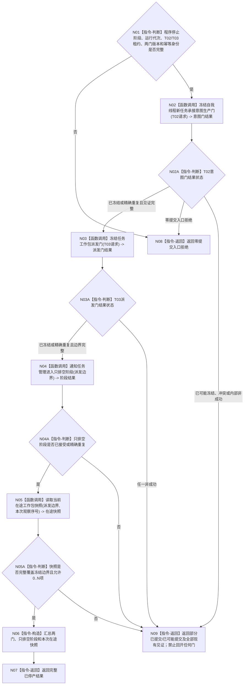

# BIZ-L2-001-12 停止自我新任务意图并冻结任务工作包派发目标函数流程图 v0.1

更新时间：2026-08-27

## 依据

```text
0050、8100 v0.8、8110 v0.3；目标线程归属与跨线程材料；BIZ-L1-T01 v0.4、BIZ-L1-T02 v0.6、BIZ-L1-T03 v0.5；确认稿第30项
```

## 身份与边界

正式目标函数设计图。程序停止阶段锁存后，先禁止 T02 为新的当前具体需求形成任务承接意图，再禁止 T03 向 T04 派发新的筹办/执行工作包。T03 随后进入只排空阶段，继续处理冻结边界内已经接受的工作回执、阶段槽、轮次结算定位和其它允许收口的材料；本函数最后读取一份当前在途工作包快照供后继跟踪。

本函数不冻结 T02/T03 的全部普通输入，不停止线程，也不取消已经派出的工作包。T02/T03 双向普通输入门、self 后继决议和轮次结算定位的共同排空仍由 BIZ-L2-001-14 v0.2 负责。

## 函数合同

```text
根函数：停止自我新任务意图并冻结任务工作包派发
归属模块 / 文件 / 目标分解深度：分阶段停止协调 / 海中鱼巣/启动.分阶段停止.ixx / BIZ-L2
现有或待新增：待新增；HEAD 3752fda8 只有任务管理线程::请求停止新派发()的单布尔锁存，未覆盖T02意图门、筹办/执行统一派发边界、只排空阶段或完整在途快照
完整签名：任务治理停产结果 停止自我新任务意图并冻结任务工作包派发(const 任务治理停产请求& 请求) noexcept
参数：请求为只读借用；含运行代次、T02/T03稳定身份与借用租约、已锁存程序停止阶段、两门幂等身份和期望版本；逐字段 ABI 待详细设计冻结
返回结果：不可变值式结果；完整成功含T02意图门冻结见证、T03派发边界、只排空阶段见证和本次在途快照；非成功区分零提交入口拒绝、部分已提交、版本漂移、幂等冲突、资源失败或内部不一致，并保留全部已成立见证
被调函数流程图：BIZ-L3-001-12-00 冻结自我线程新任务承接意图生产门；BIZ-L3-001-12-01 冻结任务工作包派发门；BIZ-L3-001-12-03 通知任务管理进入只排空阶段；BIZ-L3-001-12-02 读取当前在途工作包快照
```

## 流程图



## 节点合同

| 节点 | 类型 | 输入 | 输出 | 事实读写 | 验证 |
| --- | --- | --- | --- | --- | --- |
| N01 | 判断 | 停产请求 | 准入 | 无 | 错代、坏停止阶段、缺租约和坏幂等 |
| N02—N03A | 函数调用 / 判断 | T02/T03门请求 | 意图门见证和不可逆派发边界 | 只改线程私有生产/派发门 | 顺序固定为先T02、后T03；首次、精确重复、部分提交和并发形成 |
| N04—N04A | 函数调用 / 判断 | 不可逆派发边界 | 只排空阶段见证 | 只改T03协调阶段 | 阶段只前进不回开；不绑定动态快照版本 |
| N05—N07 | 函数调用 / 判断 / 返回 | 派发边界和观察序号 | 0..N在途快照及完整成功 | 只读工作包账 | 快照可随回执闭合而缩小，但冻结边界不变 |
| N08—N09 | 返回 | 精确非成功 | 零提交或部分提交结果 | 不补偿已冻结门 | 每项见证守恒、同键重试只补首个未完成步骤 |

## 关键边界

- T02 意图门只禁止新的具体需求 D 任务承接意图。任务轮次结算定位、已形成的 self 后继决议、停止消息和已经接管的治理批次继续按 BIZ-L2-001-14 的共同排空合同处理。
- T03 派发门必须同时覆盖筹办和执行工作包。HEAD 的 `强类型请求停止锁存`只覆盖强类型执行请求准备，不能冒充统一派发边界，也不能证明 T03 已进入只排空阶段。
- 派发边界先于只排空阶段，阶段见证先于本次快照。快照是可变化的收口观察，不参与阶段幂等身份；重试必须沿同一冻结边界重新读取当前快照，不能复用未必形成的旧快照。
- 任一门或阶段一旦提交不得回滚。后继读回、通知或快照失败必须返回部分已提交/已可能提交和现有见证，不能用普通“停发失败”掩盖不可逆状态。
- 0 项在途是完整成功形状，只证明冻结边界内当前没有未闭合工作包，不证明任务、需求或双向治理材料已经全部收口。

## 2026-08-27 校正记录

- 按确认稿第30项补回“先停止T02产生新任务意图，再停止T03新派发”的顺序，但不恢复独立001-11；该前置成为001-12的第一个具名BIZ-L3叶。
- 删除“派发门精确重复便直接复用既有快照”的错误；门重放后仍依次确认只排空阶段并读取本次当前快照。
- 把只排空阶段从动态快照版本解绑，改为只绑定不可逆派发边界；快照后置为观察材料。
- 增加部分提交/已可能提交收束，所有已冻结门保持关闭。
