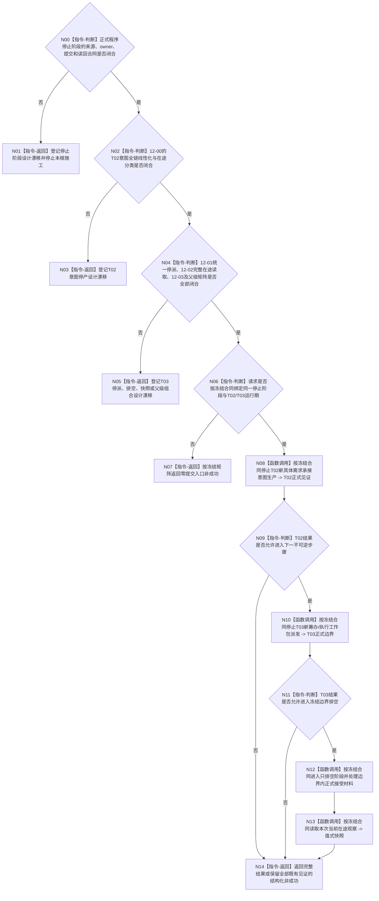

# BIZ-L2-001-12 停止自我新任务意图并冻结任务工作包派发目标函数流程图 v0.2

更新时间：2026-08-28

## 依据

```text
0050、8100 v0.7、8110 v0.3；BIZ-L1-T01 v0.4、BIZ-L1-T02 v0.6、BIZ-L1-T03 v0.5；
BIZ-L2-001-10、BIZ-L3-001-12-00 v0.2；HEAD相关线程与运行包代码。
```

## 身份与边界

正式目标治理图。程序停止收口仍需要先停止T02产生新的具体需求承接意图，再停止T03产生新的筹办/执行派发，随后排空冻结边界内已正式接受的材料并观察当前在途工作。但现行正式规范没有冻结T01程序停止阶段owner，12-00也尚未冻结T02意图全生产链的线性化边界；12-01—03的具体ABI、owner和矩阵仍须逐叶校正。

旧v0.1把四个子函数、两门顺序、只排空阶段、动态快照和部分提交收束写成已经闭合的完整事务。该方向可作为目标职责骨架，但在停止阶段来源与各叶合同未闭合前，不能宣称函数、请求/结果、四叶调用顺序、重试续点或成功公式已经获得施工授权。

## 函数合同

```text
根函数候选：停止自我新任务意图并冻结任务工作包派发
归属模块 / 文件 / 目标分解深度：程序停止协调 / 物理文件待停止阶段与各叶owner裁决 / BIZ-L2
现有或待新增：HEAD只有T03相邻的强类型执行请求停止锁存；完整停产根不存在
完整签名：未冻结；旧v0.1的任务治理停产请求/结果不构成ABI
参数：未冻结；必须绑定正式程序停止阶段、T02/T03生产边界及各自运行期
返回结果：未冻结；必须保留每个已提交子步骤的正式见证，并区分零提交、部分提交、已可能提交和完整读回
被调函数流程图：BIZ-L3-001-12-00—02 v0.2为设计门禁；BIZ-L3-001-12-03 v0.1仍待校正
```

## 设计门禁与目标骨架



## 节点合同

| 节点 | 当前可确认合同 | 仍待冻结 | 验证边界 |
| --- | --- | --- | --- |
| N00—N05 | 停产方向不能由普通停止bool、8110投影或消息出队证明 | T01停止阶段、T02/T03各owner、四叶ABI及父级事务矩阵 | 任一门禁不闭合时不形成可执行根函数 |
| N06/N07 | 全部子步骤必须绑定同一运行期和正式停止阶段 | 请求字段、租约、版本和入口非成功 | 零提交与已提交后失败必须分账 |
| N08/N09 | 必须先阻止边界后的新D承接意图材料 | T02完整生产链的线性化与中间在途分类 | 不只关闭某个形成函数或扫描邮箱 |
| N10/N11 | T03边界须覆盖筹办与执行两类新派发 | 统一派发owner、边界身份、重放和读回 | HEAD强类型执行请求锁存只是相邻机械能力 |
| N12—N14 | 已正式接受材料须收口；当前快照只能是读后观察 | 只排空阶段、完整账覆盖、0..N、部分提交和重试续点 | 快照不能反证过去完整性，也不能进入阶段幂等身份 |

## 当前代码对应（HEAD `696f93d4`）

- `任务管理线程::请求停止新派发()`只锁存强类型执行请求停止，未覆盖T02新D意图、筹办派发、统一冻结边界或只排空阶段。
- `任务结果生产运行包::请求停止新派发()`只是相邻薄包装，不能证明父级四步组合事务。
- HEAD没有本目标根、正式程序停止阶段owner或冻结边界内完整在途工作包快照入口。

## 具名偏差

1. `DRIFT-BIZ-HOST-STOP-STAGE-OWNER-COMMIT-IDEMPOTENCY-AND-READBACK-MATRIX-UNFROZEN`
2. `DRIFT-BIZ-T02-NEW-TASK-INTENT-STOP-LINEARIZATION-OWNER-AND-IN-FLIGHT-BOUNDARY-UNFROZEN`
3. `DRIFT-BIZ-T02-NEW-TASK-INTENT-STOP-ABI-IDEMPOTENCY-READBACK-AND-DRAIN-MATRIX-UNFROZEN`
4. `DRIFT-BIZ-T03-T04-IN-FLIGHT-WORK-LEDGER-OWNER-CLOSURE-EVENT-AND-COMPLETE-ENUMERATION-UNFROZEN`
5. `DRIFT-BIZ-T01-TASK-GOVERNANCE-STOP-COMPOSER-PARTIAL-COMMIT-RETRY-AND-READBACK-MATRIX-UNFROZEN`

## v0.2校正记录

- 把旧v0.1的完整四叶事务降为“设计门禁+职责骨架”，不再把具体签名、四叶结果矩阵或重试续点视为已冻结。
- 保留先T02意图停产、后T03统一停派、再排空和观察当前在途的业务方向；每一步都必须消费正式owner见证。
- 明确动态快照只作本次观察，不能参与阶段幂等身份，也不能代替冻结边界的完整性证明。
