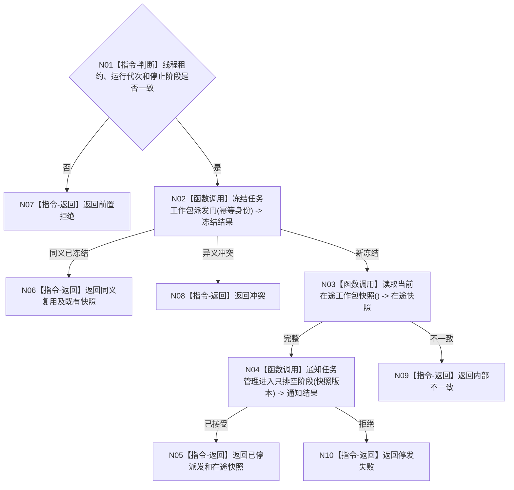

# BIZ-L2-001-12 请求任务管理停止新派发目标函数流程图 v0.1

更新时间：2026-08-03

## 依据

```text
8100、8110；目标线程归属与跨线程材料；BIZ-L1-T01、BIZ-L1-T03
```

## 身份与边界

正式目标函数设计图。关闭新的筹办/执行工作包派发，继续接收并结算已经派出的工作回执。

## 函数合同

```text
根函数：请求任务管理停止新派发
归属模块 / 文件 / 层级：分阶段停止协调 / 海中鱼巣/启动.分阶段停止.ixx / L2
现有或待新增：待新增；现有任务管理线程整体停止不能表达先停派发后排空
完整签名：任务管理停发结果 请求任务管理停止新派发(const 任务管理停发请求& 请求)
参数：请求为只读借用；含运行代次、任务管理线程租约、停止阶段身份、派发门版本和幂等身份
返回结果：任务管理停发结果；含已停发、在途工作包计数快照、同义复用或具名非成功
被调函数流程图：任务派发门冻结与在途快照读取进入L3展开
```

## 流程图



## 节点合同

| 节点 | 类型 | 输入 | 输出 | 事实读写 | 验证 |
| --- | --- | --- | --- | --- | --- |
| N01 | 指令-判断 | 停发请求 | 准入 | 无 | 错代和未启动 |
| N02—N04 | 函数调用 | 派发门与阶段 | 冻结、快照、通知结果 | 只改调度门和线程投影 | 并发派发线性化 |
| N05—N10 | 指令-返回 | 停发结论 | 结构化结果 | 不改任务业务状态 | 在途计数守恒 |

## 关键边界

停止新派发不取消运行中的工作包；在途任务如何完成、等待或失败仍由任务领域合同裁决。
