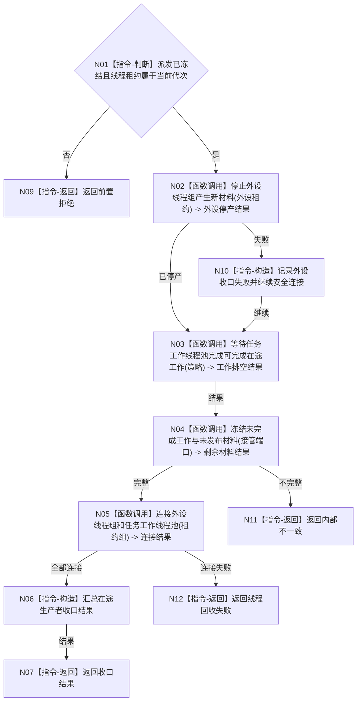

# BIZ-L2-001-13 收口并连接外设线程组与任务工作线程池目标函数流程图 v0.1

更新时间：2026-08-03

## 依据

```text
6340、8100、8110；目标线程归属与跨线程材料；BIZ-L1-T01
```

## 身份与边界

正式目标函数设计图。先停止外设新材料，再让工作线程完成或合法收口在途工作，最后连接两类生产线程。

## 函数合同

```text
根函数：收口并连接外设线程组与任务工作线程池
归属模块 / 文件 / 层级：分阶段停止协调 / 海中鱼巣/启动.分阶段停止.ixx / L2
现有或待新增：待新增；复用现有线程请求停止和连接能力
完整签名：在途生产者收口结果 收口并连接外设线程组与任务工作线程池(在途生产线程租约组&& 线程租约组, const 在途生产者收口请求& 请求)
参数：线程租约组为外设与任务工作线程的唯一移动所有权；请求为只读借用，含运行代次、已冻结派发见证、收口策略、截止时限和剩余材料接管端口
返回结果：移动值式在途生产者收口结果；逐线程含停止、连接、已发布回执/报告和合法剩余材料；所有未连接线程返还唯一租约
被调函数流程图：外设停止、工作池排空和剩余材料冻结函数进入L3展开
```

## 流程图



## 节点合同

| 节点 | 类型 | 输入 | 输出 | 事实读写 | 验证 |
| --- | --- | --- | --- | --- | --- |
| N01 | 指令-判断 | 收口请求 | 准入 | 无 | 未停派发和错代 |
| N02—N05 | 函数调用 | 线程租约、策略和接管端口 | 停产、排空、剩余材料、连接结果 | 可完成已开始的正式提交；不新开工作 | 在途/超时/异常退出 |
| N06—N12 | 指令 | 全部结果 | 结构化收口结果 | 不用join伪造任务结果 | 数量与身份守恒 |

## 关键边界

强制丢弃在途材料没有规范授权；无法完成的工作必须形成可恢复的具名剩余材料，join本身不证明任务完成。
