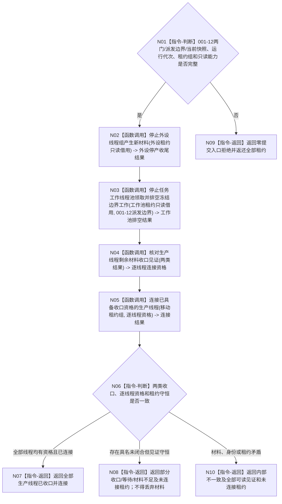

# BIZ-L2-001-13 收口并连接外设线程组与任务工作线程池目标函数流程图 v0.1

更新时间：2026-08-27

## 依据

```text
0050、6340 v0.6、8100 v0.8、8110 v0.3、8120 v0.10；目标线程归属与跨线程材料；BIZ-L1-T01 v0.4、BIZ-L1-T04 v0.3、BIZ-L1-T06 v0.4；BIZ-L2-001-12
```

## 身份与边界

正式目标函数设计图。消费 001-12 已冻结的 T02 新 D 意图门、T03 筹办/执行统一派发边界和本次当前在途工作包快照，分别让 T06 外设控制域停止产生新材料、让 T04 完成冻结边界内可完成工作，再按每个来源 owner 的正式收口见证核对剩余材料。只有取得内部完成见证且不存在未交接材料，或剩余材料已经由其合法 owner 给出可读接管见证的具体线程，才可移动租约并连接。

本函数不建立通用“剩余材料持久 owner”，不把工作包、动作后槽、外设报告、治理消息和支持旁路材料塞入同一恢复包。某线程的 owner 专属恢复合同缺失或接管失败时，只返回结构化未收口及原租约；其它独立线程仍可继续安全收口。

## 函数合同

```text
根函数：收口并连接外设线程组与任务工作线程池
归属模块 / 文件 / 目标分解深度：分阶段停止协调 / 海中鱼巣/启动.分阶段停止.ixx / BIZ-L2
现有或待新增：待新增；HEAD 18810452 的外设启动/收口仍为空壳，任务工作线程只有旧结果尾部同步排空
完整签名：在途生产者收口结果 收口并连接外设线程组与任务工作线程池(在途生产线程租约组&& 线程租约组, const 在途生产者收口请求& 请求) noexcept
参数：线程租约组唯一移动拥有 0..N 个 T06 外设线程和 0..N 个 T04 任务工作线程；请求含运行代次、001-12 完整停产结果、两类单调等待预算和各来源 owner 只读收口能力；不含通用接管端口
返回结果：移动值式结果；完整成功含逐线程停产/排空、剩余材料收口资格、内部完成与连接见证；部分成功或非成功保留全部已成立见证、未闭合材料定位和全部未连接租约
被调函数流程图：BIZ-L3-001-13-01 停止外设线程组产生新材料；BIZ-L3-001-13-02 停止任务工作线程池领取并排空冻结边界工作；BIZ-L3-001-13-03 核对生产线程剩余材料收口见证；BIZ-L3-001-13-04 连接已具备收口资格的生产线程
```

## 流程图



## 节点合同

| 节点 | 类型 | 输入 | 输出 | 事实读写 | 验证 |
| --- | --- | --- | --- | --- | --- |
| N01 | 判断 | 001-12结果、租约和只读能力 | 准入 | 无 | 0/N线程、错代、坏派发边界、快照不完整 |
| N02—N03 | 函数调用 | 两类租约只读借用和冻结边界 | 外设逐项收尾、工作包逐项交付/保护结果 | 只改各线程私有生产/领取门；业务写入仍经原owner | 一类失败不阻止另一类独立收口；不启动新采集或工作 |
| N04 | 函数调用 | 两类收口结果 | 逐线程可连接/不可连接资格 | 只读来源 owner 见证；零通用持久写 | 无剩余、外设已封存、T04 owner缺失、部分接管 |
| N05—N10 | 函数调用 / 判断 / 返回 | 移动租约组与逐线程资格 | 已释放和未连接租约 | 只释放具备资格的线程资源 | 部分连接、完成等待、租约守恒、不得detach |

## 关键边界

- 外设门冻结后，停产前已经取得的采集轮次仍可能形成最后报告。必须等外设控制域发布“无未交接在途材料，或不可舍弃材料已由外设 owner 封存可读”的收尾见证后，才能冻结最终报告截止并连接；门冻结瞬间的队列尾项不是最终截止。
- T04 只对 001-12 派发边界内的完整工作包集合排空。工作结果定位已经交给 T03 才算该工作包从 T04 侧闭合；完成消息、方法返回、线程计数或本地回执均不能替代定位交付。
- T04 动作已经发生但结果定位尚未交付时，必须保留同一受保护槽。若其专属持久恢复 owner 和可读见证尚未冻结，结果只能是材料不足并返还线程租约，不能借通用恢复包强行 join。
- 每个线程独立取得连接资格。一个外设、工作线程或恢复 owner 失败不得掩盖其它线程已经安全连接，也不得授权连接失败线程。
- 0 个外设、0 个工作线程或两组都为空均可形成完整空组成功，但只证明本次没有对应生产者租约，不证明系统其它线程已经收口。

## 2026-08-27 校正记录

- 删除“外设门一冻结就读取最后报告”的竞态；改为等待控制域完成停产收尾后再读取最终截止。
- 删除未获规范授权的通用剩余材料持久 owner；剩余材料只认各自合法 owner 的可读收口/接管见证。
- 连接从全组前置改为逐线程资格，未闭合线程返还租约，独立线程可继续安全连接。
- 修复“请求已携带完成见证但连接函数仍等待完成”的自相矛盾；完成见证由连接调用内部正式等待并读取。
