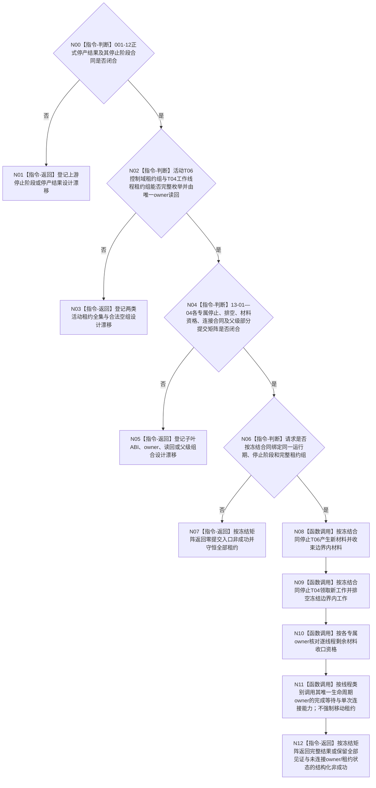

# BIZ-L2-001-13 收口并连接外设线程组与任务工作线程池目标函数流程图 v0.3

更新时间：2026-08-28

## 依据

```text
0050 v2.1、6340 v0.6、8110 v0.3、8120 v0.11；BIZ-L1-T01 v0.5、BIZ-L1-T04 v0.4、BIZ-L1-T06 v0.5；
BIZ-L2-001-12 v0.2、BIZ-L3-001-13-01—03 v0.2、BIZ-L3-001-13-04 v0.3；当前已发布启动、任务工作线程与运行包代码。
```

## 身份与边界

正式目标治理图。程序停止收口仍需要在001-12正式停止上游新意图与新派发之后，分别停止T06产生新外设材料、停止T04领取新工作并排空冻结边界内材料，再按各专属owner的正式见证核对剩余材料，最后只连接具备资格的线程。该顺序是目标职责骨架，不证明旧v0.1给出的通用租约组、请求/结果、部分提交、逐线程返还或成功矩阵已经冻结。

6340只冻结每个外设实例具有独立控制域、一个物理报告队列、任务域唯一消费和不可舍弃材料恢复边界；它没有冻结活动T06控制域/租约的完整枚举、采集轮次、停产门、最终报告截止或收尾读回。8120只冻结自我线程启动候选的租约守恒与回收，并规定自我停门后才继续准备支持线程、工作线程池、任务管理线程和外设线程；它没有产生本根所需的T06/T04租约组、生命周期owner或停止协议。13-01—04现均为设计门禁，重复快照已退出，材料资格、线程完成与资源连接已经分账；本根仍因各子合同未冻结而不可施工。

## 函数合同

```text
根函数候选：收口并连接外设线程组与任务工作线程池
归属模块 / 文件 / 目标分解深度：程序停止协调 / 物理文件待两类租约与停止阶段owner裁决 / BIZ-L2
现有或待新增：发布源码外设启动恒true、外设收口为空；任务工作线程只有旧结果尾部同步排空
完整签名：未冻结；旧v0.1的在途生产者收口请求/结果、统一variant和右值租约组不构成ABI
参数：未冻结；必须绑定001-12正式结果、完整T06/T04活动租约组、各专属owner能力和停止阶段
返回结果：未冻结；必须区分零提交、部分停产/排空、已可能提交、材料未闭合、部分连接和完整读回，并守恒全部已成立见证与未连接owner/租约状态
被调函数流程图：BIZ-L3-001-13-01—04 v0.2均为设计门禁
```

## 设计门禁与目标骨架



## 节点合同

| 节点 | 当前可确认合同 | 仍待冻结 | 验证边界 |
| --- | --- | --- | --- |
| N00/N01 | 不能从bool、消息、计数或当前队列状态补造001-12正式停产结果 | 001-12停止阶段及四叶合同 | 上游仍为设计门禁时本根零提交 |
| N02/N03 | 每个外设实例控制域独立；共享线程池不等于共享控制域 | 两类活动租约全集owner、枚举键、稳定排序、0/N和读前后守卫 | 空容器不能自动证明合法0项 |
| N04/N05 | 剩余材料只认各自正式owner；连接不能替代业务材料闭合 | 13-01—04 ABI、幂等、部分提交、重试续点和逐owner连接结果矩阵 | 一叶失败不得伪装全组完成，也不得丢失其它已成立见证 |
| N06—N12 | 目标顺序保持先停产/停领、再核对材料、最后由各线程生命周期owner逐项连接；唯一租约可由owner原位持有，不要求跨owner移动 | 父级请求/结果、停止阶段、所有权和成功公式 | 租约、材料和正式见证逐项守恒；不得detach、双join或建通用接管包 |

## 当前已发布代码对应（`28125acb`；相关源码自`f2fea3fb`后未变）

- `启动.应用程序.ixx`中的`启动外设线程组()`恒返回true，`收口并连接外设线程组()`为空函数，没有T06控制域、活动租约组或正式停产见证。
- `任务工作线程`只处理旧结果队列尾部；`停止接收并排空()`锁存本地停止，`收口等待()`直接无时限join，不能证明冻结边界工作全集或结果定位均已交付。
- `任务结果生产运行包`按“停止旧派发—同步连接一个旧工作线程—排空任务管理结果上行”收口，没有本根、两类完整租约组、专属材料资格或部分连接返还合同。

## 具名偏差

1. `DRIFT-BIZ-HOST-STOP-STAGE-OWNER-COMMIT-IDEMPOTENCY-AND-READBACK-MATRIX-UNFROZEN`
2. `DRIFT-BIZ-T06-ACTIVE-CONTROL-DOMAIN-LEASE-GROUP-COMPLETE-ENUMERATION-UNFROZEN`
3. `DRIFT-BIZ-T06-DEVICE-CONTROL-DOMAIN-PRODUCTION-ROUND-AND-STOP-LINEARIZATION-UNFROZEN`
4. `DRIFT-BIZ-T06-PRODUCTION-STOP-GATE-ABI-IDEMPOTENCY-READBACK-AND-CONCURRENCY-MATRIX-UNFROZEN`
5. `DRIFT-BIZ-T06-SHUTDOWN-TAIL-REPORT-CUTOFF-IN-FLIGHT-AND-RECOVERY-WITNESS-UNFROZEN`
6. `DRIFT-BIZ-T01-T06-T04-SHUTDOWN-COMPOSER-PARTIAL-COMMIT-RETRY-AND-LEASE-RETURN-MATRIX-UNFROZEN`

## v0.2校正记录

- 撤销旧v0.1对通用在途生产线程租约组、完整签名、部分成功和逐线程连接矩阵的提前冻结。
- 保留“先停T06/T04生产或领取、再按专属owner核对材料、最后只连接合格租约”的目标职责骨架。
- 明确13-01—04 v0.2均为设计门禁并已退出重复T04快照；材料资格、内部完成与资源连接严格分账，本根不得先于子叶合同宣称可施工。

## v0.3校正记录

- 撤销“生产线程必须进入统一variant并以右值移动租约连接”的过度实现约束；现行正式依据没有为T06/T04冻结这种共同实现形态，其专属生命周期owner、完成见证与单次连接合同仍待设计。
- 允许T06/T04各自由既有owner原位持有唯一租约并提供专属连接结果；父组合只按稳定身份归并结果，不取得第二资源owner。
