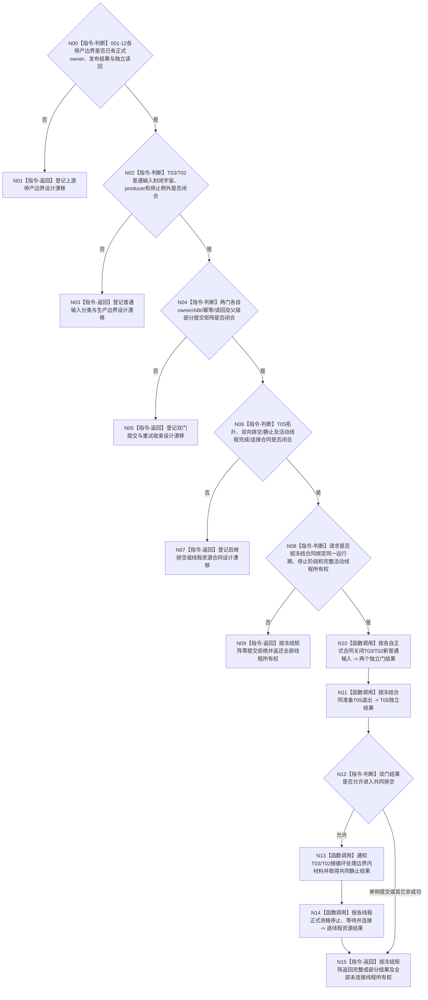

# BIZ-L2-001-14 共同排空双向治理材料并连接任务管理、自我和控制面板线程目标函数流程图 v0.2

更新时间：2026-08-28

## 依据

```text
0050、8100 v0.7、8110 v0.3、8120；BIZ-L1-T01 v0.5、T02 v0.6、T03 v0.5、T05 v0.4；
BIZ-L2-001-12 v0.2；HEAD相关线程、邮箱与停止代码。
```

## 身份与边界

正式目标治理图。生产线程收口后，T01仍应先关闭T03/T02的新普通输入，再让两线程在各自根循环完成冻结边界内已经接受的治理材料；两侧真正共同静止后才可停止和连接T03/T02。T05不参与业务共同静止，只按自身控制消息、退出和完成合同独立收口。

旧图把001-12两类停产见证、T03/T02普通输入门、共同幂等身份、最后允许序号、共同静止屏障、线程租约和完成/连接结果写成已冻结ABI。现行001-12自身仍是设计门禁；正式规范和HEAD也没有定义“普通输入”的封闭类型宇宙、全部producer、停止消息与边界内既有材料的例外准入公式，或两门各自的owner、线性化点、幂等账和正式读回。两门不是一个原子事务，不能凭共同键或同一运行代次伪装原子完成。

本图只保留业务顺序和所有权骨架。001-14-01—04及其十个BIZ-L4叶均已降为设计门禁。在所有子合同闭合前，本父根不是可施工函数合同。

## 函数合同

```text
根函数候选：共同排空双向治理材料并连接任务管理自我和控制面板线程
归属模块 / 文件 / 目标分解深度：程序停止协调 / 物理文件待停止阶段、输入门与线程租约owner裁决 / BIZ-L2
现有或待新增：HEAD无本根；只有局部停止锁存、邮箱停止和同步join能力
完整签名：未冻结；旧治理线程租约组、共同收口请求/结果不构成ABI
参数：未冻结；必须绑定正式生产收口、001-12真实发布并读回的边界、T03/T02各自普通输入门合同、控制面板正式拓扑、本次活动线程所有权和父级停止阶段
返回结果：未冻结；必须区分零提交、单侧门已提交、排空未闭合、部分线程已完成/连接、已可能提交与完整读回，并守恒全部未消费线程所有权
被调函数流程图：BIZ-L3-001-14-01—04 v0.2均为设计门禁
```

## 设计门禁与目标骨架



## 节点合同

| 节点 | 当前可确认合同 | 仍待冻结 | 验证边界 |
| --- | --- | --- | --- |
| N00/N01 | 001-12只可消费正式发布与读回见证，不能消费目标图或当前局部锁存 | 001-12各owner、ABI、发布/读回和父级结果 | 未发布、部分发布、已可能发布和读回失败 |
| N02/N03 | 普通输入必须按入口类型和producer封闭枚举；停止与边界内完成材料须有显式例外 | T03/T02类型宇宙、producer双射、接受边界和例外公式 | 新类型遗漏、旧材料晚到、停止消息并发和未知producer |
| N04/N05 | 两门分别线性化且不可把共同键当原子事务 | 各门owner/版本/幂等/读回、调用顺序、部分提交和重试矩阵 | T03先成、T02先成、同键异义、提交后读回失败 |
| N06/N07 | 业务静止、线程完成与物理连接必须分账；8110投影、`joinable()`和`join()`不能替代内部完成 | 14-02窗口合同、14-03终止检测及14-04活动线程枚举、停止/完成/连接/预算/故障返还 | 无窗口、主宿主/独立T05、最后反向发送、永久未完成和连接异常 |
| N08—N15 | 所有可知入口错误在不可逆提交前拒绝；已提交门不补偿回开 | 父请求/结果、停止阶段、活动线程全集和所有权布局 | 0/N、部分提交、部分完成、部分连接、异常与全部线程所有权守恒 |

## 当前代码对应（HEAD `f4f9c2d6`）

- `任务管理线程::请求停止新派发()`只锁存强类型执行请求停止；结果回执、重筹办意图和旧运行消息另有入口与锁，HEAD没有统一普通输入序号、排空参与者或正式门读回。
- T02已有有界治理邮箱、批次冻结和邮箱停止结果，但没有按封闭消息类型与全部producer冻结“新普通输入”的独立门、幂等账和正式读回。
- 现行启动收口使用局部停止、最终排空和同步join；T03/T04内嵌于任务结果运行包，T02对象不可移动且只以借用指针接入运行包。HEAD没有本父根、活动治理线程租约组、连接总预算或未连接所有权返还。
- T03没有正式内部完成见证；T02虽有私有`已完成_`，但治理循环退出结果被丢弃，生产收口没有完成读回入口。8110线程生命周期投影只供控制面板观察，不能证明输入边界、业务排空、内部完成或资源所有权。

## 具名偏差

1. `DRIFT-BIZ-T03-T02-ORDINARY-INPUT-CLOSED-UNIVERSE-PRODUCERS-AND-STOP-EXCEPTIONS-UNFROZEN`
2. `DRIFT-BIZ-T03-ORDINARY-INPUT-STOP-LINEARIZATION-OWNER-ABI-IDEMPOTENCY-AND-READBACK-MATRIX-UNFROZEN`
3. `DRIFT-BIZ-T02-ORDINARY-GOVERNANCE-INPUT-STOP-LINEARIZATION-OWNER-ABI-IDEMPOTENCY-AND-READBACK-MATRIX-UNFROZEN`
4. `DRIFT-BIZ-T03-T02-DUAL-INPUT-GATE-PARTIAL-COMMIT-RETRY-AND-READBACK-MATRIX-UNFROZEN`
5. `DRIFT-BIZ-CONTROL-PANEL-EXECUTION-TOPOLOGY-WINDOW-OWNER-AND-THREAD-AFFINITY-UNFROZEN`
6. `DRIFT-BIZ-T05-ORDINARY-CONTROL-INPUT-CLOSED-UNIVERSE-PRODUCERS-AND-STOP-EXCEPTIONS-UNFROZEN`
7. `DRIFT-BIZ-CONTROL-PANEL-ORDINARY-INPUT-GATE-OWNER-ABI-IDEMPOTENCY-AND-READBACK-MATRIX-UNFROZEN`
8. `DRIFT-BIZ-HOST-STOP-TO-WINDOW-CLOSE-REQUEST-ABI-IDEMPOTENCY-DELIVERY-AND-TERMINAL-MATRIX-UNFROZEN`
9. `DRIFT-BIZ-CONTROL-PANEL-EXIT-PREPARATION-PARTIAL-COMMIT-RETRY-AND-READBACK-MATRIX-UNFROZEN`
10. `DRIFT-BIZ-T03-T02-GOVERNANCE-DRAIN-CLOSED-WORK-UNIVERSE-CHANNELS-SLOTS-AND-PRODUCER-CONSUMER-BIJECTION-UNFROZEN`
11. `DRIFT-BIZ-T03-GOVERNANCE-DRAIN-STAGE-OWNER-ABI-IDEMPOTENCY-AND-READBACK-MATRIX-UNFROZEN`
12. `DRIFT-BIZ-T02-GOVERNANCE-DRAIN-STAGE-OWNER-ABI-IDEMPOTENCY-AND-READBACK-MATRIX-UNFROZEN`
13. `DRIFT-BIZ-T03-T02-COMMON-QUIESCENCE-LINEARIZATION-PROTOCOL-LOCK-ORDER-GENERATION-AND-BARRIER-READBACK-MATRIX-UNFROZEN`
14. `DRIFT-BIZ-T03-T02-GOVERNANCE-DRAIN-PARTIAL-COMMIT-RETRY-WAIT-AND-TERMINAL-MATRIX-UNFROZEN`
15. `DRIFT-BIZ-T03-T02-ACTIVE-GOVERNANCE-THREAD-LEASE-GROUP-COMPLETE-ENUMERATION-UNFROZEN`
16. `DRIFT-BIZ-T03-T02-STOP-REQUEST-OWNER-ABI-IDEMPOTENCY-READBACK-AND-PARTIAL-COMMIT-MATRIX-UNFROZEN`
17. `DRIFT-BIZ-T03-T02-INTERNAL-COMPLETION-WITNESS-PRODUCER-READBACK-AND-TERMINAL-MATRIX-UNFROZEN`
18. `DRIFT-BIZ-T03-T02-UNIQUE-MOVING-LEASE-AND-RIGHT-VALUE-CONNECTION-ABI-UNFROZEN`
19. `DRIFT-BIZ-T01-GOVERNANCE-THREAD-CONNECTION-TOTAL-BUDGET-PARTIAL-RESULT-AND-UNCONNECTED-LEASE-RETURN-MATRIX-UNFROZEN`

## v0.2校正记录

- 撤销“001-12见证已经存在”、双门共同幂等即共同原子、最后允许序号和完整父级结果已经冻结的旧声明。
- 保留“先停新普通输入、再由各根循环完成边界内材料、共同静止后停止连接”的业务顺序；每一步均须消费正式owner结果。
- 将001-14-01—04及十个BIZ-L4叶全部降为设计门禁；不因父图业务顺序正确而提前取得施工许可。
