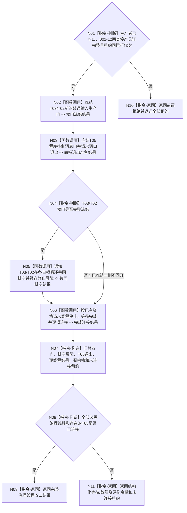

# BIZ-L2-001-14 共同排空双向治理材料并连接任务管理、自我和控制面板线程目标函数流程图 v0.2

更新时间：2026-08-27

## 依据

```text
0050、8100、8110、8120；BIZ-L1-T01 v0.4、T02 v0.6、T03 v0.5、T05 v0.4
```

## 身份与边界

正式目标函数设计图。生产线程收口后，根函数冻结 T03/T02 新普通输入，并让两个线程在各自根循环内完成已经接受的治理材料。T01 只协调排空阶段和线程资源，不读取业务正文、不调用 T02/T03 内部消费入口、不复制结算或后继算法。只有两线程在同一排空纪元到达共同静止，并在线程控制域内锁存不可被新反向材料打破的屏障，才允许请求 T03/T02 停止。

T05 不参与业务排空。存在 T05 租约时独立冻结普通控制输入、请求窗口退出，并在取得自身完成见证后连接；T03/T02 尚未取得共同静止屏障不得阻止已经完成的 T05 释放资源。

## 函数合同

```text
根函数：共同排空双向治理材料并连接任务管理自我和控制面板线程
归属模块 / 文件 / 目标分解深度：分阶段停止协调 / 海中鱼巣/启动.分阶段停止.ixx / BIZ-L2
现有或待新增：待新增；旧顺序排空合同退出
完整签名：治理线程收口结果 共同排空双向治理材料并连接任务管理自我和控制面板线程(治理线程租约组&& 线程租约组, const 治理线程共同收口请求& 请求) noexcept
参数：线程租约组唯一移动拥有T03、T02和可选T05；请求含运行代次、生产者收口结果、001-12的T02新D意图门见证与T03筹办/执行派发边界见证、三线程稳定身份、共同排空纪元、逐线程停止幂等身份和诊断观察截止
返回结果：移动值式治理线程收口结果；含双输入门、T05退出准备、T03/T02逐线程排空阶段、可选共同静止屏障、逐线程停止/完成/连接结果、剩余槽定位及全部未连接租约
被调函数流程图：BIZ-L3-001-14-01 冻结任务管理与自我治理新普通输入门；BIZ-L3-001-14-02 冻结控制面板普通输入并请求窗口退出；BIZ-L3-001-14-03 共同排空任务管理与自我治理双向材料；BIZ-L3-001-14-04 请求治理线程完成并连接租约组
```

## 流程图



## 节点合同

| 节点 | 类型 | 输入 | 输出 | 事实读写 | 验证 |
| --- | --- | --- | --- | --- | --- |
| N01—N04 | 判断/函数调用 | 生产者收口、租约、T02意图门与T03派发边界见证 | T03/T02普通输入门和T05退出准备 | 只改线程/邮箱控制门 | 空租约、错代、精确重复、单侧冻结、T05缺席 |
| N05 | 函数调用 | 双门见证、共同排空纪元、T03/T02控制端 | 逐线程进度和可选共同静止屏障 | 两线程只在自己的根循环消费；屏障只是进程内控制态 | 两侧队列/处理槽/待发布反向材料、并发最后一项、永久provider失败 |
| N06 | 函数调用 | 可选共同静止屏障、T05退出准备和租约 | 逐线程停止/完成/连接结果 | 无屏障时不停止T03/T02；T05可独立连接 | T05先完成、治理线程未完成、部分连接、连接异常 |
| N07—N11 | 构造/判断/返回 | 全部结构化结果 | 完整收口或具名非成功 | 不补造已消费、已静止或已连接 | 原槽和租约守恒 |

## 关键边界

- 旧 v0.1“先排空并停止 T03，再排空并停止 T02”会切断 T03 到 T02 与 T02 到 T03 的反向链，现退出。
- 001-12 已冻结 T02 新 D 承接意图生产门和 T03 筹办/执行工作包派发门；本函数只冻结更广的新普通输入准入，不重复冻结派发门。
- “双向材料”不是只有两条定位队列。T03 还必须收口已接受管理输入、主阶段治理槽、工作结果定位和待交付 self 材料；T02 还必须收口完整邮箱批次、私有处理槽、已接受结算定位和待下行材料。
- T01 不逐项消费治理材料。T03/T02 只能在各自根循环调用正式领域入口；共同静止屏障仅在线程控制域内证明两侧队列、处理槽和待发布反向材料同时为空，且两侧都不会再形成新反向材料。
- 普通的先后两次空快照不能证明共同静止；必须在同一排空纪元以稳定锁序或等价线性化协议锁存屏障。该屏障不是业务事实、持久 owner、L1/L2 截止或恢复记录。
- 不存在通用治理材料接管 owner。永久 provider 失败时保留原线程处理槽、原业务材料和原租约，返回既有具名 DRIFT；不得用超时、日志、队列清空、生命周期投影或 join 伪造业务闭合。
- T05 只读显示不参与治理共同静止。它的窗口退出与资源连接独立完成；无窗口模式为无需连接。

## 未闭合故障边界

- `DRIFT-BIZ-L1-T02-STOP-WITH-PERMANENT-PROVIDER-FAILURE-UNFROZEN`
- `DRIFT-BIZ-L1-T03-STOP-WITH-UNRESOLVED-GOVERNANCE-SLOT-UNFROZEN`
- `DRIFT-BIZ-L1-T04-STOP-WITH-UNDELIVERED-ACTION-RESULT-UNFROZEN`

三项 DRIFT 均不得由本函数新增第二 owner 规避；它们只限制相应故障形状的有限时收口，不阻断普通成功路径校正。
