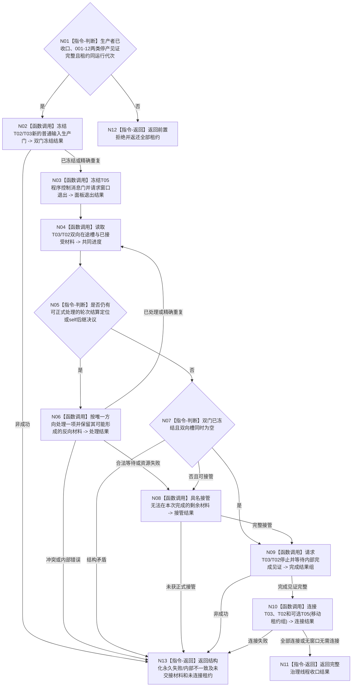

# BIZ-L2-001-14 共同排空双向治理材料并连接任务管理、自我和控制面板线程目标函数流程图 v0.2

更新时间：2026-08-26

## 依据

```text
0050、8100 v0.8、8110、8120；BIZ-L1-T01 v0.4、T02 v0.3、T03 v0.2
```

## 身份与边界

正式目标函数设计图。生产线程收口后，根函数先冻结T02/T03新的普通输入，再共同排空 `T03 -> T02` 轮次结算定位与 `T02 -> T03` self后继决议。两侧不是先后两个独立邮箱排空阶段；只有双向生产门已冻结、已接受材料均已消费或具名接管且两侧在途槽同时为空，才允许停止、连接T03/T02并退出可选T05。

## 函数合同

```text
根函数：共同排空双向治理材料并连接任务管理自我和控制面板线程
归属模块 / 文件 / 目标分解深度：分阶段停止协调 / 海中鱼巣/启动.分阶段停止.ixx / BIZ-L2
现有或待新增：待新增；旧顺序排空合同退出
完整签名：治理线程收口结果 共同排空双向治理材料并连接任务管理自我和控制面板线程(治理线程租约组&& 线程租约组, const 治理线程共同收口请求& 请求) noexcept
参数：线程租约组唯一移动拥有T03、T02和可选T05；请求含运行代次、生产者收口结果、001-12的T02新D意图门见证与T03筹办/执行派发边界见证、共同排空策略、剩余材料接管端口和幂等身份
返回结果：移动值式治理线程收口结果；含双向生产门、共同排空/接管见证、T05退出、逐线程完成/连接结果及全部未连接租约
被调函数流程图：BIZ-L3-001-14-01 冻结任务管理与自我治理新普通输入门；BIZ-L3-001-14-02 冻结控制面板普通输入并请求窗口退出；BIZ-L3-001-14-03 共同排空任务管理与自我治理双向材料；BIZ-L3-001-14-04 请求治理线程完成并连接租约组
```

## 流程图



## 节点合同

| 节点 | 类型 | 输入 | 输出 | 事实读写 | 验证 |
| --- | --- | --- | --- | --- | --- |
| N01—N03 | 判断/函数调用 | 生产者收口、租约、T02意图门与T03派发边界见证 | 三类新普通输入门冻结 | 只改线程/邮箱生产门 | 空租约、错代、精确重复、T05缺席 |
| N04—N08 | 读取/处理/接管 | 双向定位材料和处理槽 | 同时为空或具名接管见证 | 允许对应owner完成已接受正式提交；不新开普通任务轮次 | 一向为空、一向反复产生、同项重试、永久provider失败 |
| N09—N10 | 停止/资源 | 已排空或已接管见证 | 完成见证、连接结果、剩余租约 | 不用join或生命周期消息裁决业务 | 完成前禁止join、连接失败返还租约 |
| N11—N13 | 返回 | 全部结构化结果 | 完整收口或具名非成功 | 不补造已消费/已交接 | 早期失败守恒 |

## 关键边界

- 旧v0.1“先排空并停止T03，再排空并停止T02”会切断T03到T02结算定位与T02到T03后继决议的反向链，现退出。
- 001-12只在更早阶段冻结T02新D承接意图的产生，以及T03向T04的筹办/执行工作包派发；本函数继续冻结T02/T03更广的普通输入接收/生产边界并共同排空已接受双向材料，两者不得合并为同一门或重复写同一见证。
- “继续”self后继决议在停机门冻结后不得启动新普通轮次；必须按正式停止策略形成等待/接管材料，而不是丢弃或偷偷执行。
- 三个永久故障DRIFT仍限制必然有限时成功；结构化非成功必须返还剩余材料和未连接租约，不能用超时、析构或join伪造共同排空。
