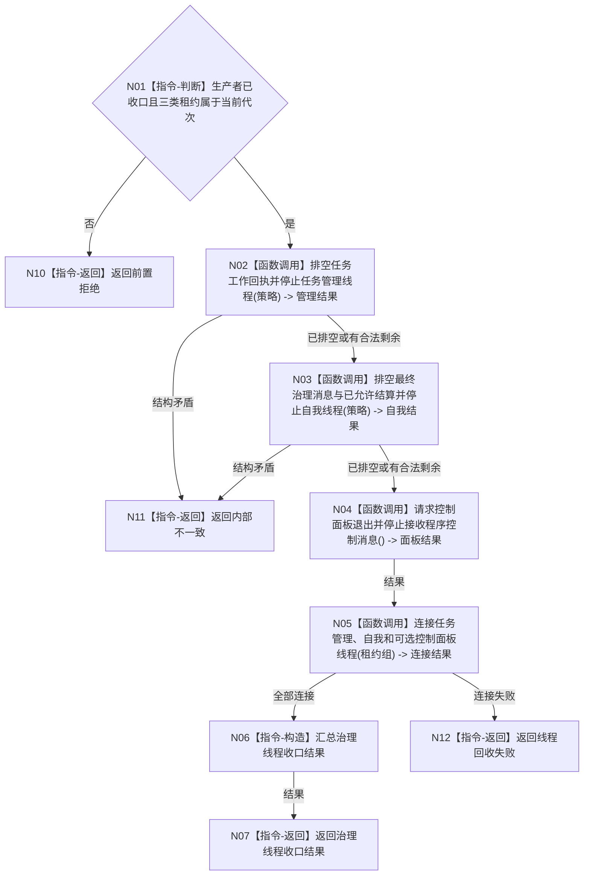

# BIZ-L2-001-14 排空结果上行并连接任务管理、自我和控制面板线程目标函数流程图 v0.1

更新时间：2026-08-03

## 依据

```text
8100、8110；目标线程归属与跨线程材料；BIZ-L1-T01
```

## 身份与边界

正式目标函数设计图。生产线程收口后依次排空任务回执、自我最终治理和控制面板消息，再连接三个线程。

## 函数合同

```text
根函数：排空结果上行并连接任务管理、自我和控制面板线程
归属模块 / 文件 / 层级：分阶段停止协调 / 海中鱼巣/启动.分阶段停止.ixx / L2
现有或待新增：待新增
完整签名：治理线程收口结果 排空结果上行并连接任务管理自我和控制面板线程(治理线程租约组&& 线程租约组, const 治理线程收口请求& 请求)
参数：线程租约组为任务管理、自我和可选控制面板线程的唯一移动所有权；请求为只读借用，含运行代次、生产者收口结果、邮箱排空策略、停止阶段和剩余消息接管端口
返回结果：移动值式治理线程收口结果；含逐邮箱排空、最终提交、窗口退出、连接、剩余材料和全部未连接租约
被调函数流程图：任务管理排空、自我排空和控制面板停止函数进入L3展开
```

## 流程图



## 节点合同

| 节点 | 类型 | 输入 | 输出 | 事实读写 | 验证 |
| --- | --- | --- | --- | --- | --- |
| N01 | 指令-判断 | 治理收口请求 | 准入 | 无 | 生产者未收口和错代 |
| N02—N05 | 函数调用 | 租约、策略、剩余材料端口 | 排空和连接结果 | 允许已授权提交完成；不创建新工作 | 空/非空邮箱与窗口缺席 |
| N06—N12 | 指令 | 全部结果 | 结构化收口结果 | 不用线程退出裁决业务 | 邮箱和身份守恒 |

## 关键边界

无窗口模式没有控制面板线程，应作为明确的无需连接结果；任务管理和自我线程必须保留未完成材料而不是静默清空邮箱。
