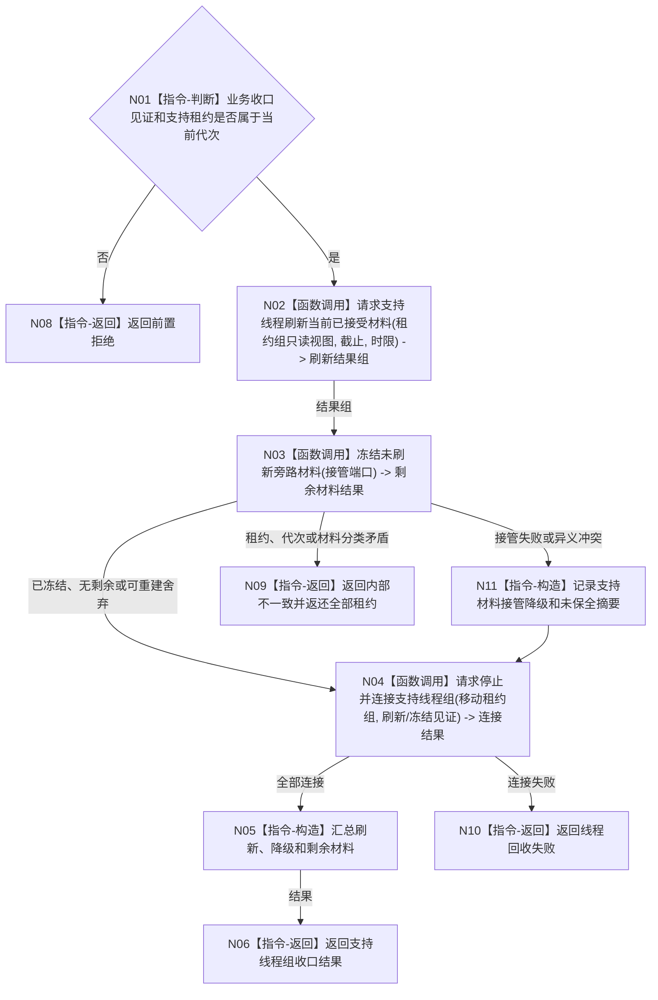

# BIZ-L2-001-15 刷新并连接支持线程组目标函数流程图 v0.1

更新时间：2026-08-03

## 依据

```text
0050、8110、8120；目标线程归属与跨线程材料；BIZ-L1-T01
```

## 身份与边界

正式目标函数设计图。业务和治理线程收口后，最佳努力刷新支持旁路，再停止并连接支持线程组。

## 函数合同

```text
根函数：刷新并连接支持线程组
归属模块 / 文件 / 层级：分阶段停止协调 / 海中鱼巣/启动.分阶段停止.ixx / L2
现有或待新增：待新增；EVENT 租约停止能力已实现但未接父组，CACHE 与持久叶及其停止能力仍待实现
完整签名：支持线程组收口结果 刷新并连接支持线程组(支持线程租约组&& 线程租约组, const 支持线程组收口请求& 请求)
参数：线程租约组为事件日志、缓存统计和可选持久证据工作者的唯一移动所有权；请求为只读借用，含运行代次、业务收口见证、各接受截止身份、刷新时限、连接时限和未持久材料接管端口
返回结果：移动值式支持线程组收口结果；逐线程含刷新、停止、连接、降级和剩余旁路材料，以及已释放/仍持有租约集合
被调函数流程图：BIZ-L3-001-15-01 请求支持线程刷新当前已接受材料；BIZ-L3-001-15-02 冻结未刷新旁路材料；BIZ-L3-001-15-03 请求停止并连接支持线程组
```

## 流程图



## 节点合同

| 节点 | 类型 | 输入 | 输出 | 事实读写 | 验证 |
| --- | --- | --- | --- | --- | --- |
| N01 | 指令-判断 | 支持收口请求 | 准入 | 无 | 业务未收口和错代 |
| N02—N04/N11 | 函数调用 / 构造 | 租约、时限、接管端口 | 刷新、剩余、降级和连接结果 | 只处理旁路材料 | 阻塞、失败、不可用和接管失败后仍回收线程 |
| N05—N10 | 指令 | 全部结果 | 结构化支持收口结果 | 不改变业务结论 | 降级与材料守恒 |

## 关键边界

日志、缓存或SQL持久证据刷新失败可以使支持收口降级，但不得把已完成业务改成失败或以持久结果替代内存已发布事实。具名接管失败也不能泄漏线程租约；只要租约身份仍可信，就必须继续停止和连接并在返回结果保留未保全摘要。
