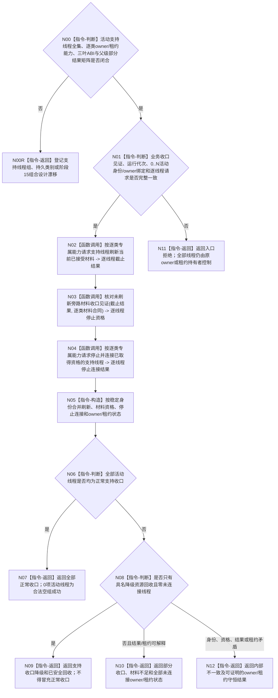

# BIZ-L2-001-15 刷新并连接支持线程组目标函数流程图 v0.3

更新时间：2026-08-28

## 依据

```text
0050、4060、8110 v0.3、8120、日志系统规范；
20260815 EVENT-LOG-THREAD-PRODUCTION-START；BIZ-L1-T01、BIZ-L2-001-04
```

## 身份与边界

正式目标治理图。业务与治理线程收口后，逐支持线程停止接受新旁路材料，处理到本线程接受截止；未到达截止时只按该线程的正式材料合同形成同截止快照、具名可重建舍弃或专属 owner 收口见证。随后只调用已经取得停止资格的线程类别专属停止连接能力。

共享 SUPPORT 已冻结可移动候选租约和安全回收基础；EVENT 已实现自有可移动租约及右值停止连接；CACHE 详细设计冻结了同类专属形态但代码尚不存在；持久证据支持线程没有已冻结生产与收口合同。EVENT 详细设计明确不实现三类支持租约 variant、支持线程组或阶段15。因此旧图的 `支持线程租约组`、三类 variant、父请求/结果和完整签名都没有共同正式依据，不能由 EVENT 单叶类推。

本图严格分开三类结果：

```text
正常支持收口：截止已完成，或剩余材料已由合法合同完整收束
降级资源回收：线程已经安全 stop + join，但支持材料未形成正常收口
未取得停止资格：不可舍弃材料缺 owner / 读回见证，原材料和原租约仍由调用方持有
```

线程已经连接只证明物理资源已回收，不能把第二类改写成第一类。不存在跨日志、缓存统计和持久证据的通用接管 owner。

## 函数合同

```text
根函数候选：刷新并连接支持线程组
归属模块 / 文件 / 目标分解深度：分阶段停止协调 / 海中鱼巣/启动.分阶段停止.ixx / BIZ-L2
现有或待新增：待新增；当前发布源码中的同名无参函数为空壳。EVENT 强类型停收、截止等待、快照与右值停止连接已实现但零生产调用；CACHE 与持久证据叶仍未实现
完整签名：未冻结；旧 `支持线程租约组&&`、三类 variant 和父请求/结果不构成ABI
参数：未冻结；必须绑定本次运行活动支持线程完整身份组、每类唯一生命周期owner或专属租约能力、业务收口见证、刷新/诊断预算、逐类材料分类和专属owner只读见证；不含通用接管端口
返回结果：未冻结；必须逐项保存刷新截止、材料资格、正常收口、降级资源回收、未取得资格、已连接状态及全部未连接owner/租约状态
被调函数流程图：BIZ-L3-001-15-01—03 v0.3均为设计门禁
父图：BIZ-L1-T01 v0.5
```

## 流程图



## 节点合同

| 节点 | 类型 | 输入 | 输出 | 事实读写 | 验证 |
| --- | --- | --- | --- | --- | --- |
| N00/N00R | 指令-判断 / 返回 | 当前正式合同与实现边界 | 设计闭合资格或具名漂移 | 无 | EVENT已实现不等于三类组ABI闭合；持久类别缺失 |
| N01 | 指令-判断 | 业务收口见证、代次、活动身份/owner组和预算 | 准入 | 无 | 错代、重复身份、未知类别、0/N线程 |
| N02 | 函数调用 | 逐类专属能力和预算 | 逐线程停收截止、完成位置或同截止快照 | 只改各支持线程私有控制域 | 已到达、超时、故障、快照资源失败 |
| N03 | 函数调用 | 截止结果和逐类材料合同 | 正常、降级或无停止资格 | 只读专属 owner；不建通用 owner | 可重建、日志具名丢失、持久材料缺 owner |
| N04 | 函数调用 | 逐类专属owner/租约能力和资格组 | 正常连接、降级回收或未连接状态 | 只改线程生命周期 | 无资格零调用、EVENT/CACHE专属右值、部分连接 |
| N05—N12 | 构造 / 判断 / 返回 | 全部逐项结果 | 结构化总结果 | 不改变业务事实 | 身份、材料、结果和owner/租约状态守恒 |

## 关键边界

- 事件日志、缓存统计和发布后持久证据均不得改写已成立业务结果；但支持线程收口失败必须进入最终程序结果，不能被“业务已成功”吞掉。
- 可确定性重建的缓存 / 统计材料可以具名舍弃。事件日志未写摘要只能按日志合同形成具名支持降级和完整位置 / 快照摘要，不能静默丢失。不可舍弃持久材料只有同截止专属 owner 见证完整时才取得停止资格。
- 缺少不可舍弃材料 owner 或正式读回时，不调用停止连接叶，原材料和原owner/租约保持不动。EVENT 租约的防御性 `前置未闭合但已安全连接` 只说明已经发生异常资源回收，不反向授权上层绕过资格核对。
- `事件日志线程租约::停止并连接` 会在请求进入后消费唯一 SUPPORT 租约；因此EVENT所有可在移动前发现的错代、身份、截止和资格问题必须先行拒绝。该专属规则不能补造其它类别或父组的共同ABI。析构只作异常安全网，不是阶段15正常路径。
- `DRIFT-BIZ-L1-SUPPORT-STOP-WITH-OWNERLESS-MATERIAL-UNFROZEN` 只限制“不可舍弃且缺专属 owner / 读回”的线程；不阻断其它独立支持线程正常收口或具名降级资源回收。

## 当前已发布代码对应（`c989510b`）

- 当前发布源码 `海中鱼巣/启动.应用程序.ixx` 中的 `void 刷新并连接支持线程组()` 为空壳，父 `运行普通程序` 无结果调用它；没有租约组、逐线程结果或未连接租约返回。
- 当前发布源码中的 EVENT 已发布 `停止接收并取得截止`、`等待完成到截止`、`冻结并读取未取出快照` 和右值 `停止并连接`。其中 `前置未闭合但已安全连接`、`请求拒绝但已安全连接` 与普通 `已安全连接` 已结构化分账。
- 当前发布源码中的 EVENT provider 零生产调用；CACHE和持久证据线程、活动组枚举、父DTO/组合器均未实现。因此本图只保留业务职责骨架，不能宣称精确ABI已冻结或阶段15已接线。

## 具名偏差

1. `DRIFT-BIZ-SUPPORT-RUNTIME-ACTIVE-SET-ENUMERATION-OWNER-AND-GROUP-ABI-UNFROZEN`
2. `DRIFT-BIZ-PERSISTENCE-SUPPORT-THREAD-PRODUCTION-MATERIAL-AND-CLOSURE-CONTRACT-UNFROZEN`
3. `DRIFT-BIZ-SUPPORT-STAGE15-PARENT-PARTIAL-RESULT-RETRY-AND-UNCONNECTED-OWNER-MATRIX-UNFROZEN`

## v0.3校正记录

- 撤销由EVENT单叶反推三类 `支持线程租约组` variant、父请求/结果和完整签名已经冻结的声明。
- 保留逐类停收取截止、同截止材料资格、专属停止连接及正常/降级/未连接分账；实际组形态、持久类别和父级矩阵闭合前保持设计门禁。
