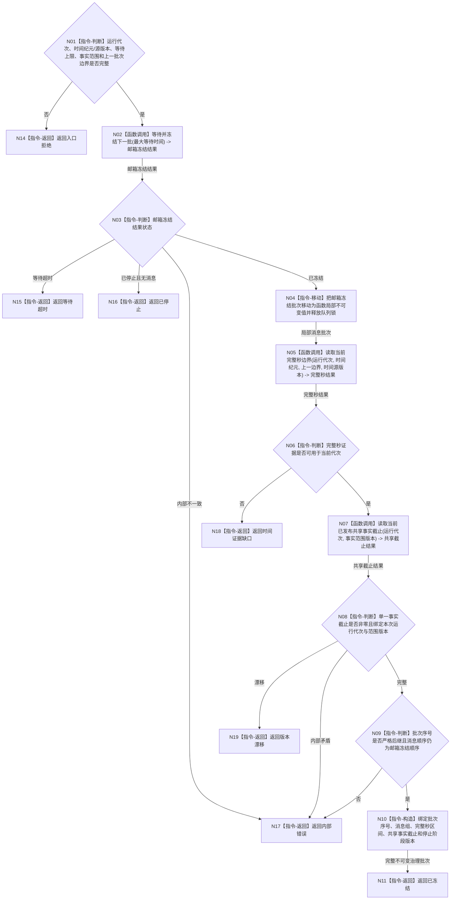

# BIZ-L2-002-01 冻结当前治理批次目标函数流程图 v0.1

更新时间：2026-08-03

## 依据

```text
8100、8200
父线程函数：BIZ-L1-T02 自我线程::运行治理循环
当前代码：有界自我治理邮箱::等待并冻结下一批已经提供锁内取批、停止唤醒和稳定优先级顺序
```

## 身份与边界

正式目标函数设计图。根函数只冻结本轮可消费的不可变消息批次、完整秒边界和普通应用同一 L1 的共享事实截止；不读取领域正文，不重新排序消息，也不提交机器事实。

## 函数合同

```text
根函数：冻结当前治理批次
归属模块 / 文件 / 层级：自我治理批次路由 / 海中鱼巣/线程/路由.自我治理批次.ixx / L2
现有或待新增：待新增；复用有界自我治理邮箱::等待并冻结下一批，补齐运行代次、完整秒和共享事实截止
完整签名：自我治理批次冻结结果 自我治理批次路由::冻结当前治理批次(const 自我治理批次冻结请求& 请求) const
参数：
  请求：const 自我治理批次冻结请求&，只读借用；必须携带运行代次、时间纪元、时间源版本、最大等待时间、上一批次序号、上一完整秒边界、事实范围版本和停止阶段版本；不得携带调用方自报当前时间
返回结果：
  自我治理批次冻结结果；包含已冻结、等待超时、已停止、时间证据缺口、版本漂移、入口拒绝或内部错误，以及批次序号、消息组、完整秒区间、单一共享事实截止、事实范围版本和停止阶段版本
被调函数流程图：BIZ-L3-002-01-01 有界自我治理邮箱::等待并冻结下一批；BIZ-L3-002-01-02 完整秒时钟服务::读取当前完整秒边界；BIZ-L3-002-01-03 v0.2 运行期事实版本服务::读取当前已发布共享事实截止
```

## 流程图



## 节点合同

| 节点 | 类型 | 参数 / 输入绑定 | 结果 / 输出绑定 | 事实读写 | 后继条件 | 验证 |
| --- | --- | --- | --- | --- | --- | --- |
| N02 | 函数调用 | 最大等待时间 | 邮箱冻结结果 | 队列锁内只移动消息 | 已冻结、超时、停止或错误 | 空队列、停止唤醒、迟到消息 |
| N04 | 指令-移动 | 邮箱冻结批次 | 局部不可变消息组 | 无业务写入 | 队列锁已释放 | 不保留队列元素引用 |
| N05 | 函数调用 | 运行代次、时间纪元、上一边界和时间源版本 | 完整秒区间 | 只读单调时间证据 | 当前代次或缺口 | 调用方不自报当前时间，循环次数不参与时间 |
| N07 | 函数调用 | 运行代次和事实范围版本 | 单一共享事实截止 | 只读同一 L1 当前已发布代次 | 已读取或错误 | 不读取半发布候选，不建立逐 owner 向量或第二见证 |
| N09/N10 | 判断 / 构造 | 批次、时间和版本 | 不可变治理批次 | 无写入 | 序号和顺序成立 | 迟到消息进入下一批 |

## 关键边界

- 邮箱提交时已经按正式优先级稳定插入；本函数保持冻结顺序，不建立第二套重排逻辑。
- 队列锁只覆盖等待和消息移动；时间、共享事实截止及任何领域读取都在释放队列锁后进行。
- 一次冻结只确定本批可消费范围，不证明消息材料真实，也不授权对应领域写入。
- 等待超时可以形成空轮后继，但不能被解释为一秒、一次衰减或一个业务事件。
