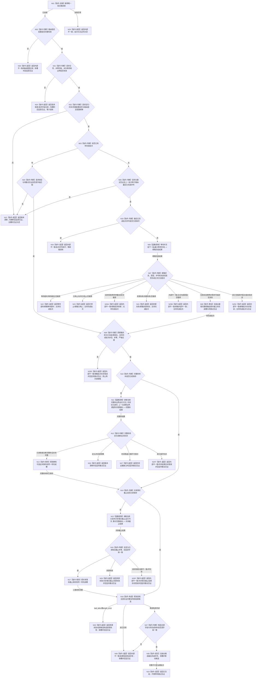

# BIZ-L2-002-01 冻结当前治理批次目标函数流程图 v0.2

更新时间：2026-08-15

## 依据

```text
0050 v1.3、4050 v1.4、8100 v0.6、8200 v0.5
BIZ-L3-002-01-01 v0.1：有界自我治理邮箱::等待并冻结下一批
BIZ-L3-002-01-02 v0.1：完整秒时钟服务::读取当前完整秒边界
BIZ-L3-002-01-03 v0.2：运行期事实版本服务::读取当前已发布共享事实截止
RUNTIME-GOVERNANCE-MAILBOX-BATCH-FREEZE v0.1
RUNTIME-COMPLETE-SECOND-BOUNDARY-PROVIDER v0.1
RUNTIME-FACT-CURRENT-CUTOFF-CONSUME v0.1
```

## 身份与边界

正式目标函数设计图；正式替代并删除同目录 v0.1。

根函数把邮箱已经按稳定顺序冻结的一个非权威消息批次，与同一运行配置下的完整秒观察、可选完整秒区间和单一共享事实截止组合为一个调用方拥有的不可变治理批次。邮箱已经取出消息而后继证据暂时失败时，路由私有保留同一待完成批次；重试只补未完成证据，绝不再次读取邮箱。

本函数不读取领域正文，不提交机器事实，不重排消息，不推进完整秒消费游标，也不建立第二停止阶段事实。停止唯一读取来源是邮箱正式结果；待完成批次先完成交付，后继无待完成调用才可返回邮箱已停止。

## 函数合同

```text
根函数：冻结当前治理批次
归属模块 / 文件 / 层级：自我治理批次路由 / 海中鱼巣/线程/路由.自我治理批次.ixx / BIZ-L2
现有或待新增：待新增；有状态、不可复制、不可移动的唯一组合路由
完整签名：自我治理批次组合结果 自我治理批次路由::冻结当前治理批次(const 自我治理批次组合请求& 请求) noexcept
参数：
  请求：const 自我治理批次组合请求&，只读借用；携带合同版本、运行代次、时间纪元身份、期望时间源版本、最大等待时间、上一已完成批次序号、上一已消费完整秒边界、事实范围版本和可选待重试见证；不得携带调用方自报当前时间或停止阶段版本
返回结果：
  自我治理批次组合结果；状态为已冻结、等待超时、已停止、请求拒绝、版本漂移、资源失败、时间证据缺口或内部不一致；只有已冻结携带完整治理批次，只有路由仍持有待完成批次时携带同一待重试见证
被调函数流程图：
  BIZ-L3-002-01-01 有界自我治理邮箱::等待并冻结下一批
  BIZ-L3-002-01-02 完整秒时钟服务::读取当前完整秒边界
  BIZ-L3-002-01-03 v0.2 运行期事实版本服务::读取当前已发布共享事实截止
```

## 流程图



## 节点合同

| 节点 | 类型 | 参数 / 输入绑定 | 结果 / 输出绑定 | 事实读写 | 后继条件 | 验证 |
| --- | --- | --- | --- | --- | --- | --- |
| N01 | 指令-加锁 | 路由私有互斥锁 | 本次唯一组合权 | 只写路由临时并发状态 | 锁覆盖全部校验、待完成槽检查、子调用和最后提交 | 并发调用串行；加锁异常无法安全读取槽，只返回双 optional 空的内部不一致 |
| N02/N31/N32/N05/N33 | 指令-判断 | 请求、路由固定配置、最后已完成序号 | 唯一状态/原因的结构化结果 | 锁内只读路由状态 | 配置无效→内部不一致；请求形状无效→请求拒绝；固定配置/序号/见证不等→版本漂移；序号耗尽→内部不一致 | 各条件逐项验证，零子调用；有槽时除加锁异常外回显原见证 |
| N04 | 指令-判断 | 请求绑定、待完成槽、待重试见证 | 同批重试或版本漂移 | 只读待完成槽 | 匹配才补证 | 最大等待时间在重试时不使用，其余绑定逐字段同一 |
| N06 | 函数调用 | 最大等待时间 -> 邮箱参数 | 邮箱冻结结果 -> 局部结果 | 邮箱内部锁内冻结；返回前已释放邮箱锁 | 只有无待完成槽时调用 | 0等待、超时、停止、资源失败和严格后继批次 |
| N07/N08/N09 | 指令-判断/移动 | 完整邮箱结果、请求绑定 | 无载荷正式结果，或路由私有待完成槽与见证 | 只读并按需写路由私有非权威状态 | 状态、原因、序号和消息组先完整配对；任何携带载荷的结果均先接管完整状态/原因/批次再校验；每次匹配重试都复核 `已冻结+原因无+合法批次` | 正式空载荷配对直接映射；其它空载荷坏配对内部不一致且无见证；任一携带载荷的坏配对不让局部批次销毁，且永不进入补证或成功；禁止重新入队 |
| N11/N12/N25T/N26/N27 | 函数调用/判断/返回 | 运行代次、时间纪元、上一边界、时间源版本 | 完整秒观察与可选区间，或唯一具名非成功 | 只读单调时间证据 | 已读取/无新秒保存；纪元/源漂移、时间缺口和坏形状分别返回自己的固定原因 | 无新完整秒是合法成功；循环次数和等待时间不参与秒数 |
| N15/N16/N25F/N28 | 函数调用/判断/返回 | 运行代次、事实范围版本 | 单一共享事实截止，或唯一具名非成功 | 经 BIZ 包装只读同一 L1 当前事实代次 | 已读取保存；资源失败和其它坏形状分别返回自己的固定原因 | 不直达 DATA-L1，不枚举 owner，不缓存全局截止 |
| N18/N35/N36/N37/N38 | 指令-构造/返回/判断/提交 | 已保存三类材料 | 完整候选、具名失败或完整治理批次 | 无业务事实写入；只有 N38 更新路由私有序号和槽 | 消息复制和全部可能抛出构造先完成；资源异常/其它异常保槽并回显见证；逐字段互证后才一次无抛出交付 | `bad_alloc/length_error` 与其它异常分账；候选结果移动、序号赋值和清槽必须静态证明无抛出 |

## 关键边界

- v0.1 在邮箱已经破坏性取出消息后直接读取时间和事实截止；任一步失败都会销毁局部批次。v0.2 用路由私有待完成槽消除该消息丢失路径。
- 邮箱 provider 返回前已经释放自身队列锁；本函数只移动调用方拥有的值式批次，绝不“替邮箱释放锁”。组合路由锁与邮箱锁、时间 provider 和 DATA 只读调用不存在反向调用边。
- 同一待完成批次可以跨多次函数调用补证。重试不再次读取邮箱；已经成功保存的完整秒或共享截止不重复读取。最大等待时间只在首次邮箱等待使用，重试可携带任意非负值但被忽略。
- 路由实例内部最后已完成批次序号固定从 0 开始；第一次请求的上一已完成批次序号必须为 0，之后只能回显本路由上一次成功返回的批次序号。本图不提供非零恢复起点、跨实例续接或调用方注入序号。
- 路由必须在该邮箱发生第一次批次冻结前构造，并成为同一运行实例唯一冻结消费者；T02和其它调用方不得绕过路由直接调用邮箱冻结入口。邮箱可在构造前已有待处理消息，但其内部已冻结批次数量必须仍为 0。
- `无新完整秒`具有完整观察但无区间，是合法已冻结治理批次；等待超时不是完整秒、业务事件或空治理批次。
- 0050 当前没有停止阶段版本的权威来源，且停机精确合同仍为未裁决。v0.2 删除该伪字段，只承认邮箱的运行中/已停止；邮箱停止前已取出的待完成批次仍须先完成，不能改绑、过滤或丢弃。
- 路由对象销毁前若仍有待完成批次，不能声明治理消息已经排空或优雅停机。跨进程恢复、持久化待完成批次、领域正文读取和后继业务提交均不在本图范围。
