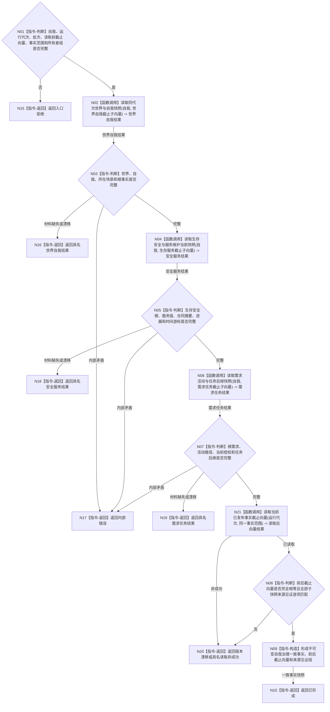

# BIZ-L2-002-02 读取自我治理一致事实目标函数流程图 v0.1

更新时间：2026-08-03

## 依据

```text
4190、5090、6140—6180、8100、8200
父线程函数：BIZ-L1-T02 自我线程::运行治理循环
当前代码：运行期只读查询组合器已有任务、方法、状态和动态组合读取；尚无完整自我治理同代次快照
```

## 身份与边界

正式目标函数设计图。根函数以治理批次冻结的发布见证向量为读取前边界，从各事实所有者读取世界、自我、需求、安全、服务和任务治理材料，再读取同一范围的发布见证向量；只有前后向量与全部子快照来源见证完全一致时才形成值式一致快照。全程只读。

## 函数合同

```text
根函数：读取自我治理一致事实
归属模块 / 文件 / 层级：运行期只读查询 / 海中鱼巣/领域/组合.运行期只读查询.ixx / L2
现有或待新增：适配扩展；复用现有具名读取能力，新增自我治理范围和同代次闭合
完整签名：自我治理一致事实结果 运行期只读查询组合器::读取自我治理一致事实(const 自我治理一致事实请求& 请求) const
参数：
  请求：const 自我治理一致事实请求&，只读借用；必须携带唯一自我、运行代次、治理批次、读取前事实截止向量、完整秒边界、事实范围版本、必需事实所有者组和读取幂等身份
返回结果：
  自我治理一致事实结果；包含已形成、材料缺失、当前性漂移、版本漂移、入口拒绝或内部错误，以及世界 / 自我快照、生存安全 / 服务维护快照、需求活动快照、任务后继摘要、读取前后事实截止向量和全部来源见证
被调函数流程图：BIZ-L3-002-02-01 读取同代次世界与自我快照；BIZ-L3-002-02-02 读取生存安全与服务维护当前快照；BIZ-L3-002-02-03 读取需求活动与任务后继快照；BIZ-L3-002-01-03 读取当前已发布事实截止向量
```

## 流程图



## 节点合同

| 节点 | 类型 | 参数 / 输入绑定 | 结果 / 输出绑定 | 事实读写 | 后继条件 | 验证 |
| --- | --- | --- | --- | --- | --- | --- |
| N02 | 函数调用 | 自我、世界自我截止子向量 | 世界、自我和所在场景快照及来源见证 | 只读世界事实 | 完整或具名返回 | 唯一自我、同场景、逐提供者见证匹配 |
| N04 | 函数调用 | 自我、生存服务截止子向量 | 生存安全 / 服务 / 合同 / 进展 / 时间快照及来源见证 | 只读各唯一所有者 | 完整或具名返回 | 值域、阈值、时间纪元、逐提供者见证匹配；不隐式枚举分层安全维护族 |
| N06 | 函数调用 | 自我、需求任务截止子向量 | 需求活动与任务后继快照及来源见证 | 只读需求和任务事实 | 完整或具名返回 | 活动路径、授权、历史隔离和逐提供者见证匹配 |
| N21 | 函数调用 | 与读取前相同的运行代次、范围和所有者组 | 读取后事实截止向量 | 只读各所有者发布见证 | 已读取或具名非成功 | 不扩大或缩小事实范围 |
| N08/N09 | 判断 / 构造 | 前后向量、三组子快照和来源见证 | 一致事实快照 | 无写入 | 前后向量和来源见证完全相等 | 禁止混代拼装、遗漏提供者或只比最大版本 |

## 关键边界

- 本函数不通过 SQL、缓存、控制面板、日志或工作线程私有状态补齐缺失事实。
- 子快照分别由正式所有者读取；组合器只验证版本并形成值式材料，不取得任何领域写权。
- 不存在覆盖全部领域的全局标量事实代次；不得用任一仓库的版本号、最大版本或时间戳替代发布见证向量。
- 快照形成后本轮只按冻结向量裁决；读取期间任一所有者发布见证变化都返回版本漂移，后续事实进入下一治理批次。
- 一项必需事实缺失时返回具名材料结果，不用旧快照、默认值或跨代次材料兜底。
