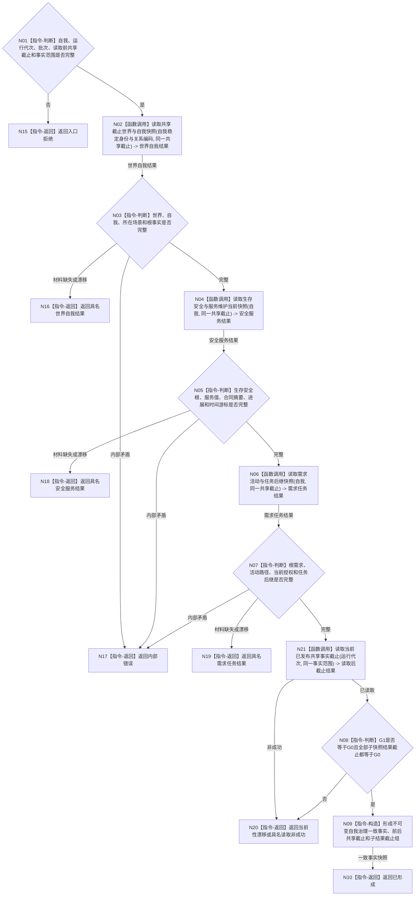

# BIZ-L2-002-02 读取自我治理一致事实目标函数流程图 v0.1

更新时间：2026-08-03

## 依据

```text
4190、5090、6140—6180、8100、8200
父线程函数：BIZ-L1-T02 自我线程::运行治理循环
当前代码：运行期只读查询组合器已有任务、方法、状态和动态组合读取；尚无完整自我治理同代次快照
```

## 身份与边界

正式目标函数设计图。根函数以治理批次冻结的单一共享事实截止为读取前边界，从各具名结构服务读取世界、自我、需求、安全、服务和任务治理材料，再读取同一 L1 的共享事实截止；只有前后截止与全部子快照结果截止完全一致时才形成值式一致快照。全程只读。

## 函数合同

```text
根函数：读取自我治理一致事实
归属模块 / 文件 / 层级：运行期只读查询 / 海中鱼巣/领域/组合.运行期只读查询.ixx / L2
现有或待新增：适配扩展；复用现有具名读取能力，新增自我治理范围和同代次闭合
完整签名：自我治理一致事实结果 运行期只读查询组合器::读取自我治理一致事实(const 自我治理一致事实请求& 请求) const
参数：
  请求：const 自我治理一致事实请求&，只读借用；必须携带唯一自我、运行代次、治理批次、读取前共享事实截止、完整秒边界和事实范围版本；纯读取不带幂等身份或 owner 组
返回结果：
  自我治理一致事实结果；包含已形成、材料缺失、当前性漂移、入口拒绝或内部错误，以及世界 / 自我快照、生存安全 / 服务维护快照、需求活动快照、任务后继摘要、读取前后共享事实截止和全部子结果截止
被调函数流程图：BIZ-L3-002-02-01 v0.3 读取共享截止世界与自我快照；BIZ-L3-002-02-02 读取生存安全与服务维护当前快照；BIZ-L3-002-02-03 读取需求活动与任务后继快照；BIZ-L3-002-01-03 v0.2 读取当前已发布共享事实截止
```

## 流程图



## 节点合同

| 节点 | 类型 | 参数 / 输入绑定 | 结果 / 输出绑定 | 事实读写 | 后继条件 | 验证 |
| --- | --- | --- | --- | --- | --- | --- |
| N02 | 函数调用 | SELF-FORM稳定身份与关系编码、同一共享截止 | 世界、自我、所在场景与内部世界快照及共享截止 | 只读场景/存在公开服务 | 完整或具名返回 | 全部正文匹配同一截止；唯一自我、成员、宿主和树拓扑逐字段闭合 |
| N04 | 函数调用 | 自我、同一共享截止 | 生存安全 / 服务 / 合同 / 进展 / 时间快照及共同截止 | 只读各具名结构服务 | 完整或具名返回 | 值域、阈值、时间纪元和全部结果截止匹配；不隐式枚举分层安全维护族 |
| N06 | 函数调用 | 自我、同一共享截止 | 需求活动与任务后继快照及共同截止 | 只读需求和任务事实 | 完整或具名返回 | 活动路径、授权、历史隔离和全部结果截止匹配 |
| N21 | 函数调用 | 与读取前相同的运行代次和事实范围 | 读取后共享事实截止 | 只读同一 L1 当前已发布代次 | 已读取或具名非成功 | 不更换 L1 实例 |
| N08/N09 | 判断 / 构造 | G0、G1、三组子快照及其结果截止 | 一致事实快照 | 无写入 | G1=G0 且全部来源截止=G0 | 禁止混代拼装、逐 owner 向量或最大版本替代 |

## 关键边界

- 本函数不通过 SQL、缓存、控制面板、日志或工作线程私有状态补齐缺失事实。
- 子快照分别由正式所有者读取；组合器只验证版本并形成值式材料，不取得任何领域写权。
- 同一普通应用 L1 的全局事实代次就是本轮共享读取截止；不得用 owner 身份、最大版本、时间戳或第二发布见证替代。
- 快照形成后本轮只按 G0 裁决；读取期间任一 L1 发布使 G1 不等于 G0，整体返回当前性漂移，后续事实进入下一治理批次。
- 一项必需事实缺失时返回具名材料结果，不用旧快照、默认值或跨代次材料兜底。
