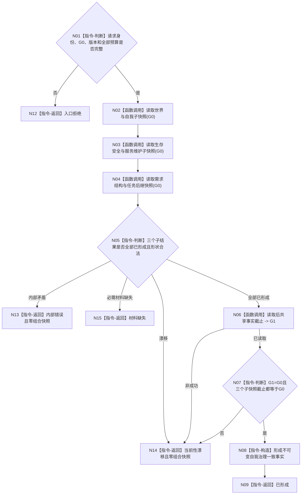

# BIZ-L2-002-02 读取自我治理一致事实目标函数流程图 v0.2

更新时间：2026-08-20

## 依据

```text
0050、3100、3200、4250、4260、5090、8100、8200
父线程函数：BIZ-L1-T02 自我线程::运行治理循环
```

## 身份与边界

本图冻结 `读取自我治理一致事实`的最终设计意图：以治理批次冻结的单一共享事实截止 `G0` 读取世界与自我、生存安全与服务维护、需求当前结构与任务后继三组完整值式材料。只有读取后共享截止 `G1`、三个已形成子快照和请求 `G0` 全部一致时，才形成自我治理一致事实。

需求子快照只提供后继治理判断所需的当前结构输入，不提前裁决活动路径、授权、权重、主需求或任务化资格。无当前根需求和需求列表项无当前任务均是合法空结构，不是材料缺失。

## 函数合同

```text
根函数：读取自我治理一致事实
归属模块 / 文件 / 层级：L2治理函数骨架 / 海中鱼巣/领域/服务.L2治理函数骨架.ixx / BIZ-L2
现有或待新增：适配扩展；本叶真实接通需求结构与任务后继子快照
完整签名：自我治理一致事实结果 读取自我治理一致事实(const 自我治理一致事实请求& 请求) noexcept
参数：唯一自我、运行代次、治理批次、读取前共享事实截止G0、完整秒边界、事实范围版本及各子快照非零预算
返回：已形成、材料缺失、当前性漂移、入口拒绝或内部错误；最终已形成时携带同一G0下的三个完整子快照
被调函数：
  BIZ-L3-002-02-01 读取共享截止世界与自我快照
  BIZ-L3-002-02-02 读取生存安全与服务维护当前快照
  BIZ-L3-002-02-03 v0.2 读取需求结构与任务后继快照
  BIZ-L3-002-01-03 读取当前已发布共享事实截止
```

## 流程图



## 节点合同

| 节点 | 输入 | 输出 | 关键约束 |
| --- | --- | --- | --- |
| N01 | 治理批次材料、唯一自我、G0、预算 | 入口准入 | 根数量、总需求节点数和结构深度预算均非零 |
| N02—N04 | 同一个 G0 | 三组最终值式子快照 | 不传 owner 向量，不读取 SQL、缓存或日志 |
| N04 | 唯一自我、G0、结构预算 | 需求结构与任务后继快照 | 空根组和无任务后继均为已形成，不产生活动结论 |
| N05 | 三个子结果 | 具名分流 | 最终合同不接受部分成功；内部不一致、漂移和普通材料缺失不得互相降级 |
| N06/N07 | G0、G1、三个子截止 | 最终一致性结论 | 任一截止不等于 G0，整体漂移且不得保留部分前缀 |

## 本叶施工覆盖

`RUNTIME-GOVERNANCE-DEMAND-STRUCTURE-TASK-SNAPSHOT v0.1`只获准接通本图 N04 的需求结构与任务后继子快照，并机械调整父 DTO / 调用字段。N02 世界与自我、N03 生存安全与服务维护的最终完整合同、N05 完整错误传播、N06/N07 读取后 `G1` 复核及父级“三子必须全部成功”均不由本叶声明完成，保持 `NOT_RUN`。

现行代码“至少一个子成功即可形成”的部分结果行为不是本图目标合同，也不得因本叶保留而升级为正式设计。

## 关键边界

- 本函数是读取组合，不写需求、任务、活动、权重或授权事实。
- “当前结构”不等于“当前活动”。活动性由 BIZ-L2-002-06 等后继治理判断产生。
- 空根需求组允许冷启动继续进入后继治理，不得因“尚无需求”制造死锁。
- 任务不存在只表示该需求列表项目标当前尚无任务承接，不表示需求无效、已满足或不可任务化。
- 当前函数没有读取后 `G1` 服务接线。本图保留 `G1` 作为正确终态设计，但本叶不以不存在的接线宣称全局返回时当前性；本叶只证明 N04 内各公开读取结果逐项绑定同一 `G0`。N02/N03 最终完整合同、N05—N07 和父级完整性收口保持 `NOT_RUN`。
- 本图替代 v0.1；v0.1 中“先读活动路径”和“活动材料缺失阻断一致事实”的语义退出。
