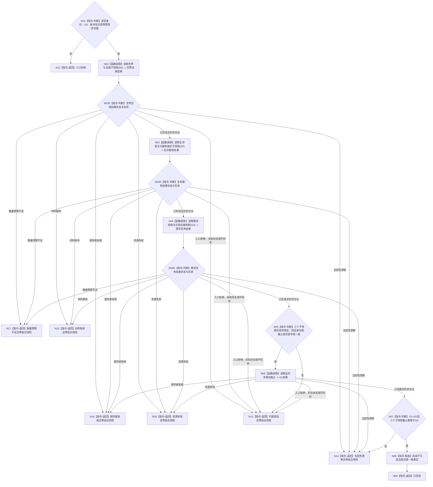

# BIZ-L2-002-02 读取自我治理一致事实目标函数流程图 v0.2

更新时间：2026-08-20

## 依据

```text
0050、3100、3200、4250、4260、5090、8100、8200
父线程函数：BIZ-L1-T02 自我线程::运行治理循环
```

## 身份与边界

本图冻结 `读取自我治理一致事实`的最终设计意图：以治理批次冻结的单一共享事实截止 `G0` 读取世界与自我、生存安全与服务维护、需求当前结构与任务后继三组完整值式材料。只有读取后共享截止 `G1`、三个已形成子快照和请求 `G0` 全部一致时，才形成自我治理一致事实。

需求子快照只提供后继治理判断所需的当前结构输入，不提前裁决活动路径、授权、权重、主需求或任务化资格。无当前根需求和需求列表项无当前任务均是合法空结构，不是材料缺失。

## 函数合同

```text
根函数：读取自我治理一致事实
归属模块 / 文件 / 层级：L2治理函数骨架 / 海中鱼巣/领域/服务.L2治理函数骨架.ixx / BIZ-L2
现有或待新增：适配扩展；本叶真实接通需求结构与任务后继子快照
完整签名：自我治理一致事实结果 读取自我治理一致事实(const 自我治理一致事实请求& 请求) noexcept
参数：唯一自我、运行代次、治理批次、读取前共享事实截止G0、完整秒边界、事实范围版本及各子快照非零预算
返回结果：已形成、材料缺失、当前性漂移、提供者拒绝、数量预算不足、资源失败、入口拒绝或内部错误；只有最终已形成携带同一G0下的三个完整子快照，所有非成功均为零组合快照
被调函数流程图：
  BIZ-L3-002-02-01 读取共享截止世界与自我快照
  BIZ-L3-002-02-02 读取生存安全与服务维护当前快照
  BIZ-L3-002-02-03 v0.2 读取需求结构与任务后继快照
  BIZ-L3-002-01-03 读取当前已发布共享事实截止
```

## 流程图



## 节点合同

| 节点 | 类型 | 参数 / 输入绑定 | 结果 / 输出绑定 | 事实读写 | 后继条件 | 验证 |
| --- | --- | --- | --- | --- | --- | --- |
| N01 | 指令-判断 | 治理批次材料、唯一自我、G0、版本和预算 | 入口准入或入口拒绝 | 无 | 全部有效才读取第一子快照 | 根数量、总需求节点数和结构深度预算均非零 |
| N02/N02R | 函数调用 / 判断 | 同一请求绑定与 G0 | 世界与自我完整值式快照或原类别非成功 | 只读正式世界与自我事实 | 只有已形成且形状合法才调用 N03 | 提供者拒绝、漂移、预算、缺失、资源和坏形状逐类短路 |
| N03/N03R | 函数调用 / 判断 | 同一请求绑定与 G0 | 生存安全与服务维护完整值式快照或原类别非成功 | 只读正式安全与服务事实 | 只有已形成且形状合法才调用 N04 | 前一子失败时零后续调用；空合同/准备组不冒充材料缺失 |
| N04/N04R | 函数调用 / 判断 | 唯一自我、同一 G0 与结构预算 | 需求结构与任务后继快照或原类别非成功 | 只读正式需求与任务后继事实 | 只有已形成且形状合法才进入组合互证 | 空根组和无任务后继均为已形成，不产生活动结论 |
| N05 | 指令-判断 | 三个已形成子快照及请求回显 | 可组合或内部错误 | 无 | 全部绑定、身份、范围和截止逐字段一致才读 G1 | 不接受部分成功，不拼接不同请求或截止的前缀 |
| N06/N07 | 函数调用 / 判断 | 运行代次、事实范围版本、G0和三个子截止 | G1结果与最终一致性结论 | 只读共享事实截止 | G1读取成功且全部截止等于 G0 才构造 | 提供者拒绝、漂移、资源和坏形状分账；任一截止不等整体漂移 |
| N08/N09 | 指令-构造 / 返回 | 三个完整同截止子快照 | 已形成及完整不可变组合快照 | 无 | 构造完整后返回 | 不保留可变服务、仓库、锁或部分前缀 |
| N12—N18 | 指令-返回 | 唯一具名非成功 | 对应状态及零组合快照 | 无 | 返回调用方 | 入口、内部、漂移、缺失、提供者拒绝、预算和资源不得互相降级 |

## 本叶施工覆盖

`RUNTIME-GOVERNANCE-DEMAND-STRUCTURE-TASK-SNAPSHOT v0.1`只获准接通本图 N04 的需求结构与任务后继子快照，并机械调整父 DTO / 调用字段。N02 世界与自我、N03 生存安全与服务维护的最终完整合同、N02R/N03R/N04R/N05 完整错误传播、N06/N07 读取后 `G1` 复核及父级“三子必须全部成功”均不由本叶声明完成，保持 `NOT_RUN`。

现行代码“至少一个子成功即可形成”的部分结果行为不是本图目标合同，也不得因本叶保留而升级为正式设计。

## 关键边界

- 本函数是读取组合，不写需求、任务、活动、权重或授权事实。
- 任一子读取非成功时不得继续调用后续子提供者；固定读取顺序为世界与自我、生存安全与服务维护、需求结构与任务后继。所有非成功均为零组合快照，提供者拒绝、当前性漂移、数量预算不足、材料缺失和资源失败保持原类别；父级入口已通过后出现子级入口拒绝、未知状态或坏形状才升级内部错误。
- “当前结构”不等于“当前活动”。活动性由 BIZ-L2-002-06 等后继治理判断产生。
- 空根需求组允许冷启动继续进入后继治理，不得因“尚无需求”制造死锁。
- 任务不存在只表示该需求列表项目标当前尚无任务承接，不表示需求无效、已满足或不可任务化。
- 当前函数没有读取后 `G1` 服务接线。本图保留 `G1` 作为正确终态设计，但本叶不以不存在的接线宣称全局返回时当前性；本叶只证明 N04 内各公开读取结果逐项绑定同一 `G0`。N02/N03 最终完整合同、N05—N07 和父级完整性收口保持 `NOT_RUN`。
- 本图替代 v0.1；v0.1 中“先读活动路径”和“活动材料缺失阻断一致事实”的语义退出。
