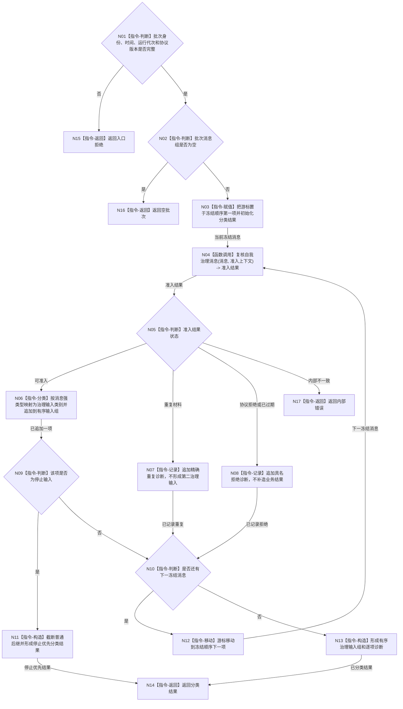

# BIZ-L2-002-03 复核并分类治理批次目标函数流程图 v0.1

更新时间：2026-08-03

## 依据

```text
4050、8100、8200
父线程函数：BIZ-L1-T02 自我线程::运行治理循环
当前代码：自我治理消息协议已提供逐消息结构复核；有界自我治理邮箱已按优先级稳定排序
```

## 身份与边界

正式目标函数设计图。根函数逐项复核冻结批次的协议、时效和路由类别，并保持邮箱冻结顺序形成有序治理输入组；它不重新排序、不读取领域正文、不提交事实。

## 函数合同

```text
根函数：复核并分类治理批次
归属模块 / 文件 / 层级：自我治理批次路由 / 海中鱼巣/线程/路由.自我治理批次.ixx / L2
现有或待新增：适配扩展；复用自我治理消息协议与邮箱稳定顺序，新增批次级分类结果
完整签名：治理批次分类结果 自我治理批次路由::复核并分类治理批次(const 治理批次分类请求& 请求) const
参数：
  请求：const 治理批次分类请求&，只读借用；必须携带不可变治理批次、当前单调时间、运行代次和协议版本
返回结果：
  治理批次分类结果；包含已分类、空批次、停止优先、存在具名拒绝或内部错误，以及保持原顺序的治理输入组、逐项准入结果和诊断材料
被调函数流程图：复核自我治理消息；现有协议函数可直接复用，不在本层复制
```

## 流程图



## 节点合同

| 节点 | 类型 | 参数 / 输入绑定 | 结果 / 输出绑定 | 事实读写 | 后继条件 | 验证 |
| --- | --- | --- | --- | --- | --- | --- |
| N04 | 函数调用 | 冻结消息、时间和幂等上下文 | 逐消息准入结果 | 无业务写入 | 准入、重复、拒绝或错误 | 协议版本、来源、时效、材料形状 |
| N06 | 指令-分类 | 已准入强类型消息 | 治理输入类别 | 无写入 | 类别唯一 | 不靠空字段或文本推断 |
| N07/N08 | 指令-记录 | 重复或拒绝结果 | 逐项诊断 | 非权威诊断 | 继续下一项 | 不形成需求 / 任务结果 |
| N09/N11 | 判断 / 构造 | 停止消息 | 停止优先分类结果 | 无业务写入 | 停止优先 | 普通输入不冒用停止优先级 |
| N10—N13 | 循环 / 构造 | 冻结顺序 | 有序治理输入组 | 无写入 | 批次穷尽 | 保持邮箱稳定顺序 |

## 关键边界

- 邮箱已经完成稳定优先级排序；本函数只保持顺序、复核并分类，绝不按另一规则再次排序。
- 协议拒绝、重复和过期属于逐项结果；只有前置成立后的协议内部矛盾才停止整个批次。
- 本函数不判断消息引用的任务、需求或事实是否真实；该职责属于 BIZ-L2-002-04。
- 停止输入只改变线程后继，不把未处理普通消息改写为业务取消或失败。

