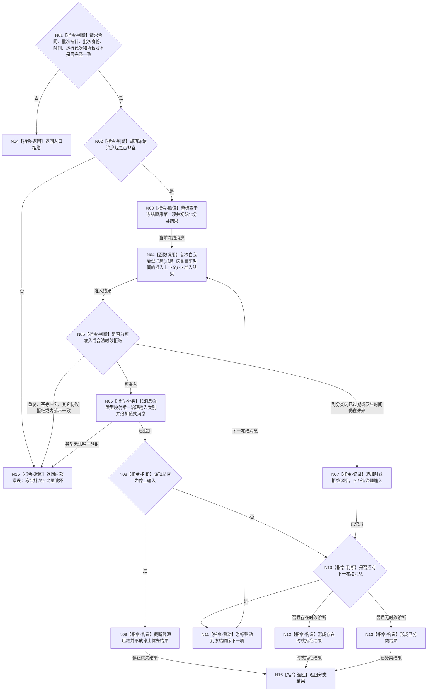

# BIZ-L2-002-03 复核并分类治理批次目标函数流程图 v0.2

更新时间：2026-08-20

替代：v0.1。v0.1 把邮箱提交阶段已经拒绝的重复材料和幂等冲突误画成冻结批次内可再次出现的普通分类分支，并保留了邮箱不能形成的空冻结批次成功语义。

## 依据

```text
4050、8100、8200
父线程函数：BIZ-L1-T02 自我线程::运行治理循环
当前代码：有界自我治理邮箱在入队前复核协议、幂等键和同任务顺序，
          只把可准入消息放入队列；冻结批次字段私有且仅邮箱可构造
被调函数图：BIZ-L3-002-03-01 复核自我治理消息 v0.1
```

## 身份与边界

正式目标函数设计图。根函数只对邮箱合法冻结批次重新检查会随时间变化的时效，保持邮箱冻结顺序完成类型分类，并执行停止优先分流；它不重新建立幂等或同任务顺序上下文，不重新排序、不读取领域正文、不提交事实。

## 函数合同

```text
根函数：复核并分类治理批次
归属模块 / 文件 / 层级：自我治理批次路由 / 海中鱼巣/线程/路由.自我治理批次.ixx / BIZ-L2
现有或待新增：适配扩展；复用自我治理消息协议与邮箱稳定顺序，新增批次级分类结果
完整签名：治理批次分类结果 自我治理批次路由::复核并分类治理批次(const 治理批次分类请求& 请求) const noexcept
参数：
  请求：const 治理批次分类请求&，只读借用且只在同步调用期间有效；
        必须携带由同一路由交付的不可变治理批次、非零当前单调时间、
        与路由和批次相同的运行代次以及当前协议版本
返回结果：
  治理批次分类结果；状态只含已分类、停止优先、存在时效拒绝、内部错误或入口拒绝；
  成功类结果值式拥有保持冻结顺序的治理输入组和仅含时效拒绝的逐项诊断
被调函数流程图：BIZ-L3-002-03-01 复核自我治理消息 v0.1；
                  本层只提供当前时间，不提供同幂等键既有消息或同任务顺序上下文
```

## 流程图



## 节点合同

| 节点 | 类型 | 参数 / 输入绑定 | 结果 / 输出绑定 | 事实读写 | 后继条件 | 验证 |
| --- | --- | --- | --- | --- | --- | --- |
| N01 | 指令-判断 | 分类请求 | 入口完整性结论 | 无 | 完整或入口拒绝 | 空指针、坏合同、坏运行代次、坏协议版本均入口拒绝 |
| N02 | 指令-判断 | 仅邮箱可构造的冻结批次 | 非空不变量 | 无 | 非空或内部错误 | 邮箱不冻结空队列；空组不是成功结果 |
| N04 | 函数调用 | 消息、当前时间；幂等和顺序上下文均为空 | 逐消息准入结果 | 无 | 可准入、时效拒绝或不变量错误 | 不在分类层重建第二套幂等 / 顺序账 |
| N05/N07 | 判断 / 记录 | 准入结果、发生时间和截止时间 | 仅时效诊断 | 非权威诊断 | 继续或内部错误 | 重复、冲突及静态协议拒绝已被邮箱排除 |
| N06 | 指令-分类 | 已准入强类型消息 | 唯一治理输入类别 | 无 | 类别唯一或内部错误 | 不靠空字段、文本或来源名称推断 |
| N08/N09 | 判断 / 构造 | 停止消息 | 停止优先结果 | 无 | 截断普通后继 | 普通输入不冒用停止优先级 |
| N10—N13 | 循环 / 构造 | 冻结顺序、时效诊断存在性 | 已分类或存在时效拒绝 | 无 | 批次穷尽 | 保持邮箱顺序；不二次排序 |
| N14—N16 | 指令-返回 | 入口或分类结果 | 具名终态 | 无业务写入 | 返回调用方 | 内部错误不得夹带部分治理输入 |

## 关键边界

- 邮箱提交是协议、幂等和同任务顺序的唯一准入点；分类层不得建立第二套既有消息上下文。
- 同键同义重复、同键异义、静态协议错误和同任务顺序错误不能通过合法邮箱进入冻结批次；若分类层观察到这些结果，属于内部不变量破坏，不是普通逐项诊断。
- 邮箱不会冻结空队列，外部也不能填写冻结批次私有字段；空冻结消息组固定为内部错误，不存在 `空批次`成功状态。
- 只有时间推进会使已入队消息在分类时转为合法时效拒绝；发生时间仍晚于当前分类时间同样按具名时效拒绝处理。
- 本函数不判断消息引用的任务、需求或事实是否真实；该职责属于 BIZ-L2-002-04。
- 停止输入只改变线程后继，不把未处理普通消息改写为业务取消或失败。
