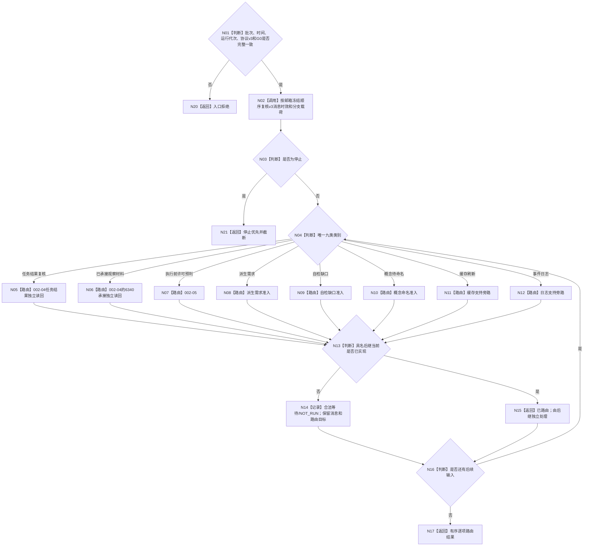

# BIZ-L2-002-03 复核并路由治理批次目标函数流程图 v0.3

更新时间：2026-08-20

## 依据与替代

依据：0050、6340、8100、8200，以及用户已裁决的 `DECISION-GOVERNANCE-INPUT-V3-IDENTITY-AND-ROUTING`。

本图替代旧 `BIZ-L2-002-03 v0.1/v0.2`。九类分类表是唯一分类表；旧 002-04 的“父链变化”“事实更新”退出，不建立猜测映射。

## 函数合同

```text
根函数：复核并路由治理批次
归属模块：海中鱼巣.线程.路由.自我治理批次
物理文件：海中鱼巣/线程/路由.自我治理批次.ixx
现状：002-03 分类已实现；v3 强类型载荷和分类后路由待适配扩展
输入：不可变治理批次、当前单调时间、运行代次、读取截止 G0
输出：稳定有序的逐项路由结果；不持有领域服务、事务或可变事实
```

`自我治理消息协议 v3` 的每个消息分支直接携带该分支所需的领域公开强类型稳定身份。来源材料版本、运行代次和读取截止 `G0` 分字段保存，不进入身份。禁止 `节点句柄{仓库编号, 节点编号, 版本号}`、句柄到稳定身份适配、双路兼容和数值推断。

## 唯一九类路由

| 002-03 类别 | 唯一后继 | 本叶行为 |
| --- | --- | --- |
| 停止 | 002-03 立即截断 | 返回停止优先，不进入普通路由 |
| 任务结果复核 | 002-04 独立事实读回 | provider 未实现时返回合法等待，不伪造可消费 |
| 观察材料准入 | 仅 6340 已正式承接材料进入 002-04 | 未携带正式承接身份或 provider 未实现时合法等待；原始观察不得进入 |
| 执行前许可预判 | 002-05 生存控制与执行许可前置 | 当前 002-05 未实现时合法等待 |
| 派生需求 | 具名派生需求准入 | 未实现时 `NOT_RUN/合法等待` |
| 自检缺口 | 具名自检缺口准入 | 未实现时 `NOT_RUN/合法等待` |
| 概念待命名 | 具名概念命名准入 | 未实现时 `NOT_RUN/合法等待` |
| 缓存刷新 | 缓存支持旁路 | 未实现时 `NOT_RUN/合法等待`，零业务写入 |
| 事件日志 | 日志支持旁路 | 未实现时 `NOT_RUN/合法等待`，零业务写入 |

## 流程图



## 完成边界

本图完成只证明 v3 消息能被唯一分类和显式定向，未实现分支不会静默消费、伪造成功或阻断同批其它类别。它不证明 002-04/05/06、任务实际结果、6340 承接、显式需求核算父链回流、任务筹办或任务执行已经实现。
