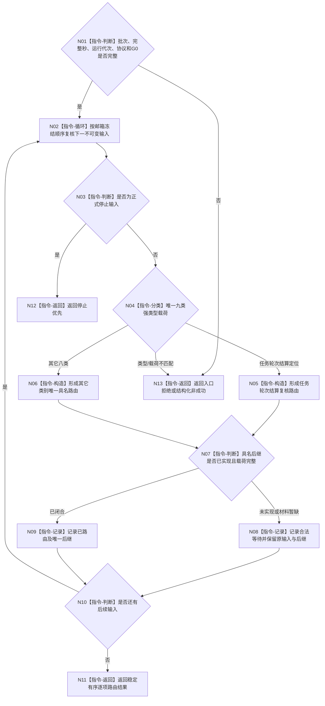

# BIZ-L2-002-03 复核并路由治理批次目标函数流程图 v0.4

更新时间：2026-08-27

## 依据与替代

```text
0050、3200 v1.0、5090 v0.7、6340、8100 v0.7、8200 v0.7
BIZ-L1-T02 v0.6、BIZ-L2-004-14 v0.2
```

本图完整替代 v0.3。v0.3仍把“任务实际结果定位”直接路由给 self；现行主链要求 T03 先完成任务轮次结算与轮次收束，再只上报显式 `T / R / 轮次结算身份 / G` 定位。self 不从当前实例方法、旧结果消息或线程序号反推轮次结算。

## 身份与边界

正式目标函数设计图。根函数只按邮箱冻结顺序复核一个不可变治理批次，把每项强类型载荷映射到唯一后继。它不二次排序、不调用领域写入口，也不把消息正文升级为机器事实。

九类路由中的第一类由“任务结果复核”替换为“任务轮次结算复核”；其余类别保持各自既有边界。停止仍唯一优先截断，普通业务项保持冻结顺序。

## 函数合同

```text
根函数：自我治理批次路由::复核并路由治理批次
归属模块 / 文件 / 目标分解深度：自我治理批次路由 / 海中鱼巣/线程/路由.自我治理批次.ixx / BIZ-L2
现有或待新增：适配现行v3路由；任务结果分支退出，增加任务轮次结算定位分支
完整签名：治理批次路由结果 自我治理批次路由::复核并路由治理批次(const 治理批次路由请求& 请求) const noexcept
参数：不可变治理批次、当前完整秒、运行代次、非零读取截止G0和协议版本
返回结果：已路由、停止优先、合法等待、入口拒绝、版本漂移、引用冲突、资源失败或内部不一致；成功携带稳定有序逐项路由结果
被调函数流程图：各消息分支只做纯值协议复核；领域后继由BIZ-L1-T02按类别另行调用
```

## 唯一九类路由

| 类别 | 唯一后继 | 禁止补位 |
| --- | --- | --- |
| 停止 | 立即截断普通路由 | 普通消息优先级、队列序号 |
| 任务轮次结算复核 | BIZ-L2-002-04 v0.4 | 任务实际结果、当前实例、线程缓存 |
| 观察材料准入 | 仅6340正式承接材料后继 | 原始观察或未承接报告 |
| 自我现实执行授权请求 | BIZ-L2-002-05 | 技术许可、调度资格或消息布尔值 |
| 派生需求 | 具名派生需求准入 | 任务缺口文本直接建需求 |
| 自检缺口 | 具名自检缺口准入 | 自检直接建修复任务 |
| 概念待命名 | 具名概念命名准入 | 名称文本代替概念身份 |
| 缓存刷新 | 缓存支持旁路 | 反写业务事实 |
| 事件日志 | 日志支持旁路 | 日志参与机器裁决 |

## 流程图



## 关键边界

- 任务轮次结算定位必须显式携带任务、任务轮次、轮次结算身份和来源截止；不再接受任务实际结果载荷进入该分支。
- 消息类别只决定后继，不证明后继已经读取、裁决或发布任何事实。
- 缓存、事件日志和停止各有专属来源；任务管理上行桥不得借本九类表发送其未生产的类别。
