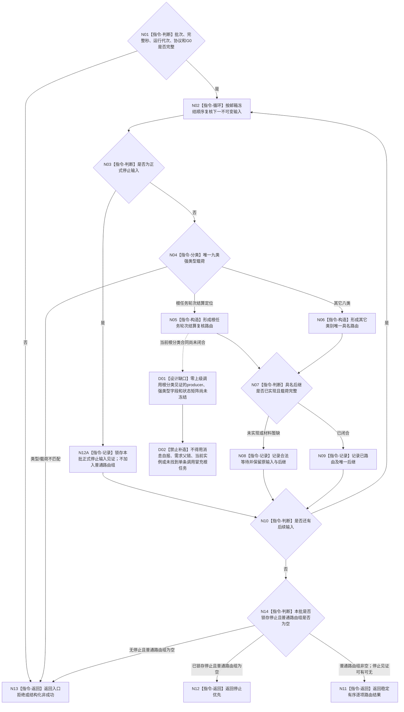

# BIZ-L2-002-03 复核并路由治理批次目标函数流程图 v0.5

更新时间：2026-08-28

## 依据与替代

```text
0050 v1.9、3200 v1.0、5090 v0.7、6340、8100 v0.7、8200 v0.7
用户冻结业务边界：恰一正式上级调用只回显式上级任务；零上级调用根任务才进入self
BIZ-L1-T02 v0.7、BIZ-L2-002-04 v0.5、BIZ-L2-004-14 v0.3
```

本图完整替代 v0.4。v0.4已经退出“任务实际结果定位”，但仍把任意任务轮次结算定位路由给 self。现行主链要求 T03 先完成任务轮次结算与轮次收束，再按正式轮次级上级调用数分流：恰一调用留在 T03 并回显式上级任务 fresh 重判；只有零调用根任务才可上报 self。self 不从当前实例方法、旧结果消息、需求父链、当前实例或“未找到一条调用”反推根分类。

## 身份与边界

正式目标函数设计图。根函数只按邮箱冻结顺序复核一个不可变治理批次，把每项强类型载荷映射到唯一后继。它不二次排序、不调用领域写入口，也不把消息正文升级为机器事实。

九类路由中的第一类限定为“根任务轮次结算复核”；原“自检缺口”类别扩正为“结构化治理缺口”，自检缺口只是其合法强类型来源之一。类别总数仍为九类。停止取得唯一优先锁存，但不得截断或丢弃同一已冻结批次中的普通业务项；普通业务项继续保持邮箱冻结顺序。

## 函数合同

```text
根函数：自我治理批次路由::复核并路由治理批次
归属模块 / 文件 / 目标分解深度：自我治理批次路由 / 海中鱼巣/线程/路由.自我治理批次.ixx / BIZ-L2
现有或待新增：适配现行v3路由；任务结果分支退出，结算分支限定为根任务轮次结算定位
完整签名：治理批次路由结果 自我治理批次路由::复核并路由治理批次(const 治理批次路由请求& 请求) const noexcept
参数：不可变治理批次、当前完整秒、运行代次、非零读取截止G0和协议版本
返回结果：已路由、停止优先、合法等待、入口拒绝、版本漂移、引用冲突、资源失败或内部不一致；已路由携带稳定有序逐项路由结果和可选停止锁存见证，停止优先只允许批次含停止且普通路由组为0项
被调函数流程图：各消息分支只做纯值协议复核；领域后继由BIZ-L1-T02按类别另行调用
```

## 唯一九类路由

| 类别 | 唯一后继 | 禁止补位 |
| --- | --- | --- |
| 停止 | 锁存停止见证；继续复核同批普通输入，批次仅含停止时才返回零路由停止优先 | 丢弃同批普通输入、普通消息优先级、队列序号 |
| 根任务轮次结算复核 | BIZ-L2-002-04 v0.5 | 子任务结算定位、任务实际结果、当前实例、需求父链、线程缓存或“未找到一条调用” |
| 观察材料准入 | 仅6340正式承接材料后继 | 原始观察或未承接报告 |
| 自我现实执行授权请求 | BIZ-L2-002-05 | 技术许可、调度资格或消息布尔值 |
| 派生需求 | 具名派生需求准入 | 任务缺口文本直接建需求 |
| 结构化治理缺口 | 按具名任务缺口、结构化事实缺口或能力缺口的强类型后继准入；自检缺口只是合法来源之一 | 裸文本、派生需求三件套或调用方概括直接建任务 |
| 概念待命名 | 具名概念命名准入 | 名称文本代替概念身份 |
| 缓存刷新 | 缓存支持旁路 | 反写业务事实 |
| 事件日志 | 日志支持旁路 | 日志参与机器裁决 |

## 流程图



## 节点合同

| 节点 | 类型 | 参数 / 输入绑定 | 结果 / 输出绑定 | 事实读写 | 后继条件 | 验证 |
| --- | --- | --- | --- | --- | --- | --- |
| N01 | 指令-判断 | 完整不可变批次、完整秒、运行代次、协议和 G0 | 入口准入或具名非成功 | 无 | 全部完整才开始按冻结顺序复核 | 空批次、错代、坏协议和零截止均不得进入循环 |
| N02/N03 | 循环 / 判断 | 下一不可变输入 | 停止输入或普通输入分流 | 只读批次值 | 停止进入 N12A，普通输入进入 N04 | 不二次排序；不得因停止忽略同批其它输入 |
| N12A | 指令-记录 | 正式停止输入 | 本批可选停止锁存见证 | 只写本次值式结果候选 | 继续 N10 处理剩余输入 | 多次停止输入必须按协议形成同义重复或具名冲突，不得覆盖首个见证 |
| N04—N06 | 指令-分类 / 构造 | 普通强类型载荷 | 九类之一的唯一普通后继路由 | 无机器事实写入 | 类型和载荷唯一匹配才进入 N07 | 结算分支只接受根任务定位；不得回退为任务结果、需求父链、消息自报或当前实例猜测；派生需求不得回退为结构化治理缺口 |
| D01/D02 | 设计缺口 / 禁止补造 | 根任务定位及其正式根分类见证 | 具名DRIFT | 无 | 目标路径仍为N05→N07；当前实现必须先闭合合同 | 当前缺口只阻断结算路由分支，不得扩大成其它八类停工，也不得临场发明根分类ABI |
| N07—N09 | 判断 / 记录 | 后继实现状态与完整载荷 | 已路由或合法等待路由项 | 只写本次值式路由组 | 每项均形成结构化路由后继续 N10 | 未实现保留原输入和具名后继，不冒充已处理 |
| N10/N14 | 判断 | 剩余输入、停止见证和普通路由组 | 继续循环、停止优先或已路由 | 无 | 处理完全部输入后按0/N普通路由分账 | 停止与普通输入共存必须返回普通路由组并保留停止见证 |
| N11/N12/N13 | 指令-返回 | 完整路由候选或具名非成功 | 已路由、停止优先或非成功 | 无 | 返回 T02 根循环 | 停止优先只允许普通路由0项；所有失败不得带部分普通路由组 |

## 关键边界

- 根任务轮次结算定位必须显式携带任务、任务轮次、轮次结算身份、来源截止和可由 `002-04` 同 G 独立互证的零上级调用根分类见证；不再接受子任务结算定位或任务实际结果载荷进入该分支。
- 派生需求三件套与结构化治理缺口是两个互斥类别。结构化治理缺口必须保留具名缺口类型、身份、影响范围、证据截止和合法后继；不得接收裸文本，也不得用它包装派生需求。
- 停止输入只取得本批停止锁存优先级，不取得销毁同批普通输入的权力。停止与普通输入共存时，结果状态仍为已路由，普通路由组保持原冻结顺序并附停止锁存见证；T02必须完成这些路由后才清槽退出。
- 消息类别只决定后继，不证明后继已经读取、裁决或发布任何事实。
- 缓存、事件日志和停止各有专属来源；任务管理上行桥不得借本九类表发送其未生产的类别。

## 设计DRIFT

`DRIFT-BIZ-ROOT-TASK-SETTLEMENT-ZERO-PARENT-CALL-PROOF-AND-SELF-SUCCESSOR-INPUT-ABI-UNFROZEN`：业务分流已经冻结，但当前正式目标合同尚未给出根分类见证的唯一 producer、强类型字段、同 G 读前后守卫、0/1/N 状态矩阵和失败收束。闭合前本函数的根任务结算分支不可施工；其它八类路由和停止守恒不受影响。
