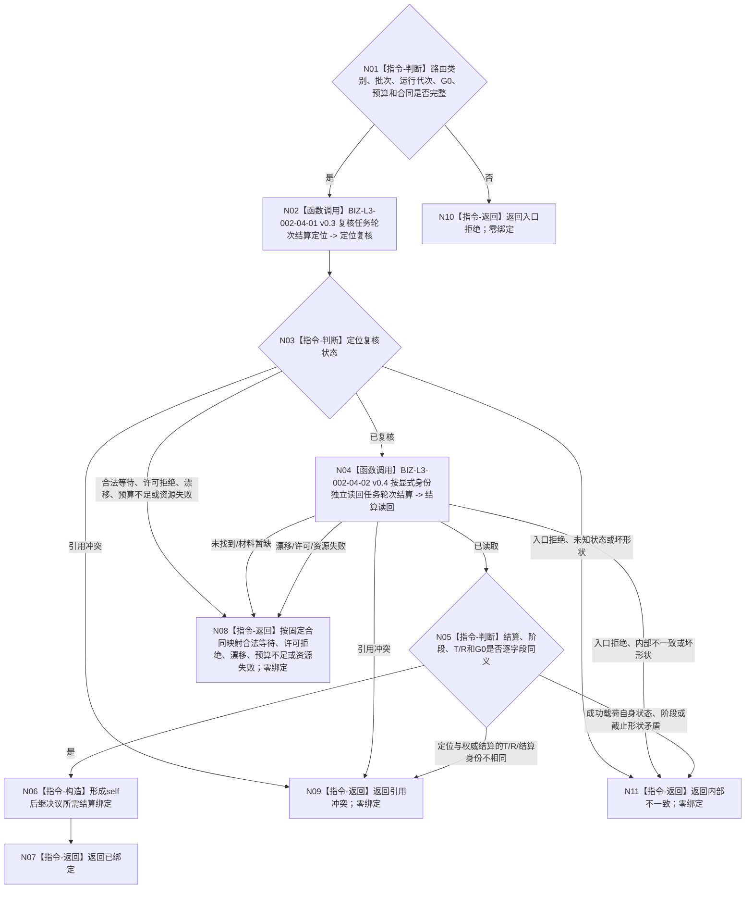

# BIZ-L2-002-04 复核任务轮次结算定位绑定事实目标函数流程图 v0.4

更新时间：2026-08-27

## 依据与替代

```text
0050、3200 v1.0、5090 v0.7、8100 v0.7、8200 v0.7
BIZ-L1-T02 v0.6、BIZ-L2-002-03 v0.4、BIZ-L2-002-09 v0.1、BIZ-L2-004-14 v0.2
```

本图完整替代 v0.3“复核任务结果治理输入绑定事实”。任务实际结果由 T03 在轮次收束前独立读回；self 只消费轮次已收束后的显式结算定位。按任务读取当前实例方法和按执行轮次重读实际结果不再属于本根。

## 身份与边界

正式目标函数设计图。根函数只处理已经由 `002-03 v0.4` 分类为任务轮次结算复核的单项输入，先纯值复核 `T / R / 轮次结算身份 / G`，再按这些显式身份独立读回首次完整轮次结算及轮次已收束阶段。成功结果只供 `002-09` 形成 self 后继决议，不写需求、任务或决议事实。

## 函数合同

```text
根函数：复核任务轮次结算定位绑定事实
归属模块 / 文件 / 目标分解深度：任务轮次结算只读绑定 / 海中鱼巣/领域/服务.L2治理函数骨架.ixx / BIZ-L2
现有或待新增：替换当前任务结果混合入口；目标名称待代码迁移
完整签名：任务轮次结算定位复核结果 复核任务轮次结算定位绑定事实(const 任务轮次结算定位复核请求& 请求) noexcept
参数：已分类任务轮次结算定位、治理批次身份、运行代次、同一非零G0、读取预算和合同版本
返回结果：已绑定、合法等待、入口/许可拒绝、当前性/版本漂移、引用冲突、数量预算不足、资源失败或内部不一致；成功携带任务、任务轮次、完整轮次结算、轮次已收束阶段和G0
被调函数流程图：BIZ-L3-002-04-01 v0.3、BIZ-L3-002-04-02 v0.4
```

## 流程图



## 节点合同

| 节点 | 类型 | 参数 / 输入绑定 | 结果 / 输出绑定 | 事实读写 | 后继条件 | 验证 |
| --- | --- | --- | --- | --- | --- | --- |
| N01 | 指令-判断 | 已分类定位、批次、运行代次、G0、预算和合同 | 入口准入或入口拒绝 | 无 | 全部有效才调用定位复核 | 错类别、零身份、零截止、坏预算和坏合同均零子调用 |
| N02/N03 | 函数调用 / 判断 | 原定位与同一批次绑定 | 纯值定位复核或具名非成功 | 无机器事实写入 | 只有已复核才进入权威读回 | 普通非成功按固定父合同映射；父入口已通过后的子入口拒绝或坏形状为内部不一致 |
| N04 | 函数调用 | 显式 T/R/轮次结算身份/G0 | 首次完整轮次结算与轮次已收束阶段或具名非成功 | 只读 task owner 正式事实 | 只有已读取且载荷完整才进入逐字段互证 | 不按任务猜轮次，不从实际结果或线程缓存补造定位 |
| N05 | 指令-判断 | 原定位、权威结算、阶段和 G0 | 同义、引用冲突或内部不一致 | 无 | 全部同义才构造绑定 | 定位对权威身份不匹配为引用冲突；成功载荷自身状态/截止矛盾为内部不一致 |
| N06/N07 | 指令-构造 / 返回 | 完整同义读回材料 | 已绑定及完整值式结算绑定 | 无 | 一次构造后返回 | 结果只供002-09形成self后继，不自证决议已发布 |
| N08—N11 | 指令-返回 | 唯一具名非成功原因 | 原类别普通非成功、引用冲突、入口拒绝或内部不一致 | 无 | 返回 T02 | 全部零绑定；四类出口不得互相降级 |

## 关键边界

- 不按任务猜当前轮次或结算身份，不读取当前实例方法，不从任务实际结果、完成消息、线程序号或缓存补造结算定位。
- 定位消息和读取成功都不等于 self 后继决议已经形成；后继只由 `002-09` 正式发布并读回。
- 任务轮次结算中的正式结果引用由 task owner 已经冻结；本根不重新解释或批量结算其它需求。
