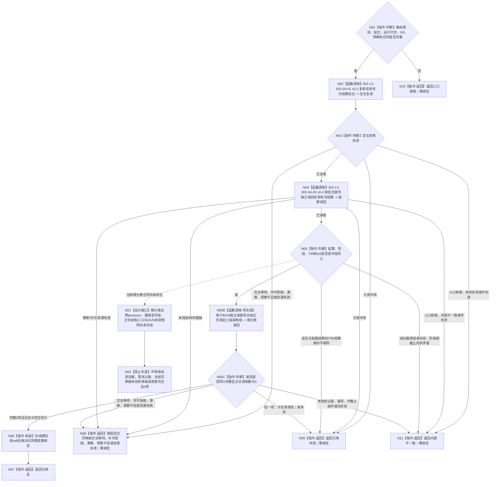

# BIZ-L2-002-04 复核任务轮次结算定位绑定事实目标函数流程图 v0.5

更新时间：2026-08-28

## 依据与替代

```text
0050 v1.9、3200 v1.0、5090 v0.7、8100 v0.7、8200 v0.7
用户冻结业务边界：恰一正式上级调用只回显式上级任务；零上级调用根任务才进入self
BIZ-L1-T02 v0.7、BIZ-L2-002-03 v0.5、BIZ-L2-002-09 v0.2、BIZ-L2-004-14 v0.2
```

本图完整替代 v0.4。v0.4 已退出任务结果混合入口，但未证明进入 self 的结算定位属于零上级调用根任务。任务实际结果由 T03 在轮次收束前独立读回；恰一正式上级调用的子任务只留在 T03 回显式上级任务，self 只消费轮次已收束且正式证明零上级调用的根任务结算定位。按任务读取当前实例方法和按执行轮次重读实际结果不再属于本根。

## 身份与边界

正式目标函数设计图。根函数只处理已经由 `002-03 v0.5` 分类为根任务轮次结算复核的单项输入，先纯值复核 `T / R / 轮次结算身份 / G / 根分类见证`，再按显式身份独立读回首次完整轮次结算、轮次已收束阶段和同 G 零上级调用证明。成功结果只供 `002-09 v0.2` 形成根任务 self 后继决议，不写需求、任务或决议事实。

## 函数合同

```text
根函数：复核任务轮次结算定位绑定事实
归属模块 / 文件 / 目标分解深度：任务轮次结算只读绑定 / 海中鱼巣/领域/服务.L2治理函数骨架.ixx / BIZ-L2
现有或待新增：替换当前任务结果混合入口；目标名称待代码迁移
完整签名：任务轮次结算定位复核结果 复核任务轮次结算定位绑定事实(const 任务轮次结算定位复核请求& 请求) noexcept
参数：已分类根任务轮次结算定位、治理批次身份、运行代次、同一非零G0、读取预算和合同版本
返回结果：已绑定、合法等待、入口/许可拒绝、当前性/版本漂移、引用冲突、数量预算不足、资源失败或内部不一致；成功携带任务、任务轮次、完整轮次结算、轮次已收束阶段、零上级调用根分类见证和G0
被调函数流程图：BIZ-L3-002-04-01 v0.3、BIZ-L3-002-04-02 v0.4；根分类证明的直接子函数/公开读取ABI仍为具名DRIFT，不伪列为已闭合子图
```

## 流程图



## 节点合同

| 节点 | 类型 | 参数 / 输入绑定 | 结果 / 输出绑定 | 事实读写 | 后继条件 | 验证 |
| --- | --- | --- | --- | --- | --- | --- |
| N01 | 指令-判断 | 已分类根任务定位、批次、运行代次、G0、预算和合同 | 入口准入或入口拒绝 | 无 | 全部有效才调用定位复核 | 错类别、零身份、零截止、坏预算和坏合同均零子调用 |
| N02/N03 | 函数调用 / 判断 | 原定位与同一批次绑定 | 纯值定位复核或具名非成功 | 无机器事实写入 | 只有已复核才进入权威读回 | 普通非成功按固定父合同映射；父入口已通过后的子入口拒绝或坏形状为内部不一致 |
| N04 | 函数调用 | 显式 T/R/轮次结算身份/G0 | 首次完整轮次结算与轮次已收束阶段或具名非成功 | 只读 task owner 正式事实 | 只有已读取且载荷完整才进入逐字段互证 | 不按任务猜轮次，不从实际结果或线程缓存补造定位 |
| N05 | 指令-判断 | 原定位、权威结算、阶段和 G0 | 同义、引用冲突或内部不一致 | 无 | 全部同义才进入根分类读回 | 定位对权威身份不匹配为引用冲突；成功载荷自身状态/截止矛盾为内部不一致 |
| N05B/N05C/D01/D02 | 待读取 / 判断 / 设计缺口 | T/R/G0与根分类见证 | 正式0项根证明、子任务误投、引用冲突或具名DRIFT | 目标为只读task owner正式调用事实；当前零写 | 仅完整0项进入N06 | 0项必须有完整枚举见证；1项不得进入self；N项大于1为冲突；合同未冻结时零调用 |
| N06/N07 | 指令-构造 / 返回 | 完整同义结算、阶段和零上级调用证明 | 已绑定及完整值式根任务结算绑定 | 无 | 一次构造后返回 | 结果只供002-09形成根任务self后继，不自证决议已发布 |
| N08—N11 | 指令-返回 | 唯一具名非成功原因 | 原类别普通非成功、引用冲突、入口拒绝或内部不一致 | 无 | 返回 T02 | 全部零绑定；四类出口不得互相降级 |

## 关键边界

- 不按任务猜当前轮次或结算身份，不读取当前实例方法，不从任务实际结果、完成消息、线程序号或缓存补造结算定位。
- “未找到一条上级调用”不是合法0项证明。成功必须由同G正式读取覆盖完整调用宇宙并证明0项；恰一项说明子任务误投，多项为引用冲突。
- 定位消息和读取成功都不等于 self 后继决议已经形成；后继只由 `002-09` 正式发布并读回。
- 任务轮次结算中的正式结果引用由 task owner 已经冻结；本根不重新解释或批量结算其它需求。

## 设计DRIFT

`DRIFT-BIZ-ROOT-TASK-SETTLEMENT-ZERO-PARENT-CALL-PROOF-AND-SELF-SUCCESSOR-INPUT-ABI-UNFROZEN`：0050 v1.9 已冻结业务分流，但当前正式目标合同没有冻结根分类证明的唯一 producer、强类型载荷、同 G 完整读取入口、合法0项见证、0/1/N矩阵及失败收束。D01闭合前，本函数不得返回“已绑定”，也不得据此调用002-09；结算和阶段的既有显式读回目标不回退。
