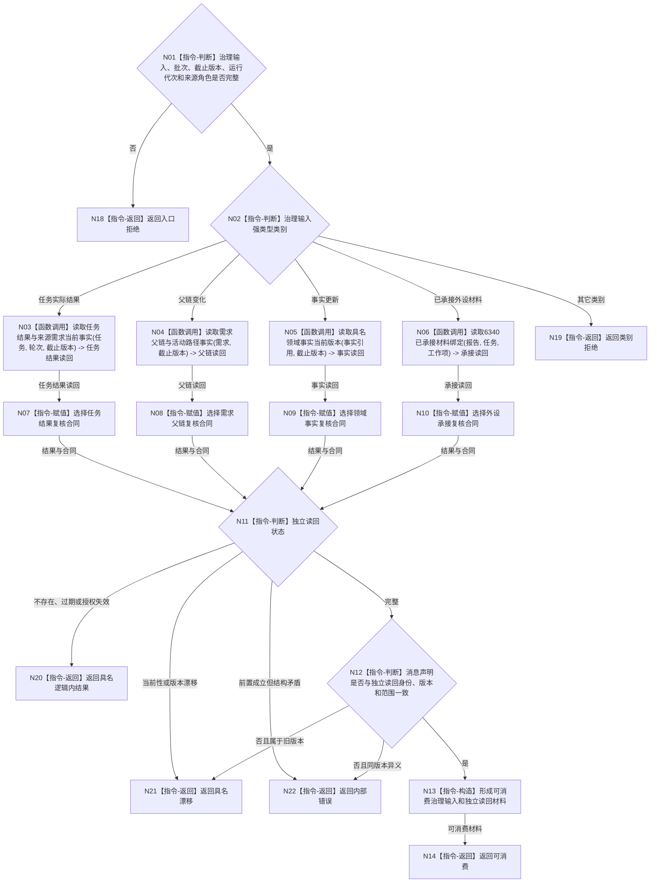

# BIZ-L2-002-04 复核治理输入绑定事实目标函数流程图 v0.1

更新时间：2026-08-03

## 依据

```text
4050、5090、8100、8200、8210
父线程函数：BIZ-L1-T02 自我线程::运行治理循环
当前代码：自我治理领域路由已对固定根需求消息执行协议和部分领域材料复核，尚未覆盖目标治理输入全集
```

## 身份与边界

正式目标函数设计图。根函数按治理输入种类从正式所有者独立读回绑定事实，裁决其是否仍可在本批消费；消息只用于定位，不能自证事实。

## 函数合同

```text
根函数：复核治理输入绑定事实
归属模块 / 文件 / 层级：自我治理领域路由 / 海中鱼巣/线程/自我治理领域路由.ixx / L2
现有或待新增：适配扩展；复用现有协议复核和固定根需求读回，扩展任务结果、父链变化、事实更新和已承接材料分支
完整签名：治理输入事实复核结果 自我治理领域路由::复核治理输入绑定事实(const 治理输入事实复核请求& 请求) const
参数：
  请求：const 治理输入事实复核请求&，只读借用；必须携带已分类治理输入、治理批次、事实截止版本、运行代次和期望来源角色
返回结果：
  治理输入事实复核结果；包含可消费、精确重复、已过期、合法等待、材料缺失、授权失效、当前性漂移、版本漂移、入口拒绝或内部错误，以及独立读回材料和来源版本
被调函数流程图：按治理输入类型读取任务结果、需求父链、世界事实或已承接外设材料；进入 L3 时按正式所有者分别展开
```

## 流程图



## 节点合同

| 节点 | 类型 | 参数 / 输入绑定 | 结果 / 输出绑定 | 事实读写 | 后继条件 | 验证 |
| --- | --- | --- | --- | --- | --- | --- |
| N03 | 函数调用 | 任务、轮次、截止版本 | 正式任务结果、独立实际读回和来源需求当前结算前事实 | 只读任务 / 需求事实 | 具名状态 | 回执不自证结果；不预读或推导需求满足结论 |
| N04 | 函数调用 | 需求、截止版本 | 父链与活动路径 | 只读需求事实 | 具名状态 | 历史子项不冒充活动项 |
| N05 | 函数调用 | 具名事实引用、截止版本 | 当前领域事实 | 只读对应所有者 | 具名状态 | 不使用通用缓存兜底 |
| N06 | 函数调用 | 报告、任务、工作项 | 已承接材料绑定 | 只读 6340 承接事实 | 具名状态 | 一次承接、时效和任务绑定 |
| N11/N12 | 判断 | 独立读回与消息声明 | 可消费、漂移或错误 | 无写入 | 身份和版本一致 | 同版本异义追根因 |

## 关键边界

- 消息、回执、日志和材料摘要都不能证明绑定事实成立；必须从各正式所有者读回。
- 外设报告只复核 6340 已承接绑定，不把报告解释成世界事实。
- 本函数全程只读，不更新需求活动集、不提交任务状态、不执行结算。
- 同一治理输入在本批读回后发生的新版本只影响下一批；不得把多个版本拼成一个可消费输入。
- 任务结果分支只读取来源需求当前生命周期、目标合同和结算前事实；需求满足必须由后继需求结算入口重新比较并正式发布。
