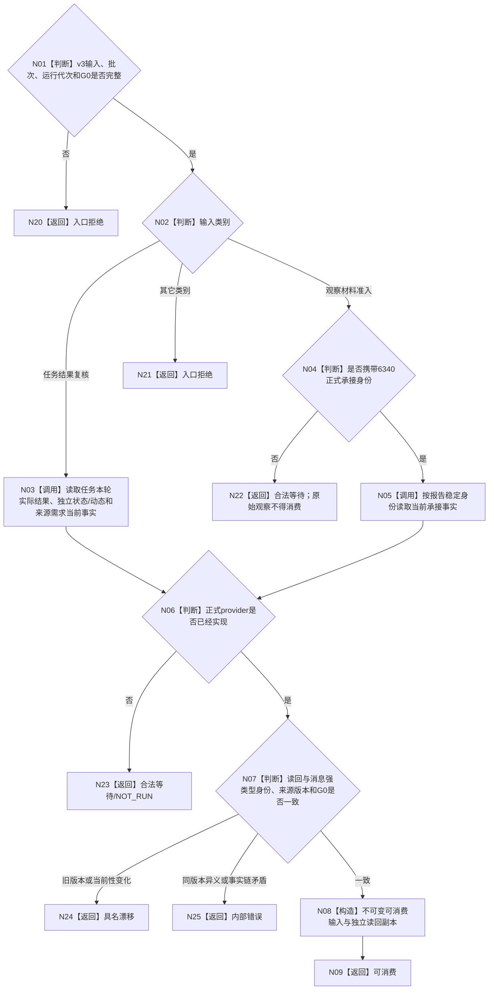

# BIZ-L2-002-04 复核治理输入绑定事实目标函数流程图 v0.2

更新时间：2026-08-20

## 依据与替代

依据：0050、6340、8100、8200，以及 `DECISION-GOVERNANCE-INPUT-V3-IDENTITY-AND-ROUTING`。

本图替代 v0.1。002-04 只接受 002-03 唯一九类表中的两个分支：`任务结果复核`与`观察材料准入`。旧“父链变化”“事实更新”直接退出；不建立映射、兼容或兜底。

## 函数合同

```text
根函数：复核治理输入绑定事实
归属：DATA 之外的治理业务只读组合器
目标物理文件：海中鱼巣/领域/服务.L2治理函数骨架.ixx（先替换既有骨架合同）
输入：一个已分类 v3 治理输入、批次身份、运行代次、读取截止 G0
输出：可消费、合法等待、当前性漂移、版本漂移、入口拒绝或内部错误；成功携带独立读回副本
```

## 流程图



## 后继限制

- 只有任务结果经 002-04 返回 `已验真`，才允许把它作为治理唤醒线索触发 002-06 需求父链与活动集重判；该结果不得直接发布需求满足，也不得作为可分配或可消费资源。
- 已承接观察材料经 002-04 可消费，只证明绑定仍当前；它仍不自动形成世界事实或触发需求活动重判。
- 本函数全程只读。provider 未实现是合法等待，不得用消息、日志、摘要、默认值或 legacy 句柄补造事实。
- 本首叶只冻结并接通请求与路由合同；任务结果事实模型和 6340 承接 provider 是不同 owner 的直接后继缺口。
