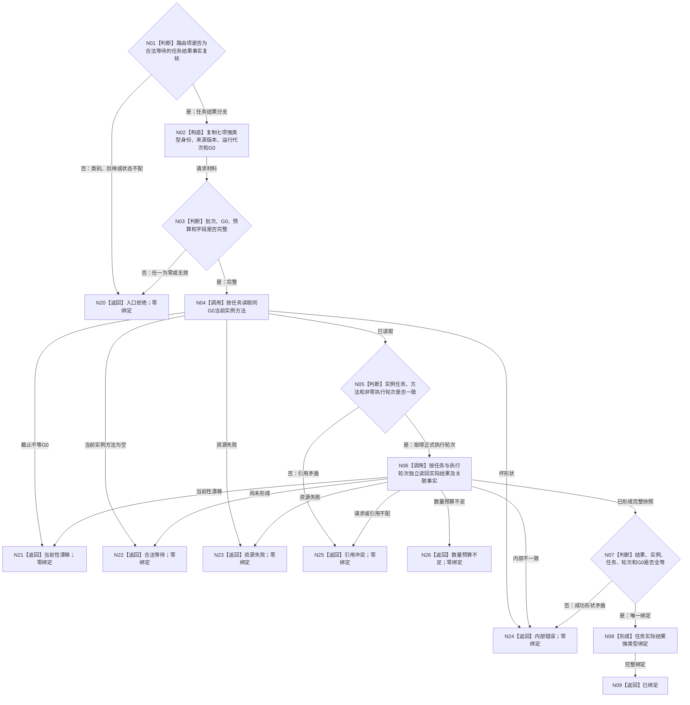

# BIZ-L2-002-04 复核治理输入绑定事实目标函数流程图 v0.3

更新时间：2026-08-21

## 依据与替代

依据：0050、8100、8200、治理输入强类型协议与唯一路由正式结果、任务实际结果事实与独立读回提供者正式结果，以及同名详细设计 v0.1。

本图替代 v0.2。本版只激活任务结果复核分支到任务实际结果身份的绑定；观察材料准入仍合法等待，002-05 及以后不推进。

## 函数合同

```text
唯一公开入口：复核任务结果治理输入绑定事实
输入：一个已分类并路由的任务结果治理输入、治理批次身份、需求成员预算
执行轮次来源：同 G0 当前实例方法公开读取结果
输出：已绑定或具名非成功；成功携带任务、实例方法、执行轮次、任务实际结果身份和事实截止
```

## 流程图



## 强制边界

- 来源任务序号只参与消息顺序，不进入执行轮次选择。
- 不从日志、摘要、默认值或消息编号推导执行轮次或任务实际结果身份。
- 本函数全程只读；成功也不触发需求重判或推进治理批次成功游标。
