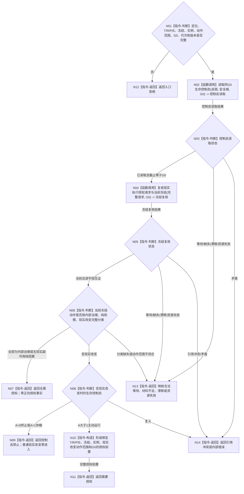

# BIZ-L2-002-05 裁决生存控制与现实执行授权前置目标函数流程图 v0.2

更新时间：2026-08-26

## 依据

```text
0050、5090、5230、6120、6170、8100、8200
父线程函数：BIZ-L1-T02 v0.5 自我线程::运行治理循环
替代关系：v0.2 正式替代“生存控制输入 / 旧工作项许可”v0.1
```

## 身份与边界

正式目标函数设计图。根函数只消费任务管理线程上行的强类型现实执行授权请求定位，在同一 `G0` 读取生存控制态、任务当前执行冻结和当前实例方法，逐字段互证请求后裁决“无需授权、需要自我现实执行授权或控制态禁止”。它不发布授权，不计算正常调度资格，不读取技术许可或安全硬否决，也不建立工作项占用、旧许可账或通用执行令牌。

程序停止、终止态恢复 / 重建和休眠态唤醒继续走各自具名最小入口；本函数不得从现实执行授权请求猜测这些系统控制身份。

## 函数合同

```text
根函数：裁决生存控制与现实执行授权前置
归属模块 / 文件 / 目标分解深度：自我治理裁决组合 / 海中鱼巣/领域/组合.自我治理裁决.ixx / BIZ-L2
现有或待新增：待新增；当前已发布骨架仍是旧“裁决生存控制输入”材料缺失占位，不能视为本合同实现
完整签名：现实执行授权前置裁决结果 自我治理裁决组合器::裁决生存控制与现实执行授权前置(const 现实执行授权前置裁决请求& 请求) const noexcept
参数：`请求`，类型 `const 现实执行授权前置裁决请求&`，输入、只读借用且仅在调用期间有效；字段为强类型授权请求定位、唯一自我、任务、任务轮次、筹办轮次、执行轮次、执行绑定冻结材料身份、实例方法身份、完整有序冻结动作范围、G0、运行代次及合同 / 规则版本；任一身份 / 轮次 / G0 / 版本为零、动作范围不完整或非规范顺序均非法
返回结果：`现实执行授权前置裁决结果`，按值交给调用方；无需授权、需要授权、控制态禁止、合法等待、材料不足、当前性漂移、引用冲突、资源失败、入口拒绝或内部错误；成功载荷携带同G0控制态、当前冻结 / 实例互证和规范化现实改变动作范围，非成功零成功载荷
被调函数流程图：BIZ-L3-002-05-01 v0.2 读取同G0生存控制态；BIZ-L3-002-05-02 v0.2 复核现实执行授权请求与当前冻结
```

## 流程图



## 节点合同

| 节点 | 输入 | 输出 | 事实读写 | 验证 |
| --- | --- | --- | --- | --- |
| N02/N03 | 自我、安全根、G0和规则版本 | 由A唯一派生的同G0控制态 | 只经具名领域服务读取6170正式事实 | 不接受调用方声明控制态 |
| N04/N05 | 强类型授权请求与G0 | 当前选择、冻结和实例方法互证 | 只经任务owner领域服务读取当前事实 | T/R/P/E、冻结、实例、动作范围和截止逐字段一致 |
| N06—N11 | 已互证冻结和控制态 | 无需授权、控制态禁止或需要授权 | 无写入 | 内部治理 / 纯观察零授权；现实改变只有A大于1进入授权发布 |
| N12—N14 | 非成功来源 | 结构化非成功 | 无写入 | 非成功零授权载荷 |

## 关键边界

- `A=0/1` 的具名恢复、重建、停止、请求接收、合同准入、完整秒维护和安全事实接收不是普通现实执行授权请求；不得在这里按名称猜测放行。
- 调度配额 / 资格只决定普通任务是否参加派发竞争，不是正向授权；本函数不接收或形成调度许可。
- 安全硬否决和技术许可在动作开始前 fresh 门控中独立裁决；它们不得写进自我授权前置，也不得由“需要授权”结果替代。
- 本函数不持久化控制态，不创建工作项占用或许可账，不消费任何一次性令牌。
