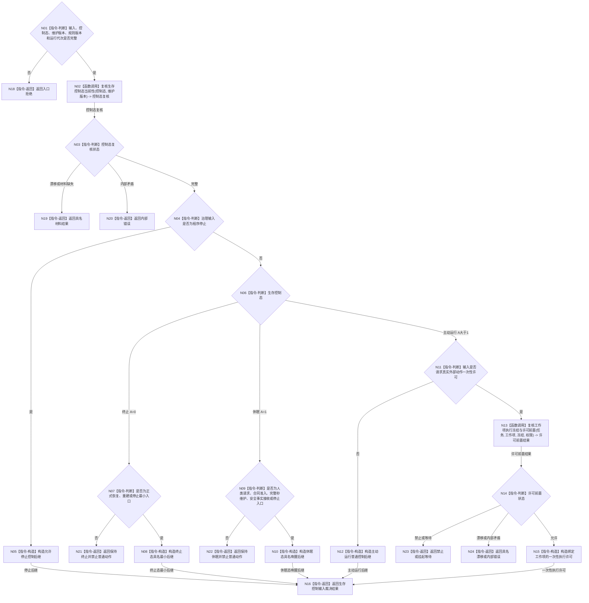

# BIZ-L2-002-05 裁决生存控制输入目标函数流程图 v0.1

更新时间：2026-08-03

## 依据

```text
6120、6170、8100、8200
父线程函数：BIZ-L1-T02 自我线程::运行治理循环
当前代码：现有自我治理消息协议只验证许可预判材料形状，尚无完整生存控制输入裁决入口
```

## 身份与边界

正式目标函数设计图。根函数根据已发布生存控制态裁决停止、终止、休眠、唤醒和一次性执行许可输入；只形成值式裁决，不直接改变安全值、服务值、任务或线程状态。

## 函数合同

```text
根函数：裁决生存控制输入
归属模块 / 文件 / 层级：自我治理裁决 / 海中鱼巣/领域/服务.自我治理裁决.ixx / L2
现有或待新增：待新增；复用 6170 值式生存控制态和现有许可预判消息材料
完整签名：生存控制输入裁决结果 自我治理裁决服务::裁决生存控制输入(const 生存控制输入裁决请求& 请求) const
参数：
  请求：const 生存控制输入裁决请求&，只读借用；必须携带治理输入、生存控制态、安全 / 服务维护版本、任务 / 工作项、执行冻结、当前权限和规则版本
返回结果：
  生存控制输入裁决结果；包含允许停止、保持终止、保持休眠、准入唤醒最小入口、允许一次性执行、禁止、挂起等待、材料缺失、版本漂移、入口拒绝或内部错误，以及不可变控制后继或许可材料
被调函数流程图：复核生存控制态当前性、复核工作项执行冻结与许可前置；进入 L3 时分别展开
```

## 流程图



## 节点合同

| 节点 | 类型 | 参数 / 输入绑定 | 结果 / 输出绑定 | 事实读写 | 后继条件 | 验证 |
| --- | --- | --- | --- | --- | --- | --- |
| N02 | 函数调用 | 控制态与维护版本 | 当前控制态复核 | 只读 6170 已发布结果 | 完整或具名返回 | A=0/1/>1 和版本 |
| N07/N09 | 指令-判断 | 输入类别和控制态 | 最小入口准入 | 无写入 | 准入或拒绝 | 终止 / 休眠入口白名单 |
| N13 | 函数调用 | 任务、工作项、冻结和权限 | 许可前置结果 | 只读任务 / 方法 / 权限 | 允许、禁止、等待或错误 | 工作项唯一、冻结当前、权限正值 |
| N15 | 指令-构造 | 完整许可前置 | 一次性执行许可 | 无业务写入 | 绑定当前工作项 | 不替代任务授权或执行冻结 |

## 关键边界

- `A=0` 不能由服务值或普通消息被动唤醒；`A=1` 只开放正式人类需求及 6170 允许的最小入口。
- 一次性许可只决定具名外部动作工作项能否开始，不裁决筹办、任务完成、需求满足或价值结算。
- 本函数不修改线程停止标志；程序宿主和线程入口消费值式控制后继后各自执行生命周期动作。
- 线程数量、任务积压和队列等待不得参与控制态或许可数值。

