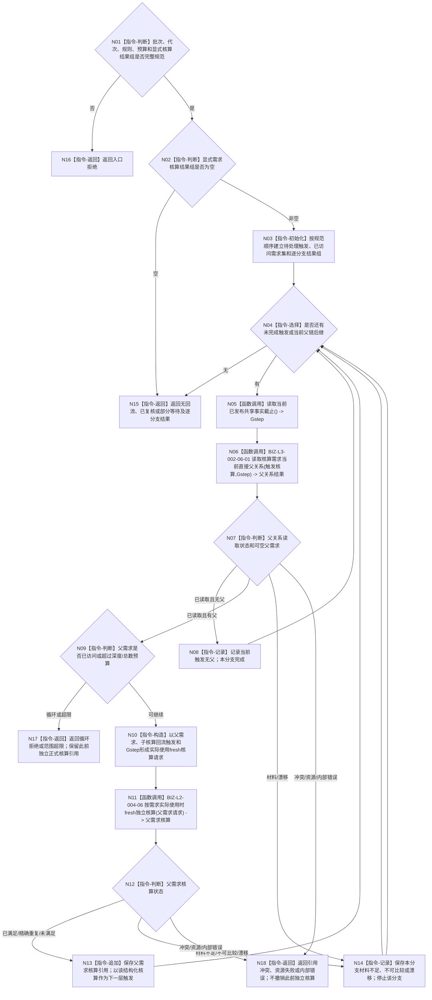

# BIZ-L2-002-06 按显式需求核算结果回流复核父需求目标函数流程图 v0.2

更新时间：2026-08-26

## 依据与替代

```text
0050、3100、5090 v0.8、5110、5160 v0.5、8100、8200
BIZ-L1-T02 v0.6；BIZ-L2-004-06 v0.2；BIZ-L3-002-06-01 v0.2
```

本图替代 v0.1。旧图从任意治理批次结果推导“受影响需求闭包”，并试图一次发布整棵活动集、权重和父目标结论；这会把任务结果、需求实际使用和需求树治理混成一个批量结算事务。当前边界是：只有本批已经完成的显式需求核算结果能够触发父需求回流；每个父需求仍以自己的目标合同和 fresh 当前事实独立核算。

## 身份与边界

正式目标函数设计图。函数按规范顺序处理零至多个显式需求核算结果，沿当前唯一直接父关系逐级复核。子需求结果只是父需求“现在需要实际使用当前事实”的强类型触发，不是父需求满足证据；父需求是否满足只能复用 BIZ-L2-004-06 fresh 核算。

每一级在紧邻读取前取得新的当前事实截止 `Gstep`。一个父需求已经形成满足、精确重复或未满足结构化核算后，才可作为下一层回流触发；材料不足、不可比较或漂移只停止该分支。不同分支已经形成的正式需求核算彼此独立，不因后续分支失败撤销。

## 函数合同

```text
根函数：按显式需求核算结果回流复核父需求
归属模块 / 文件 / 目标分解深度：需求父链回流组合 / 海中鱼巣/领域/组合.需求父链回流.ixx / BIZ-L2
现有或待新增：待新增；复用当前直接父关系读取和需求实际使用时fresh独立核算，不建立活动集事务
完整签名：需求父链回流复核结果 需求父链回流组合器::按显式需求核算结果回流复核父需求(const 需求父链回流复核请求& 请求) const noexcept
参数：`请求`为只读借用；含运行代次、治理批次身份、按需求身份/核算身份规范有序且无重复的 `std::vector<需求独立核算结果>` 显式需求核算结果组、需求树/父关系/读取/核算规则版本、最大回流深度和最大处理需求数；结果组允许显式为空，零版本、零预算、坏结果形状或非规范顺序非法
返回结果：按值返回 `需求父链回流复核结果`；含无回流、已复核、部分等待、入口拒绝、循环拒绝、范围超限、材料不足、当前性/版本漂移、引用冲突、资源失败或内部错误，以及逐触发需求的父链复核结果组；已发布的父需求核算只保存强类型引用，不复制结算正文
被调函数流程图：BIZ-L3-002-06-01 v0.2 读取核算需求当前直接父关系；BIZ-L2-004-06 v0.2 按需求实际使用时fresh独立核算
线程归属：T02只组合值式结果和调用具名需求服务；不取得任务、需求结构、结算、权重或活动资格第二写入权
```

## 流程图



## 节点合同

| 节点 | 类型 | 参数 / 输入绑定 | 结果 / 输出绑定 | 事实读写 | 后继条件 | 验证 |
| --- | --- | --- | --- | --- | --- | --- |
| N01—N04 | 判断 / 初始化 / 选择 | 本批显式需求核算结果组 | 稳定待处理触发 | 无领域写入 | 空、下一项或完成 | 只接收实际使用核算结果，不解析任意批次 variant |
| N05/N06 | 函数调用 | 当前触发需求和紧邻 `Gstep` | 可空唯一当前父需求 | 只经具名事实截止与需求领域服务读取 | 无父、有父或具名非成功 | 不从任务结果、需求列表、缓存或历史关系猜父 |
| N09/N10 | 判断 / 构造 | 当前父关系和回流触发 | 父需求实际使用请求 | 无写入 | 可调用或结构拒绝 | 每级新截止、全局去重、深度/数量有界 |
| N11—N14 | 函数调用 / 判断 / 追加 / 记录 | 父需求自己的目标与 fresh 当前事实 | 独立父需求核算或分支停止 | 仅 BIZ-L2-004-06 经需求 owner 按自身合同写入 | 向上继续、停止分支或终止 | 子结论不替代父目标比较；未满足也可作为上一级显式回流触发 |
| N15—N18 | 返回 | 全部分支结果 | 结构化根结果 | 无额外写入 | 返回 T02 | 独立已发布结果不跨需求回滚 |

## 关键边界

- 任务实际结果、`T→D` 关系组、队列、线程缓存和服务结算结果都不能自动扩张为“受影响需求集合”。
- 一个明确子任务调用槽的返回由 task owner 即时结算；本函数只处理需求树中显式需求核算结果的父需求回流，两者不能互相猜测。
- 不建立需求活动集、路径权重、预算份额或结算结论的一次性跨需求事务。活动资格和权重在真正选择 / 承接 / 筹办时按当前路径 fresh 投影。
- 其它关联、受益或同目标需求仍只在自身实际使用时调用 BIZ-L2-004-06；本函数不得批量替它们结算。
- 父需求满足、任务轮次收束、调用槽结算、价值、预算、奖励和归因继续由各自 owner 分账。

## 当前代码实现对照

- HEAD 已有 `L2需求结构服务::按子需求读取当前父需求` 及当前事实代次读取，可作为 BIZ-L3-002-06-01 的 DATA 基础。
- HEAD 尚无 `组合.需求父链回流.ixx`、显式需求核算回流组合器或 BIZ-L2-004-06 v0.2 生产实现，因此本图不声明代码闭环。
- 当前代码和已发布基线均无旧图所设想的“需求活动重判四参与者事务”；该缺失不应通过新增第二活动权威来填补。
