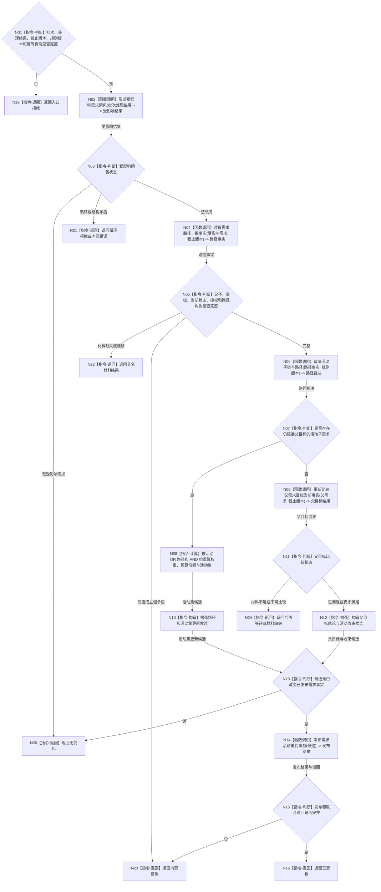

# BIZ-L2-002-06 重判需求父链与活动集目标函数流程图 v0.1

更新时间：2026-08-03

## 依据

```text
3100、5100、5110、5120、5160、8100、8200
父线程函数：BIZ-L1-T02 自我线程::运行治理循环
当前代码：需求业务服务已有需求读取、父关系更新和正式结算相邻能力；缺完整受影响集、活动路径和父链重判入口
```

## 身份与边界

正式目标函数设计图。根函数由需求领域唯一重判本批受影响需求的活动子链、OR / AND 路径和父目标当前状态；任务结果只提供证据，任务管理线程不写需求树。

## 函数合同

```text
根函数：重判需求父链与活动集
归属模块 / 文件 / 层级：需求领域服务 / 海中鱼巣/领域/服务.需求.ixx / L2
现有或待新增：适配扩展；复用需求读取、父子关系和正式结算能力，新增批次级受影响闭包与活动集事务
完整签名：需求父链重判结果 需求业务服务::重判需求父链与活动集(const 需求父链重判请求& 请求)
参数：
  请求：const 需求父链重判请求&，只读借用；必须携带唯一自我、治理批次、批次处理结果、事实截止版本、需求树版本、路径规则版本和幂等身份
返回结果：
  需求父链重判结果；包含无变化、已更新、合法等待、材料缺失、循环拒绝、当前性漂移、版本漂移、入口拒绝或内部错误，以及受影响需求、活动路径、父目标比较和发布版本
被调函数流程图：形成受影响需求闭包、读取需求路径一致事实、裁决活动子链与路径、发布需求活动重判事务；进入 L3 时分别展开
```

## 流程图



## 节点合同

| 节点 | 类型 | 参数 / 输入绑定 | 结果 / 输出绑定 | 事实读写 | 后继条件 | 验证 |
| --- | --- | --- | --- | --- | --- | --- |
| N02 | 函数调用 | 批次处理结果 | 受影响需求及祖先闭包 | 只读来源引用 | 空、闭合或错误 | 去重、循环和范围上限 |
| N04 | 函数调用 | 受影响需求、截止版本 | 需求路径一致事实 | 只读需求事实 | 完整或具名返回 | 历史 / 当前隔离 |
| N06 | 函数调用 | 路径事实和规则版本 | 活动子链与路径裁决 | 无写入 | 有阻塞或无阻塞 | 角色不由拓扑单独决定 |
| N08 | 指令-计算 | 父权重、活动 OR / AND | 权重和预算份额 | 无写入 | checked 计算成功 | OR 不平分、AND 组内分配 |
| N09 | 函数调用 | 父目标与当前事实 | 目标比较结果 | 只读目标事实 | 具名比较状态 | 子完成不等于父满足 |
| N14/N15 | 函数调用 / 判断 | 完整候选和幂等身份 | 发布结果与权威读回 | 需求领域事务 | 全确认或内部错误 | 无半活动集、同义幂等 |

## 关键边界

- 子任务或子需求结束只触发父目标重判，不能直接写父需求已满足。
- 活动直接子需求必须当前、未收束、未取消且仍阻塞父目标；历史子项不继续占用活动集。
- 需求领域是唯一写入者；任务管理、自我线程和工作线程只提交证据或调用本入口。
- 无变化不发布假更新；需求权重、任务基础优先级、安全权限和结算预算保持分账。
