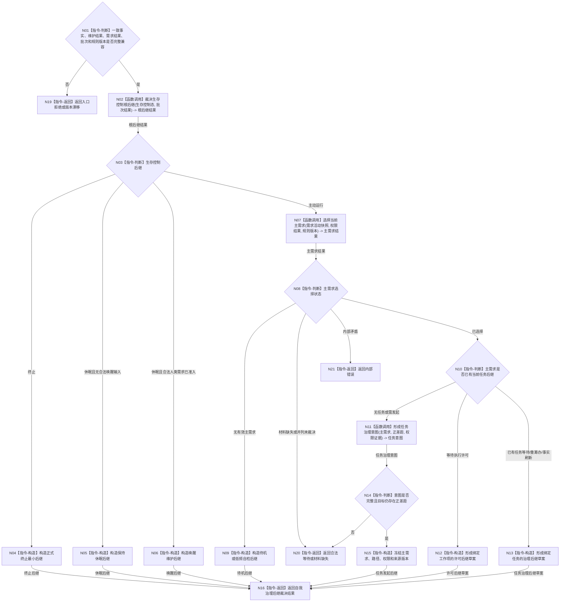

# BIZ-L2-002-07 裁决主需求与生存控制后继目标函数流程图 v0.1

更新时间：2026-08-03

## 依据

```text
5090、5110、6140—6170、8100、8200
父线程函数：BIZ-L1-T02 自我线程::运行治理循环
当前代码：现有自我治理领域路由仅覆盖固定安全 / 服务根需求串联，尚无通用主需求与生存控制后继裁决
```

## 身份与边界

正式目标函数设计图。根函数从一致事实、维护结果、需求重判和正差距结果中选择本轮唯一治理后继；只形成意图、许可或待机控制材料，不创建需求、任务或方法。

## 函数合同

```text
根函数：裁决主需求与生存控制后继
归属模块 / 文件 / 层级：自我治理裁决 / 海中鱼巣/领域/服务.自我治理裁决.ixx / L2
现有或待新增：待新增；可组合现有固定根需求治理结果，但不得沿用固定名称或旧线程状态裁决
完整签名：自我治理后继裁决结果 自我治理裁决服务::裁决主需求与生存控制后继(const 自我治理后继裁决请求& 请求) const
参数：
  请求：const 自我治理后继裁决请求&，只读借用；必须携带一致事实、安全 / 服务维护结果、权限结果、需求父链重判、正差距结果、治理批次、规则版本和当前时间
返回结果：
  自我治理后继裁决结果；包含任务治理意图、执行许可后继、终止、休眠、唤醒、待机、合法等待、材料缺失、版本漂移、入口拒绝或内部错误，以及主需求、来源路径、权限证据和不可变后继草案
被调函数流程图：裁决生存控制根后继、选择当前主需求、形成任务治理意图；进入 L3 时分别展开
```

## 流程图



## 节点合同

| 节点 | 类型 | 参数 / 输入绑定 | 结果 / 输出绑定 | 事实读写 | 后继条件 | 验证 |
| --- | --- | --- | --- | --- | --- | --- |
| N02 | 函数调用 | 已发布控制态和批次结果 | 终止 / 休眠 / 唤醒 / 主动运行 | 只读 | 根后继唯一 | A=0/1/>1 |
| N07 | 函数调用 | 活动需求、权重、权限和规则版本 | 主需求结果 | 只读需求事实 | 无、等待、错误或唯一选择 | 不按名称、线程或队列压力选择 |
| N10 | 指令-判断 | 主需求当前任务后继 | 发起、许可或已有任务后继 | 无写入 | 分支互斥 | 唯一当前任务树 |
| N11 | 函数调用 | 主需求、正差距和权限证据 | 任务治理意图 | 无业务写入 | 完整或具名缺口 | 不直接创建任务 |
| N15 | 指令-构造 | 选择和来源版本 | 不可变后继 | 无写入 | 材料完整 | 迟到事实进入下一批 |

## 关键边界

- 生存控制态先于主需求选择；终止和休眠门禁不能被高权重、任务积压或线程空闲绕过。
- 主需求选择必须调用正式需求权重和权限比较合同；本函数不在图内发明第二套总分算法。
- “没有主需求”形成待机或低频自检后继，不自动建立修复需求、学习需求或空任务。
- 输出只是不可变治理后继草案；需求、任务和许可分别由其正式入口继续裁决。
