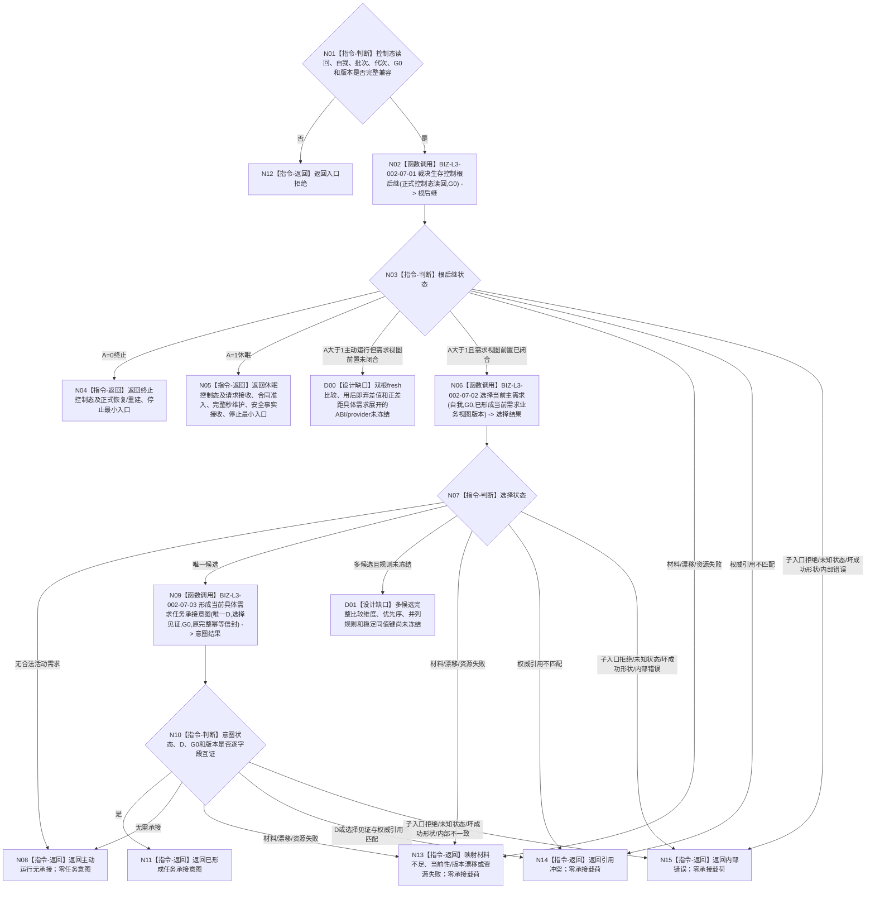

# BIZ-L2-002-07 裁决生存控制与当前具体需求承接后继目标函数流程图 v0.2

更新时间：2026-08-26

## 依据与替代

```text
0050 v2.1、3100 v0.9、5090 v0.7、5110 v0.4、6120 v0.8、6130 v0.7、6170 v0.3、8100 v1.1、8200 v0.7、8300 v1.0
BIZ-L1-T02 v0.7；BIZ-L3-002-07-01—03 v0.2
```

本图替代 v0.1。旧图把执行冻结后、真实派发前才形成的 6150 / 6170 调度资格提前到需求选择与任务承接阶段，并让自我侧读取当前任务、形成许可或唤醒后继。当前正式顺序是：先消费由 `A` 唯一派生的生存控制态；只有主动运行态才选择一个当前具体需求 `D`；自我线程只形成绑定 `D` 的任务承接意图。任务查找 / 创建 / 复用、筹办、执行冻结、调度资格和现实执行授权均由后继具名链裁决。

## 身份与边界

正式目标函数设计图，但尚未达到可施工状态。生存控制真值表和具体需求承接边界已经冻结；其输入活动需求组必须先经双根角色和锁定锚点在 fresh `G0` 读取两个目标合同与当前特征值，按需形成用后即弃差值，仅把正差距交内建治理方法展开为具体需求候选。该前置的公开 ABI、物理提供者和结构化结果尚未冻结，具名为 `DRIFT-BIZ-ROOT-DEMAND-FRESH-COMPARISON-AND-CONCRETE-EXPANSION-ABI-UNFROZEN`。多个合法活动需求之间的完整主需求比较规则仍具名为 `DRIFT-BIZ-L3-002-07-02-CURRENT-MAIN-DEMAND-SELECTION-RULE-UNFROZEN`。本图不得用旧权限、任务数量、队列压力、创建时间、显示顺序或稳定编码填补任一缺口。

根函数零领域写入。`A=0/1` 只返回对应控制态与具名最小入口，不进入普通需求承接；`A>1` 且无合法活动需求时返回主动运行无承接；只有取得唯一具体需求 `D` 后才形成一份不可变任务承接意图。

## 函数合同

```text
根函数：裁决生存控制与当前具体需求承接后继
归属模块 / 文件 / 目标分解深度：自我治理裁决组合 / 海中鱼巣/领域/组合.自我治理裁决.ixx / BIZ-L2
现有或待新增：待新增；发布源码旧治理骨架只有材料缺失占位，不能作为本合同实现
完整签名：当前具体需求承接后继结果 自我治理裁决组合器::裁决生存控制与当前具体需求承接后继(const 当前具体需求承接后继请求& 请求) const noexcept
参数：`请求`为只读借用；含正式生存控制态读回、唯一自我、锁定本能根锚点、治理批次、运行代次、共享事实截止G0、经双根fresh比较与正差距展开形成的当前需求业务视图引用、需求树 / 活动资格 / 路径 / 权重 / 选择规则版本，以及T02为本处理槽一次分配的任务承接完整幂等信封；不得携带持久差值、调度资格、执行许可、当前任务状态或调用方声明的主需求
返回结果：按值返回；终止控制态、休眠控制态、主动运行无承接、已形成任务承接意图、入口拒绝、材料不足、当前性 / 版本漂移、引用冲突、资源失败或内部错误；成功承接载荷只携带唯一具体需求D、选择依据引用、G0、批次 / 代次 / 版本和原完整幂等信封
被调函数流程图：BIZ-L3-002-07-01 v0.2 裁决生存控制根后继；BIZ-L3-002-07-02 v0.2 选择当前主需求（设计缺口图）；BIZ-L3-002-07-03 v0.2 形成当前具体需求任务承接意图
线程归属：T02只组合值式读取与意图；任务管理按D所属列表项L查询0..1当前任务并建立 / 复用T→D
```

## 流程图



## 节点合同

| 节点 | 类型 | 参数 / 输入绑定 | 结果 / 输出绑定 | 事实读写 | 后继条件 | 验证 |
| --- | --- | --- | --- | --- | --- | --- |
| N01—N05 | 判断 / 函数调用 / 返回 | 已发布控制态与同G0见证 | 终止、休眠或主动运行 | 只读；零控制态写入 | A=0/1/>1唯一 | 合同预支不直接唤醒；线程状态不裁决A |
| D00 | 设计缺口 | 锁定双根锚点、fresh G0、目标合同和当前特征值 | 尚无可施工的具体需求候选生产结果 | 不允许持久差值或用状态 / 动态代替当前值 | 先冻结提供者 ABI、非成功和读前后守卫 | 两根独立、当前满足零展开、正差距展开、差值用后丢弃 |
| N06—N08 | 函数调用 / 判断 / 返回 | 已正式形成的当前活动资格、路径、权重及版本 | 无候选、唯一候选或设计缺口 | 只读需求业务视图 | 无候选可待机；多候选停在设计 | 不读取6150/6170调度资格，不按任务或队列选D |
| D01 | 设计缺口 | 多个合法活动需求 | 尚无可施工唯一选择 | 无写入 | 先修订正式机器语义 | 0050明确需求权重完整维度未裁决 |
| N09—N11 | 函数调用 / 判断 / 返回 | 唯一具体需求D、同G0选择见证和原完整幂等信封 | 一份不可变任务承接意图 | 无任务写入 | 接收方独立复核 | 意图不携带当前任务、许可或授权包；完整信封不得换键或派生 |
| N12—N15 | 返回 | 非成功来源 | 结构化非成功 | 无写入 | 返回T02 | 引用冲突与内部错误分别保真；非成功零承接载荷 |

## 关键边界

- 人类需求合同、30%预支和安全门禁本身不能把 `A=1` 改成主动运行；只有后续完整秒由6170正式发布 `A>1`，下一次读取才进入普通需求承接。
- 6150 / 6170调度配额只在任务承接、筹办和执行冻结完成后、真实派发前按当前 `T→D` 计算。零调度资格保留需求、任务、路径、实例与冻结，不得反向删除候选或阻止承接。
- 自我线程不读取0..1当前任务、不建立任务、不判断任务阶段。它只为原处理槽一次分配输入键、来源关系承接键、准备键和六阶段键组。任务管理收到具体D后，先读D所属L，再以L查询0..1当前任务并按原信封建立新任务首轮链或幂等扩展 `T→D`。
- 任务承接意图不是执行许可、现实执行授权、技术许可或安全硬否决。现实改变授权只在执行冻结完成后由自我业务owner发布。
- `DRIFT-BIZ-ROOT-DEMAND-FRESH-COMPARISON-AND-CONCRETE-EXPANSION-ABI-UNFROZEN` 阻断从已锁定双根锚点到当前具体需求业务视图的生产接线；不得从锚点旧截止、初始状态、动态后状态、持久差值或普通根顺序补造。
- `DRIFT-BIZ-L3-002-07-02-CURRENT-MAIN-DEMAND-SELECTION-RULE-UNFROZEN` 只阻断多个已合法活动候选的唯一比较合同；不得以旧权限、权重总分或稳定身份兜底取得假确定性。
- 父入口 N01 已通过后，子入口拒绝、未知状态或坏成功形状属于父子合同失配，必须升级为内部错误；只有正式需求、选择见证或意图引用与请求不匹配才返回引用冲突。意图提供者正式返回无需承接时回到主动运行无承接，不得落入坏形状。

## 当前代码实现对照

- 当前发布源码 `L2治理函数骨架.数据.h` 中仍含旧 `执行许可后继`状态；`服务.L2治理函数骨架.ixx`只校验请求后固定返回材料缺失，属于目标实现漂移。
- 当前发布源码 `创建.自我线程.ixx` 中已调用旧002-07骨架，但没有当前活动资格 / 路径 / 权重业务视图、正式主需求比较或具体D承接闭环。
- 发布源码已发布需求根、父子、列表和任务后继读取能力，可作为中性DATA材料；它们不判断活动资格、权重、主需求或业务优先级，不能补造D01规则。
