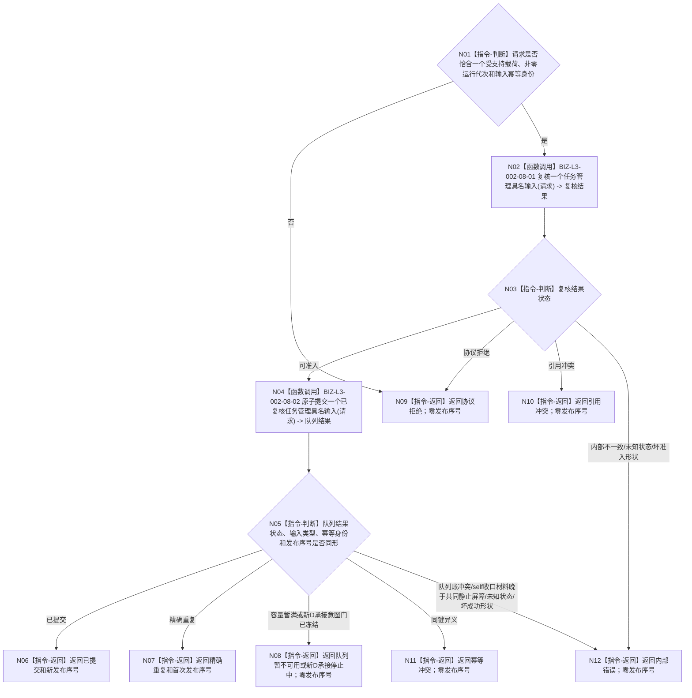

# BIZ-L2-002-08 提交一个任务管理具名输入目标函数流程图 v0.3

更新时间：2026-08-28

## 依据与替代

```text
0050 v1.9、4050、5090 v0.7、8100 v0.7、8200 v0.7
BIZ-L1-T02 v0.7、BIZ-L1-T03 v0.6
BIZ-L2-002-07 v0.2、BIZ-L2-002-09 v0.2、BIZ-L2-004-09 v0.3、BIZ-L2-004-16 v0.2
```

本图替代 v0.2。v0.2 已将模糊任务治理消息组收窄为单项强类型输入，但仍允许任意任务的 self 后继决议定位。现行边界进一步限定：self 后继分支只接受已经由 `002-09 v0.2` 正式发布并读回的根任务后继决议定位；恰一上级调用的子任务只在 T03 内回显式上级，不进入本队列。每次仍只提交一个具名强类型输入，单项在队列锁内原子可见。

## 身份与边界

正式目标函数设计图。当前允许的载荷类型只有：

1. `具体需求任务承接意图`：由 `BIZ-L2-002-07 v0.2` 形成，只绑定一个具体需求 `D`及其原完整任务承接幂等信封；
2. `根任务自我后继决议定位`：由 `BIZ-L2-002-09 v0.2` 的正式读回结果形成，显式绑定根任务、任务轮次、轮次结算身份、决议身份和事实截止 `G`；其决议事实必须已经绑定同G零上级调用根分类见证。

两类载荷共享同一个单项有界输入队列，但不共享停止资格、业务字段、事实解释或消费函数。具体需求承接意图受 `001-12` 新 D 承接意图生产门约束；根任务 self 后继决议定位是已接管根任务的反向收口材料，在只排空阶段继续允许提交，直到 `001-14` 共同静止屏障锁存。子任务调用返回不是本通道的第三类输入；调度、普通取消 / 挂起、权重调整、事实更新唤醒和等待条件变化只有在各自上游生产者、强类型载荷、唯一消费者和读回合同另行冻结后才能加入，不得以空字段或通用编码塞入当前两类。

## 函数合同

```text
根函数：提交一个任务管理具名输入
归属模块 / 文件 / 目标分解深度：任务治理下行桥 / 海中鱼巣/线程/任务治理下行桥.ixx / BIZ-L2
现有或待新增：待新增；HEAD同名相邻骨架只有无载荷请求并固定返回入口拒绝，不能复用为已实现能力
完整签名：任务管理具名输入提交结果 任务治理下行桥::提交一个任务管理具名输入(const 任务管理具名输入提交请求& 请求) noexcept
参数：`请求`为只读借用；只携带一个具名强类型载荷、载荷类型、运行代次和输入幂等身份。D承接载荷内部还必须原样携带来源关系承接键、准备键和六阶段键组；根任务self载荷只携带正式决议定位，不复制结算、根分类或决议正文；类型与载荷必须一一匹配；不得携带消息组、子任务调用返回、可变服务引用、队列候选、当前任务缓存、调度资格、执行许可或现实授权正文
返回结果：按值返回；已提交、精确重复、队列暂不可用、停止中、协议拒绝、引用冲突、幂等冲突或内部错误，以及输入类型、输入幂等身份和队列发布序号。只有已提交 / 精确重复具有非零发布序号
被调函数流程图：BIZ-L3-002-08-01 v0.2 复核一个任务管理具名输入；BIZ-L3-002-08-02 v0.2 原子提交一个已复核任务管理具名输入
异步消费者：BIZ-L2-004-09 v0.3 取出一个不可变任务管理输入
```

## 流程图



## 节点合同

| 节点 | 类型 | 参数 / 输入绑定 | 结果 / 输出绑定 | 事实读写 | 后继条件 | 验证 |
| --- | --- | --- | --- | --- | --- | --- |
| N01—N03 | 判断 / 函数调用 | 一个强类型载荷、运行代次和输入幂等身份 | 可准入或具名拒绝 | 无业务读写 | 只有两种载荷可准入 | 类型与载荷一一对应；D承接载荷的来源关系承接键、准备键和六阶段键组完整；根任务self载荷只含正式定位，不接收子任务调用返回或正文 |
| N04/N05 | 函数调用 / 判断 | 已复核单项输入 | 队列发布、重复、暂不可用、停止或冲突 | 只写进程内队列与队列幂等账 | 单项原子可见 | 不建立外露候选，不逐字段半发布 |
| N06/N07 | 返回 | 新发布或既有同义发布 | 非零首次发布序号 | 无业务写入 | T02保存交付见证 | 发布只证明到达输入边界 |
| N08—N12 | 返回 | 队列或协议非成功 | 零发布序号 | 无业务写入 | T02保留同一处理槽或结构化终止 | 协议、引用、幂等和内部错误分别保真；不换幂等身份、不补写任务事实 |

## 停止、幂等与消费边界

- 队列幂等键固定为 `{运行代次, 输入幂等身份}`。同键完整载荷逐字段相等返回精确重复；同键任一字段不同返回幂等冲突。
- 幂等账查询先于停止资格判断：已经成功发布的同义重试不新增队列项，即使相应门已经冻结也可收敛为精确重复。
- 输入被消费者移出后，队列幂等账在本运行代次内仍保留首次发布序号；运行代次变化形成不同账域，不跨代次猜测重复。
- 队列容量不足只返回暂不可用；T02必须保留原批次、原载荷和原幂等身份重试，不得重新执行 `002-07` / `002-09` 或改换输入类型。
- `001-12` 只禁止此前未发布的新具体需求 D 承接意图；根任务 self 后继决议定位继续作为已接管根任务的反向收口材料进入 T03。只有 `001-14` 在证明双向队列、处理槽和待发布反向材料共同静止后才锁存最终屏障；屏障后再出现新的 self 决议定位属于内部不一致，不得伪装成普通停止重试。

## 关键边界

- 本函数不调用任务、需求、方法、安全或世界事实服务，不等待 T03 消费，也不把消息发布解释为任务已经建立、复用、继续、等待或取消。
- D承接意图的接收方必须按D正式读取所属列表项L，再以L查询0..1当前任务，并只使用载荷中的原来源关系承接键/准备键/六阶段键组完成对应分支；根任务self后继决议定位的接收方必须按显式身份独立读回正式决议及其根分类绑定。二者不得从消息正文补造权威事实或临场派生幂等键。
- 旧“整组准备 -> 停止复核 -> 确认 / 撤销”不是本业务所需事务。单个不可变队列项可以在同一短锁内完成准入、幂等、容量、停止和发布，不建立可跨调用存活的候选令牌。
- 8100列出的其它合法消息类别不因本图被否定；但它们不得在生产者、载荷、消费者和失败矩阵尚未冻结时进入当前通道。
- T02 已完成入口和协议复核后，队列未知状态、坏成功形状、账项矛盾或共同静止屏障后新出现的 self 收口材料必须升级为内部错误；载荷业务引用不匹配和同键异义分别保持引用冲突与幂等冲突。

## 设计DRIFT

本队列不负责裁决根任务，但其根任务self载荷必须引用 `002-09 v0.2` 已发布的正式根任务决议。根分类见证ABI未冻结期间，该载荷分支不可施工；具体需求D承接意图分支和队列原子/幂等/停止合同不受影响。禁止为了让队列先编译而删除根限定、接收子任务定位或把一枚bool当根证明。

## 当前代码实现对照

- HEAD `L2治理函数骨架.数据.h` 的 `任务治理消息组提交请求`没有消息载荷，只含数值占位字段；`服务.L2治理函数骨架.ixx`固定返回入口拒绝。
- HEAD `创建.自我线程.ixx`只构造空占位请求并调用旧骨架；没有具体需求 D 承接意图或 self 后继决议定位的真实提交。
- HEAD `任务管理线程.ixx`已有强类型执行请求两阶段队列和结果上行槽，可证明有界队列、停止锁存和幂等思想可复用；它们的工作包 / 回执协议不能直接充当本输入通道。
