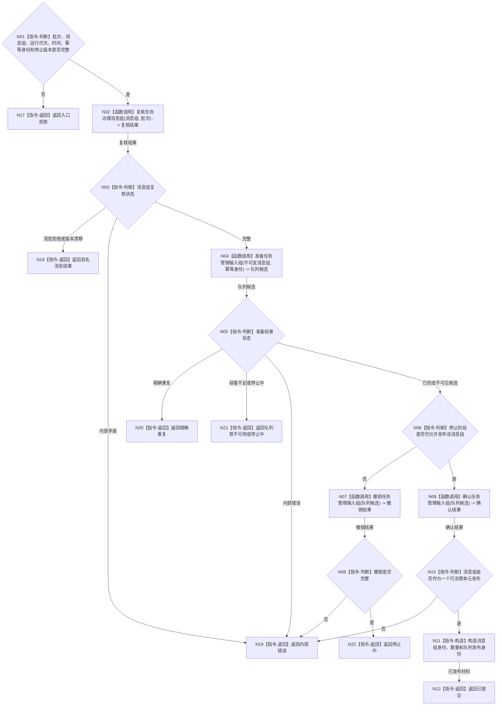

# BIZ-L2-002-08 提交任务治理消息组目标函数流程图 v0.1

更新时间：2026-08-03

## 依据

```text
4050、8100、8200
父线程函数：BIZ-L1-T02 自我线程::运行治理循环
异步后继：BIZ-L1-T03 任务管理线程::运行治理循环
当前代码：已有有界自我治理邮箱和任务执行请求队列，但尚无自我到任务管理的通用强类型消息组桥
```

## 身份与边界

正式目标函数设计图。根函数把同一治理裁决形成的不可变任务治理消息组一次性发布给任务管理输入队列；不调用任务领域、不等待任务管理线程处理。

## 函数合同

```text
根函数：提交任务治理消息组
归属模块 / 文件 / 层级：任务治理下行桥 / 海中鱼巣/线程/任务治理下行桥.ixx / L2
现有或待新增：待新增；可复用现有有界队列的准入、预留、确认和幂等机制，不复用执行工作包协议
完整签名：任务治理消息组提交结果 任务治理下行桥::提交任务治理消息组(const 任务治理消息组提交请求& 请求) const
参数：
  请求：const 任务治理消息组提交请求&，只读借用；必须携带治理批次、不可变消息组、运行代次、当前时间、消息组幂等身份和停止阶段版本
返回结果：
  任务治理消息组提交结果；包含已提交、精确重复、队列暂不可用、停止中、消息拒绝、版本漂移、入口拒绝或内部错误，以及消息组身份、消息数量和队列发布身份
被调函数流程图：复核任务治理消息组、准备任务管理输入组、确认或撤销任务管理输入组；进入 L3 时分别展开
```

## 流程图



## 节点合同

| 节点 | 类型 | 参数 / 输入绑定 | 结果 / 输出绑定 | 事实读写 | 后继条件 | 验证 |
| --- | --- | --- | --- | --- | --- | --- |
| N02 | 函数调用 | 消息组和治理批次 | 结构与来源复核 | 无业务写入 | 完整或具名返回 | 类型互斥、任务 / 工作项绑定、批次一致 |
| N04 | 函数调用 | 不可变消息组和幂等身份 | 不可见队列候选 | 只预留任务管理队列 | 候选、重复或暂不可用 | 容量和同键异义 |
| N07 | 函数调用 | 不可见候选 | 撤销结果 | 只撤销队列预留 | 完整或错误 | 无半消息组 |
| N09/N10 | 函数调用 / 判断 | 完整候选 | 可消费消息组 | 只发布队列项 | 整组发布或错误 | 不逐条半发布 |

## 关键边界

- 消息组是同一治理裁决的不可变传递材料；任务管理线程仍须重读正式状态后自行决定筹办、执行、等待或收口。
- 本函数不提交任务状态、不创建任务、不申请工作线程，也不等待异步消费者。
- 队列锁内只准备、确认或撤销值式消息组；任何领域读取和任务状态提交均在锁外。
- 精确重复返回既有发布身份；同键异义是内部错误，不能发布第二组或逐条补发。

