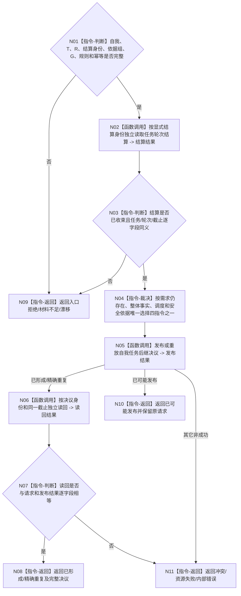

# BIZ-L2-002-09 形成并读回自我任务后继决议目标函数流程图 v0.1

更新时间：2026-08-26

## 依据

```text
0050、5090 v0.8、8100 v0.8、8200；BIZ-L1-T02 v0.5
```

## 身份与边界

正式目标函数设计图。T02 只在任务轮次已经正式收束、显式任务/轮次/结算身份和同截止当前整体事实完整时，形成并独立读回 `继续 / 结束 / 等待 / 取消` 后继决议。该决议属于自我治理，不是需求满足、任务状态、现实执行授权或新任务轮次；只有 T03 独立消费“继续”决议后才能创建下一轮。

## 函数合同

```text
根函数：形成并读回自我任务后继决议
归属模块 / 文件 / 目标分解深度：自我任务后继决议 / 海中鱼巣/领域/自我治理/服务.自我任务后继决议.ixx / BIZ-L2
现有或待新增：当前工作区已有未发布提供者WIP；目标调用合同按正式规范冻结
完整签名：自我任务后继决议结果 自我任务后继决议提供者::发布或读取自我任务后继决议(const 自我任务后继决议请求& 请求) noexcept
参数：请求含自我、任务、已收束任务轮次、轮次结算、需求/安全/整体治理依据、来源共同事实截止、规则版本、发生时间和幂等身份
返回结果：已形成、精确重复、未找到、幂等冲突、入口/许可拒绝、当前性漂移、材料不足、资源失败、内部错误或已可能发布；成功携带完整决议和正式读回截止
被调函数流程图：不新增 BIZ 子函数；通过唯一 L2自我治理结构服务提交并按决议身份正式读回
```

## 流程图



## 关键边界

- 不按任务猜轮次结算身份，不从任务结果、线程当前值或旧缓存补造依据。
- 后继决议只决定该任务轮次之后的治理方向；“继续”也必须由 T03 建立新轮次并重新筹办，旧路径、实例、冻结和授权全部失效。
