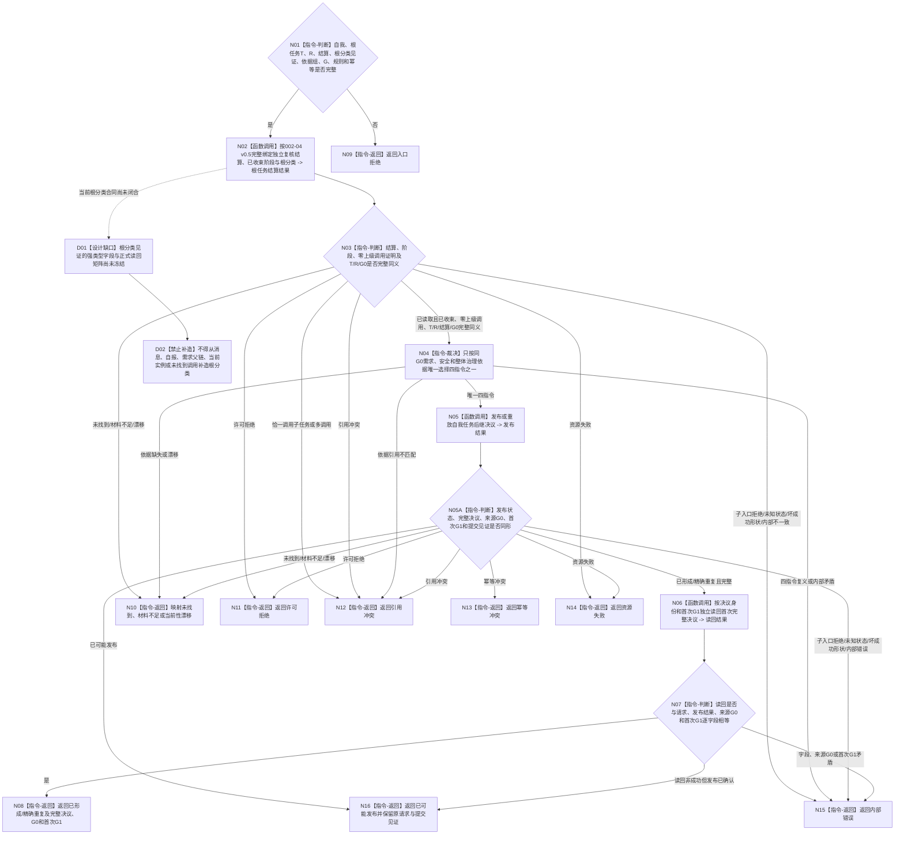

# BIZ-L2-002-09 形成并读回自我任务后继决议目标函数流程图 v0.2

更新时间：2026-08-28

## 依据

```text
0050 v1.9、5090 v0.7、8100 v0.7、8200 v0.7、8300 v0.6
用户冻结业务边界：恰一正式上级调用只回显式上级任务；零上级调用根任务才进入self
BIZ-L1-T02 v0.7、BIZ-L2-002-04 v0.5、BIZ-L2-002-08 v0.3
```

本图完整替代 v0.1。v0.1 引用了尚未发布的5090/8100版本，并允许任意已收束任务轮次进入self决议。v0.2回到HEAD正式版本，同时按用户和0050 v1.9冻结的上级业务边界，把本函数限定为零上级调用根任务；5090/8100/8200/8300尚未发布的同步文字不得冒充当前正式依据。

## 身份与边界

正式目标函数设计图。T02 只在任务轮次已经正式收束、`002-04 v0.5` 已按同G证明零上级调用根分类、显式任务/轮次/结算身份和来源共同事实截止 `G0` 的当前整体事实完整时，形成 `继续 / 结束 / 等待 / 取消` 后继决议。self owner 的新决议事实在独立首次发布截止 `G1` 形成并按决议身份读回；`G0` 与 `G1` 分账，精确重复回显首次 `G1`。该决议属于根任务自我治理，不是需求满足、任务状态、现实执行授权或新任务轮次；只有 T03 独立消费“继续”决议后才能创建下一轮。恰一上级调用的子任务不得调用本函数。

## 函数合同

```text
根函数：形成并读回自我任务后继决议
归属模块 / 文件 / 目标分解深度：自我任务后继决议 / 海中鱼巣/领域/自我治理/服务.自我任务后继决议.ixx / BIZ-L2
现有或待新增：当前发布源码尚无提供者；当前工作区未发布候选不得作为当前能力，目标调用合同按正式规范冻结
完整签名：自我任务后继决议结果 自我任务后继决议提供者::发布或读取自我任务后继决议(const 自我任务后继决议请求& 请求) noexcept
参数：请求含自我、根任务、已收束任务轮次、轮次结算、正式零上级调用根分类见证、需求/安全/整体治理依据、来源共同事实截止G0、规则版本、发生时间和幂等身份；全部依据必须绑定同一G0，请求不得指定或猜测首次发布截止G1
返回结果：已形成、精确重复、未找到、入口拒绝、许可拒绝、当前性漂移、材料不足、引用冲突、幂等冲突、资源失败、内部错误或已可能发布；成功携带完整根任务决议、根分类绑定、来源截止G0和首次正式读回截止G1，已可能发布只保留原请求与提交见证
被调函数流程图：不新增 BIZ 子函数；通过唯一 L2自我治理结构服务提交并按决议身份正式读回
```

## 流程图



## 节点合同

| 节点 | 输入 | 输出 | 事实读写 | 验证 |
| --- | --- | --- | --- | --- |
| N01—N03 | 显式根任务T/R/结算、同G0根分类见证、治理依据和幂等身份 | 已收束根任务结算绑定或结构化非成功 | 只读task owner正式轮次结算、阶段和调用事实 | 不按任务猜结算身份或根分类；恰一调用子任务不得进入决议；子入口拒绝在父准入后升级内部错误 |
| N04 | 同G0需求、安全与整体治理依据 | 继续、结束、等待、取消恰一 | 纯值裁决 | 不读取调度缓存、旧路径或线程当前任务补齐依据 |
| N05/N05A | 完整决议请求 | 首次发布、精确重复、已可能发布或具名失败 | 只经唯一self owner发布 | 来源G0与首次发布/读回G1分账；同键异义为幂等冲突 |
| N06—N08 | 决议身份、首次G1和首次请求 | 正式完整决议 | 只读同一self owner | 精确重复仍回显首次G1；载荷、G0、G1逐字段一致 |
| N09—N16 | 非成功来源 | 结构化非成功 | 无额外写入 | 入口、许可、引用、幂等、资源和内部错误分别保真；发布后读回失败只返回已可能发布见证 |
| D01/D02 | 根分类合同未闭合 | 具名DRIFT和零决议 | 无 | 只阻断本根任务后继决议分支，不得删根限定换取可编译空壳 |

## 关键边界

- 不按任务猜轮次结算身份，不从任务结果、线程当前值或旧缓存补造依据。
- 只有同G完整证明零正式上级调用的根任务可形成self后继决议；恰一调用子任务只回显式上级任务fresh重判，多调用为引用冲突。
- 后继决议只决定该任务轮次之后的治理方向；“继续”也必须由 T03 建立新轮次并重新筹办，旧路径、实例、冻结和授权全部失效。
- 来源共同事实截止G0只冻结决议依据；决议事实由self owner在独立G1首次发布。请求不得预填G1，独立读回必须使用发布结果回显的首次G1，不能在G0读取尚未存在的新决议。
- 发布已确认后任何独立读回非成功都不能降级成“未找到”或普通资源失败；返回已可能发布并保留同一幂等请求和提交见证，后继重试先收敛首次决议事实。

## 设计DRIFT

`DRIFT-BIZ-ROOT-TASK-SETTLEMENT-ZERO-PARENT-CALL-PROOF-AND-SELF-SUCCESSOR-INPUT-ABI-UNFROZEN`：根任务业务边界已经冻结，但根分类见证的producer、强类型字段、同G正式读回、合法0项证明和0/1/N矩阵仍未闭合。闭合前本函数不得发布任何self后继决议；不得把一枚调用方bool、消息类别或“查询未找到”当作根证明。
