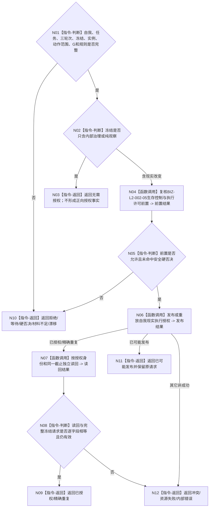

# BIZ-L2-002-10 发布并读回自我现实执行授权目标函数流程图 v0.1

更新时间：2026-08-26

## 依据

```text
0050、5090 v0.8、8100 v0.8、8200；BIZ-L1-T02 v0.4、BIZ-L2-002-05
```

## 身份与边界

正式目标函数设计图。仅当执行冻结包含现实改变步骤且生存控制/执行许可前置完整时，T02 调用自我业务 owner 发布或读回一份绑定任务、三轮次、冻结、实例方法和现实动作范围的正向授权。内部治理和纯观察零授权；安全硬否决、技术许可和调度资格都不是第二份正向授权。

## 函数合同

```text
根函数：发布并读回自我现实执行授权
归属模块 / 文件 / 目标分解深度：自我现实执行授权 / 海中鱼巣/领域/自我治理/服务.自我现实执行授权.ixx / BIZ-L2
现有或待新增：当前工作区已有未发布提供者WIP；目标调用合同按正式规范冻结
完整签名：自我现实执行授权结果 自我现实执行授权提供者::发布或读取自我现实执行授权(const 自我现实执行授权请求& 请求) noexcept
参数：请求含自我、任务、任务轮次、筹办轮次、执行轮次、执行冻结、实例方法、完整现实动作范围、事实截止、规则版本、有效期和幂等身份
返回结果：已授权、精确重复、无需授权、拒绝、等待、撤回、硬否决、当前性漂移、材料不足、资源失败、内部错误或已可能发布；成功携带完整授权和正式读回截止
被调函数流程图：不新增 BIZ 子函数；通过唯一 L2自我治理结构服务提交并按授权身份正式读回
```

## 流程图



## 关键边界

- 一份授权覆盖该执行尝试及实例方法冻结的全部现实改变动作，不再拆成任务授权和方法授权。
- 冻结、实例、动作范围、事实截止、规则或有效期变化立即使旧授权失效；不得跨任务轮次、执行轮次或冻结复用。
