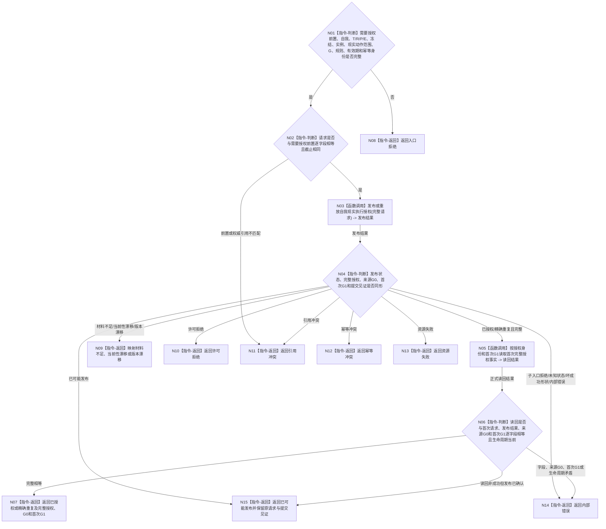

# BIZ-L2-002-10 发布并读回自我现实执行授权目标函数流程图 v0.2

更新时间：2026-08-26

## 依据

```text
0050、5090、5230、6120、8100、8200；BIZ-L1-T02 v0.6、BIZ-L2-002-05 v0.2
替代关系：v0.2移除安全硬否决和旧通用执行令牌混入授权发布
```

## 身份与边界

正式目标函数设计图。本函数只消费 BIZ-L2-002-05 已形成的“需要授权”完整前置，由唯一自我业务 owner 发布或重放一份绑定任务、三轮次、冻结、实例方法和完整现实改变动作范围的正向授权，再按授权身份独立读回。前置及全部依据绑定来源共同事实截止 `G0`；新授权事实由 owner 在独立首次发布截止 `G1` 形成并读回，精确重复回显首次 `G1`。内部治理和纯观察不会调用本函数。

安全硬否决、技术许可、结构写许可和正常调度资格都在各自门控中独立裁决，不进入授权事实，不改变同键幂等语义。

## 函数合同

```text
根函数：发布并读回自我现实执行授权
归属模块 / 文件 / 目标分解深度：自我现实执行授权 / 海中鱼巣/领域/自我治理/服务.自我现实执行授权.ixx / BIZ-L2
现有或待新增：已发布HEAD尚无提供者；当前工作区候选不得作为当前能力
完整签名：自我现实执行授权结果 自我现实执行授权提供者::发布或读取自我现实执行授权(const 自我现实执行授权请求& 请求) noexcept
参数：`请求`，类型 `const 自我现实执行授权请求&`，输入、只读借用且仅在调用期间有效；字段为BIZ-L2-002-05 v0.2需要授权前置、自我、任务、任务轮次、筹办轮次、执行轮次、执行冻结、实例方法、完整现实改变动作范围、来源事实截止G0、授权规则版本、有效期和幂等身份；任一身份 / 轮次 / G0 / 版本 / 有效期为零、动作范围为空或非规范、前置非“需要授权”均非法；请求不得指定或猜测首次发布截止G1
返回结果：`自我现实执行授权结果`，按值交给调用方；已授权、精确重复、入口拒绝、许可拒绝、当前性漂移、材料不足、版本漂移、引用冲突、幂等冲突、资源失败、内部错误或已可能发布；成功携带完整授权、来源G0和首次正式读回截止G1，非成功零授权载荷，已可能发布只保留原请求和提交见证
被调函数流程图：不新增BIZ子函数；通过唯一L2自我治理结构owner提交，并按授权身份正式读回
```

## 流程图



## 节点合同

| 节点 | 输入 | 输出 | 事实读写 | 验证 |
| --- | --- | --- | --- | --- |
| N01/N02 | 需要授权前置与完整请求 | 准入结论 | 无写入 | T/R/P/E、冻结、实例、现实动作范围和来源G0逐字段相等；不匹配为引用冲突 |
| N03/N04 | 已准入请求 | 首次发布、精确重复或结构化非成功 | 通过唯一自我治理owner领域提交写入正式授权事实 | 来源G0与首次G1分账；同键同义零新增，同键异义为幂等冲突 |
| N05/N06 | 授权身份、首次G1和首次请求 | 正式读回授权 | 只读同owner | 载荷、来源G0、首次G1和生命周期完整；精确重复仍回显首次G1 |
| N07—N15 | 发布与读回状态 | 结构化结果 | 无额外写入 | 入口、许可、引用、幂等、资源与内部错误分别保真；发布后读回失败固定为已可能发布 |

## 关键边界

- 一份授权覆盖该执行尝试及实例方法冻结的全部现实改变动作，不再拆成任务授权、方法授权或工作项许可。
- 冻结、实例、动作范围、事实截止、授权规则或有效期变化立即使旧授权失效；不得跨任务轮次、执行轮次或冻结复用。
- 本函数不读取、枚举或裁决安全硬否决，不计算调度资格，不形成技术许可；这些结果也不写入授权事实。
- 授权成功只证明唯一正向授权事实已发布并读回，不证明当前仍可派发或动作可以开始。
- 来源G0只冻结授权前置与依据；授权事实由self owner在独立G1首次发布。请求不得预填G1，独立读回必须使用发布结果回显的首次G1，不能在G0读取尚未存在的新授权。
- 发布已确认后任何独立读回非成功都返回已可能发布并保留同一幂等请求和提交见证；不得降级为未找到、许可拒绝、资源失败或内部错误后换键重发。
