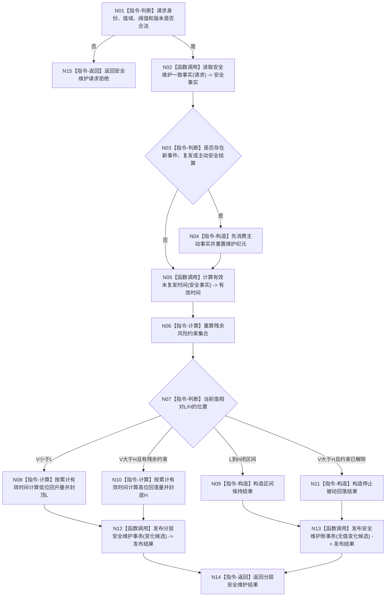

# BIZ-L2-003-01 维护分层安全值目标函数流程图 v0.1

更新时间：2026-08-03

## 依据

```text
6100、6140、6150、6170
父函数：BIZ-L1-003 自我治理服务::执行一轮自我治理
```

## 身份与边界

正式目标函数设计图。根函数只维护 6140 分层安全值，不写生存安全根值、服务值或任务权限。

## 函数合同

```text
根函数：维护分层安全值
归属模块 / 文件 / 层级：安全维护 / 海中鱼巣/领域/服务.安全维护.ixx / L2
现有或待新增：待新增；当前代码中目标完整签名零命中，底层相邻能力仍待核
完整签名：分层安全维护结果 安全维护服务::维护分层安全值(const 分层安全维护请求& 请求)
参数：
  请求：const 分层安全维护请求&，只读借用，调用期间有效；必须携带自我、维护单元、当前值版本、事实截止版本、有效未复发证据、阈值和规则版本
返回结果：
  分层安全维护结果；包含无变化、低位回升、高位回落、残余约束解除、精确重复、材料拒绝或内部错误，以及已发布值/状态/动态/维护账身份
被调函数流程图：下一层待按安全证据读取、纯值计算和安全事务发布分别展开
```

## 流程图



## 节点合同

| 节点 | 类型 | 参数 / 输入绑定 | 结果 / 输出绑定 | 事实读写 | 后继条件 | 验证 |
| --- | --- | --- | --- | --- | --- | --- |
| N02 | 函数调用 | 请求身份与截止版本 | 安全事实 | 只读当前事实 | 完整或拒绝 | 同代次读取 |
| N05 | 函数调用 | 场景、覆盖、因素区间 | 有效时间 | 只读证据 | 允许为0 | 缺一项即0 |
| N08/N10 | 指令-计算 | R、T、Utime、V、L/H | 新值候选 | 无 | checked wide成功 | 余数累计等价 |
| N12 | 函数调用 | 值、状态、动态、维护账 | 发布结果 | 安全领域事务 | 全确认或撤销 | 零半结构 |
| N13 | 函数调用 | 游标、纪元、维护账 | 发布结果 | 仅参与者事务 | 全确认或撤销 | 无哨兵写入 |

## 关键边界

- 物理时间经过本身不产生有效未复发事实。
- 新安全事件优先于被动变化；同批不得用旧累计时间抵消新事件。
- 算术异常不钳制为 `I64_MAX`，属于内部错误并停止整批发布。
