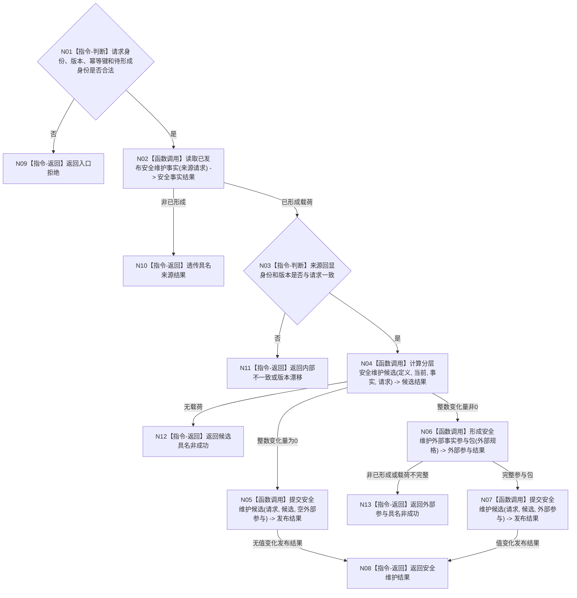

# BIZ-L2-003-01 维护分层安全值目标函数流程图 v0.1

更新时间：2026-08-03

## 依据

```text
6100、6140、6150、6170
父线程函数：BIZ-L1-T02 自我线程::运行治理循环
```

## 身份与边界

正式目标函数设计图。根函数只维护 6140 分层安全值，不写生存安全根值、服务值或任务权限。

## 函数合同

```text
根函数：评估并维护安全层
归属模块 / 文件 / 层级：分层安全维护 / 海中鱼巣/领域/服务.分层安全维护.ixx / L2
现有或待新增：当前复用；现行代码已具备协议、纯值算法、服务编排、数据操作和专项自检
完整签名：安全维护结果 分层安全维护服务::评估并维护安全层(const 安全维护请求& 请求)
参数：
  请求：const 安全维护请求&，只读借用，调用期间有效；必须携带自我、维护族、适用场景、当前值版本、事实截止版本、幂等主键、时间和规则版本；形成值变化时还须携带三个待形成稳定主键
返回结果：
  安全维护结果；包含已维护、无变化、精确重复、入口/结构/材料/版本拒绝、资源失败或内部不一致，以及完整已发布载荷
被调函数流程图：BIZ-L3-003-01-01—04
```

## 流程图



## 节点合同

| 节点 | 类型 | 参数 / 输入绑定 | 结果 / 输出绑定 | 事实读写 | 后继条件 | 验证 |
| --- | --- | --- | --- | --- | --- | --- |
| N02 | 函数调用 | 请求机械形成来源请求 | 安全事实结果 | 只读当前已发布事实 | 已形成或具名非成功 | 同代次回显 |
| N04 | 函数调用 | 定义、当前、事实、请求 | 纯值维护候选 | 无写入 | 有载荷或具名非成功 | 6140全部边界 |
| N06 | 函数调用 | 前后值、状态、动态身份和来源 | 外部事实参与包 | 只形成事务参与候选 | 值变化时必须完整 | 三类命名域 |
| N05/N07 | 函数调用 | 候选与可选外部参与 | 发布结果 | 安全领域不透明事务 | 全确认或逆序撤销 | 无变化与值变化分账 |

## 关键边界

- 物理时间经过本身不产生有效未复发事实。
- 新安全事件优先于被动变化；同批不得用旧累计时间抵消新事件。
- 同批主动安全结算已经改变当前值时，本函数只发布重置后的维护账并跳过被动回升 / 回落；不得继续消费事件发生前的累计时间。
- 算术异常不钳制为 `I64_MAX`，属于内部错误并停止整批发布。
- 本图按当前代码事实复用现行唯一服务入口；不得再建立 `安全维护服务::维护分层安全值` 转发壳或第二套算法。
