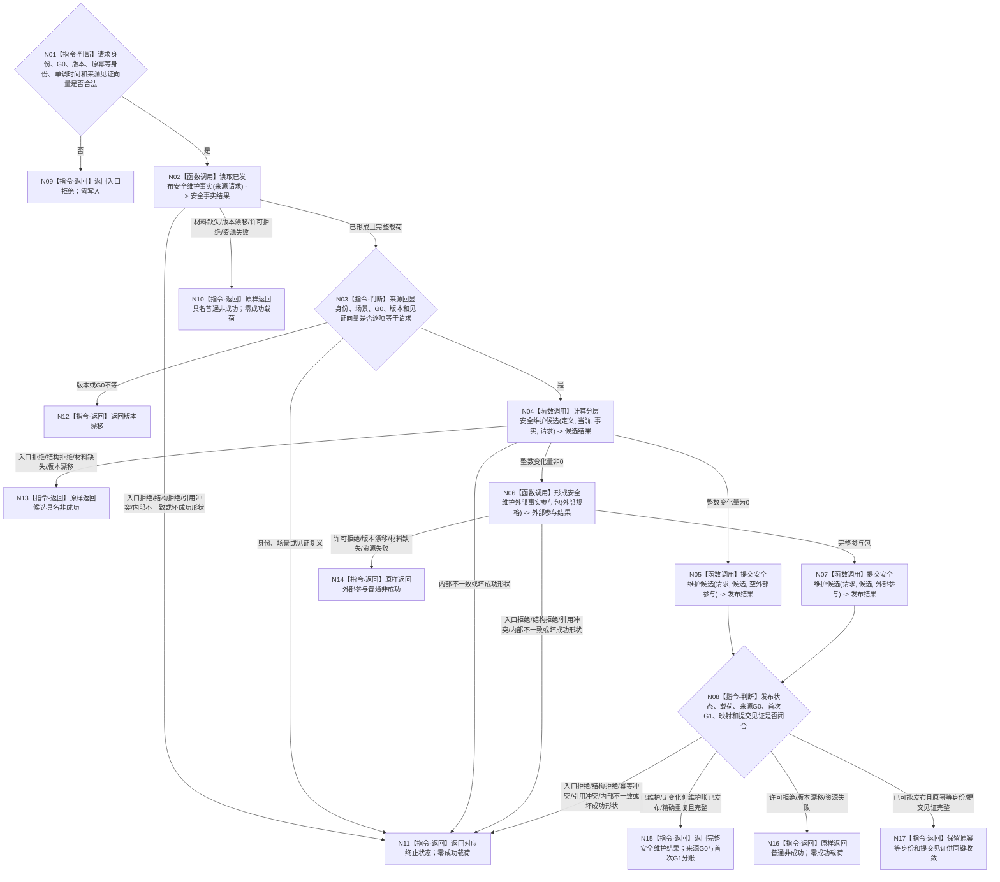

# BIZ-L2-003-01 维护分层安全值目标函数流程图 v0.2

更新时间：2026-08-27

## 依据

```text
0050、4050、4190、4220、6100、6140、6150、6170
确认稿 51：安全被动维护双动态同写集发布
父线程函数：BIZ-L1-T02 v0.6 自我线程::运行治理循环
```

## 身份与边界

正式目标函数设计图。根函数只维护 6140 分层安全值，不写生存安全根值、服务值或任务权限。来源事实截止 `G0` 与安全 owner 首次发布、正式读回截止 `G1` 分账；调用方不得预分配后值、后状态或两个动态的正式稳定编码。

## 函数合同

```text
根函数：评估并维护安全层
归属模块 / 文件 / 目标分解深度：分层安全维护 / 海中鱼巣/领域/服务.分层安全维护.ixx / BIZ-L2
现有或待新增：目标组合待实现；HEAD 只有协议、纯值算法和 `服务.L2治理函数骨架.ixx` 空壳，生产事实提供者、外部事实参与提供者、正式数据操作和装配均未形成
完整签名：安全维护结果 分层安全维护服务::评估并维护安全层(const 安全维护请求& 请求)
参数：
  请求：const 安全维护请求&，只读借用，调用期间有效；必须携带自我、维护族、适用场景、期望当前值版本、来源事实截止G0、原幂等身份、单调时间、规则版本和具名来源见证向量；不得携带或生成后值、后状态、状态迁移动能、被动动作致变动态的正式稳定编码
返回结果：
  安全维护结果；包含已维护、无变化但维护账已发布、精确重复、入口拒绝、许可拒绝、结构拒绝、材料缺失、版本漂移、幂等冲突、引用冲突、资源失败、已可能发布或内部不一致；三个成功状态必须携带完整首次已发布载荷和非零G1，已可能发布必须保留原幂等身份与提交见证，其余非成功无成功载荷
被调函数流程图：BIZ-L3-003-01-01—04 v0.2
```

## 流程图



## 节点合同

| 节点 | 类型 | 参数 / 输入绑定 | 结果 / 输出绑定 | 事实读写 | 后继条件 | 验证 |
| --- | --- | --- | --- | --- | --- | --- |
| N02—N03 | 函数调用 / 判断 | 请求机械形成来源请求 | 安全事实结果与逐项绑定裁决 | 只读当前已发布事实 | 已形成完整载荷或具名非成功 | 全部来源截止等于G0；坏成功形状不得继续 |
| N04 | 函数调用 | 定义、当前、事实、请求 | 纯值维护候选 | 无写入 | 完整候选或具名非成功 | 6140全部边界；纯值结果不得冒充正式重复读回 |
| N06 | 函数调用 | 前后值、状态端点、来源和正式提交方法；无正式新编码 | move-only外部事实参与包 | 只形成同一写集的本地键和候选参与者 | 值变化时必须完整 | 后值、后状态、迁移动能、动作动态四键互异；动作动态角色8只指向迁移动能 |
| N05/N07—N08 | 函数调用 / 判断 | 候选与可选外部参与 | 发布状态、完整载荷、G1、新编码映射和见证 | 安全领域一个不透明事务 | 全确认、逆序撤销或已可能发布 | 无变化与值变化分账；成功状态必须验载荷 |
| N15—N17 | 返回 | 已复核发布结果 | 结构化安全维护结果 | 无新增写入 | 返回父图 | 精确重复回显首次G1；已可能发布只允许原键收敛 |

## 关键边界

- 物理时间经过本身不产生有效未复发事实。
- 新安全事件优先于被动变化；同批不得用旧累计时间抵消新事件。
- 同批主动安全结算已经改变当前值时，本函数只发布重置后的维护账并跳过被动回升 / 回落；不得继续消费事件发生前的累计时间。
- 算术异常不钳制为 `I64_MAX`，属于内部错误并停止整批发布。
- 实际值变化时，后值、后状态、状态迁移动能和被动动作致变动态在同一写集内使用四个互异本地键；L1最后发布时统一分配正式编码并回显映射。状态迁移动能角色6/8均为0；动作动态角色6绑定安全正式提交方法且角色8恰一指向同源迁移动能。
- 无值变化不创建后值、状态或动态，只发布维护账变化；不得伪造哨兵节点或空核心写集。
- 确认稿51已经裁决目标设计，但 `HEAD` 的6140第9节仍保留“调用方提供三个正式稳定主键”的旧句；进入详细设计、计划或代码施工前必须先把四写集本地键与发布后编码映射登记进正式规范，本图不能单独覆盖该规范冲突。
- HEAD 只有空壳根与纯值算法，不能写成“当前复用完整服务”。后继必须实现唯一根组合、两个具名生产提供者、数据操作、装配和合法T02消费验证；不得再建立第二套安全维护入口或第二算法。
