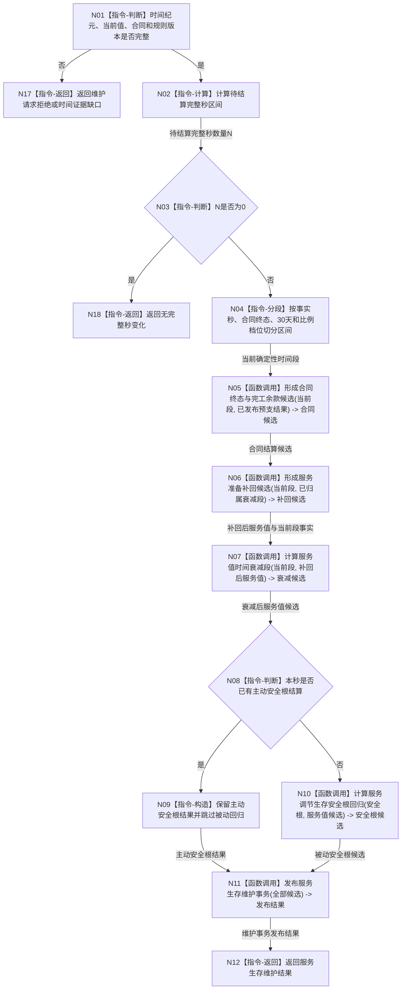

# BIZ-L2-003-02 维护服务与生存安全目标函数流程图 v0.1

更新时间：2026-08-03

## 依据

```text
6120、6160、6170
父线程函数：BIZ-L1-T02 自我线程::运行治理循环
```

## 身份与边界

正式目标函数设计图。根函数按完整单调秒原子维护服务合同、服务值和生存安全根值；不消费 6140 分层安全算法。

## 函数合同

```text
根函数：维护服务与生存安全
归属模块 / 文件 / 层级：服务生存治理 / 海中鱼巣/领域/服务.服务生存治理.ixx / L2
现有或待新增：待新增；当前代码中目标完整签名零命中，底层相邻能力仍待核
完整签名：服务生存维护结果 服务生存治理服务::维护服务与生存安全(const 服务生存维护请求& 请求)
参数：
  请求：const 服务生存维护请求&，只读借用，调用期间有效；必须携带自我、运行代次、时间纪元、完整秒区间、服务值、安全根、已发布合同预支结果、合同终态 / 服务准备聚合输入、合同 / 进展集合和规则版本
返回结果：
  服务生存维护结果；包含已结算完整秒、合同结算、服务值、安全根、控制态、衰减段和发布身份，或无完整秒、时间缺口、拒绝、精确重复和内部错误
被调函数流程图：BIZ-L3-003-02-01—05
```

## 流程图



## 节点合同

| 节点 | 类型 | 参数 / 输入绑定 | 结果 / 输出绑定 | 事实读写 | 后继条件 | 验证 |
| --- | --- | --- | --- | --- | --- | --- |
| N04 | 指令-分段 | 完整秒和事实集合 | 确定性段序列 | 无 | 有界段数 | 批量等价逐秒 |
| N05 | 函数调用 | 同秒合同终态事实和已发布预支结果 | 余款关闭或70%完工余款与合同终态候选 | 不单独发布 | 当前段完成 | 预支不重算、70%一次和同秒顺序 |
| N06 | 函数调用 | 当前段准备事实与已归属衰减段 | 补回候选 | 不单独发布 | 不含本秒新衰减 | 不重复补回 |
| N07 | 函数调用 | 当前段需求、活动与补回后服务值 | 衰减候选 | 无直接发布 | 饱和算术成功 | 0/1保护、30天和批量等价 |
| N10 | 函数调用 | A、L/H、V和主动事实 | 安全根候选 | 无直接发布 | A=0先行 | 比例档位边界 |
| N11 | 函数调用 | 合同、值、状态、动态、衰减段 | 发布结果 | 跨领域事务 | 全确认或撤销 | 同秒零中间态 |

## 关键边界

- 循环次数不参与数值；批量 N 秒必须与逐秒参考顺序相同。
- 有效服务活动只保护正服务值不降到0，不能凭活动从0生成服务值。
- 服务值为0时把 `A>=1` 调到1；`A=0` 始终保持终止，不能被动唤醒。
- 30%预支只由 `建立服务合同并结算预支` 独立原子发布；本函数只读取其正式结果，不建立合同、不重复预支。
- 合同终态、70%余款或准备补回、本秒衰减和生存安全根回归只在 N11 的同一个服务生存维护事务中共同发布。
