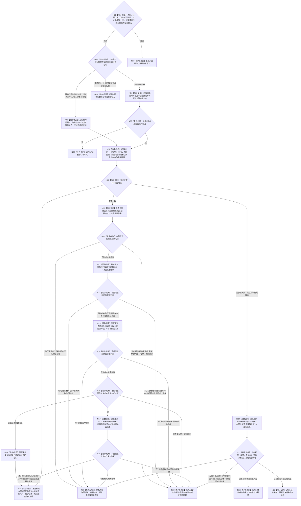

# BIZ-L2-003-02 维护服务与生存安全目标函数流程图 v0.2

更新时间：2026-08-27

## 依据

```text
0050、4050、6120、6160、6170
父线程函数：BIZ-L1-T02 v0.6 自我线程::运行治理循环
```

## 身份与边界

正式目标函数设计图。根函数以单调完整秒为逻辑单位，在一次入口内按确定性分段处理全部到期完整秒，并以一个服务生存维护事务原子发布合同终态、余款或准备补回、服务值、衰减段、生存安全根、状态动态和维护游标；不消费6140分层安全算法，不计算任务调度资格。

## 函数合同

```text
根函数：维护服务与生存安全
归属模块 / 文件 / 目标分解深度：服务生存治理 / 海中鱼巣/领域/服务.服务生存治理.ixx / BIZ-L2
现有或待新增：目标组合待实现；HEAD只有`服务.L2治理函数骨架.ixx`空壳和极简DTO，无生产provider、算法、数据操作或装配
完整签名：服务生存维护结果 服务生存治理服务::维护服务与生存安全(const 服务生存维护请求& 请求)
参数：请求为只读借用；必须绑定自我、运行代次、时间纪元、上一已结算完整秒边界、当前单调时间、来源事实截止G0、服务值/安全根/合同/进展/主动安全事实当前版本、原幂等身份和全部规则版本；合同终态与服务准备只携带正式值式结算输入定位，根服务仍按G0独立读回
返回结果：服务生存维护结果；已维护、无完整秒或精确重复为完整逻辑内成功。已维护/精确重复携带完整首次发布载荷、来源G0和首次G1；无完整秒为零写入且截止仍为G0。入口拒绝、许可拒绝、时间证据缺口、材料缺失、版本漂移、幂等冲突、引用冲突、资源失败、已可能发布或内部不一致均结构化分账
被调函数流程图：BIZ-L3-003-02-01—05 v0.2；其中01/02分别展开两张BIZ-L4正式读取/裁决图，05展开三张BIZ-L4事务/读回图
```

## 流程图



## 节点合同

| 节点 | 类型 | 输入绑定 | 输出绑定 | 事实读写 | 后继条件 | 验证 |
| --- | --- | --- | --- | --- | --- | --- |
| N01—N06 | 判断 / 构造 / 计算 / 返回 | 运行代次、时间纪元、单调时间和上一边界 | 新纪元候选、N或结构化零写结果 | 仅新纪元为候选 | N=0合法完成；硬时间缺口零写 | 跨代次有/无证明与当前时间无效分账 |
| N07—N08 | 分段 / 选择 | 全部到期完整秒和事实边界 | 有序确定性段 | 无 | 全段有界遍历 | 批量结果等价逐秒，不只处理首段 |
| N09—N19 | 调用 / 判断 / 追加 | 当前段与段前值式状态 | 合同、补回、衰减和安全根候选 | 只形成候选 | 每个子结果先验状态×载荷 | 同秒顺序；主动安全优先；不发布中间态 |
| N20—N21 | 函数调用 / 判断 | 新纪元与全部段候选 | 一次原子发布结果 | 一个服务生存维护事务 | 已发布、重复、已可能发布或具名非成功 | 全确认、逆序撤销、最后发布、联合读回 |
| N22—N27 | 返回 | 已复核结果 | 结构化父级结果 | 无新增写入 | 返回T02 | G0/G1分账；未知只按原键收敛 |

## 关键边界

- 循环次数不参与数值；批量N秒必须与逐秒参考顺序相同，且一次入口处理全部确定性段后只发布一次。
- `N=0`是合法无完整秒结果，T02必须继续治理路由，不能把它当领域失败。
- 只缺跨代次连续时长证明时必须建立新纪元并发布缺口/游标；当前运行代次、时间或新纪元身份本身无效才返回零写时间证据缺口。
- 有效服务活动只保护正服务值不降到0，不能凭活动从0生成服务值；`A=0`始终保持终止。
- 30%预支由独立合同入口发布；本函数只读取正式结果。合同终态、70%余款或准备补回、本秒衰减和生存安全根回归只在N20同一事务共同发布。
- HEAD空壳只接受`已结算完整秒`且不承载本图状态矩阵，不能证明本目标已实现。
- 五张直接BIZ-L3子图及七张必要BIZ-L4图已同步到v0.2并回接T02；这只证明目标分解闭合，不证明详细设计、代码、构建、运行或业务闭环完成。
