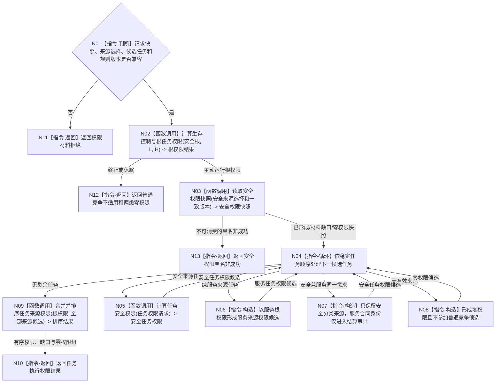

# BIZ-L2-003-03 计算任务执行权限目标函数流程图 v0.1

更新时间：2026-08-03

## 依据

```text
6150、6170
父线程函数：BIZ-L1-T02 自我线程::运行治理循环
```

## 身份与边界

正式目标函数设计图。根函数只形成可重建权限投影，不写安全值、服务值、需求、任务或方法事实。

## 函数合同

```text
根函数：计算任务执行权限
归属模块 / 文件 / 层级：任务执行权限 / 海中鱼巣/领域/服务.任务执行权限.ixx / L2
现有或待新增：待新增；当前代码中目标完整签名零命中，底层相邻能力仍待核
完整签名：任务执行权限结果 任务执行权限服务::计算任务执行权限(const 任务执行权限请求& 请求) const
参数：
  请求：const 任务执行权限请求&，只读借用，调用期间有效；必须含自我、安全根、L/H、稳定排序且无重复的安全层来源选择组、候选任务组、任务集合版本、因果图 / 场景 / 事实截止 / 权限 / 排序规则版本和基础优先级；每个安全层选择项绑定来源需求、维护族、来源因果信息、最终安全结果和期望当前安全值版本
返回结果：
  任务执行权限结果；包含控制态、根权限、逐来源权限、任务有效优先级、并列来源和排序证据，或材料缺口、无安全深度和内部错误
被调函数流程图：BIZ-L3-003-03-01—04
```

## 流程图



## 节点合同

| 节点 | 类型 | 参数 / 输入绑定 | 结果 / 输出绑定 | 事实读写 | 后继条件 | 验证 |
| --- | --- | --- | --- | --- | --- | --- |
| N02 | 函数调用 | A、L、H和根规则版本 | 控制态与两类根权限 | 无 | 主动态和为1000000 | 0/1/>1与阈值边界 |
| N03 | 函数调用 | 稳定安全来源选择和一致版本 | 五级安全权限快照 | 只读 | 可含未归层或组级缺口 | 因果深度、组门控与守恒 |
| N05 | 函数调用 | 单任务及同一安全快照 | 安全任务权限候选 | 只读 | 不写任务 | 多来源取最高并保留并列 |
| N06-N08 | 指令-构造 | 分类后的正式来源 | 服务或零权限候选 | 无 | 不求和 | 安全兼服务需求去重 |
| N09 | 函数调用 | 根权限与全部来源候选 | 有序任务权限结果 | 无 | checked wide成功 | 组5和全局稳定比较 |

## 关键边界

- 五级只提供任务权限精度，精确因果深度不截断。
- `D=0` 和无有效安全路径保留为未归层来源，不进入五组；只有 `D>=1` 才按 `G=min(D,5)` 分组。
- 权限为0不删除需求、任务、方法或事实，也不阻止观察和事件登记。
- 权限是值式投影；只有实际派发消费的快照可冻结为历史证据。
