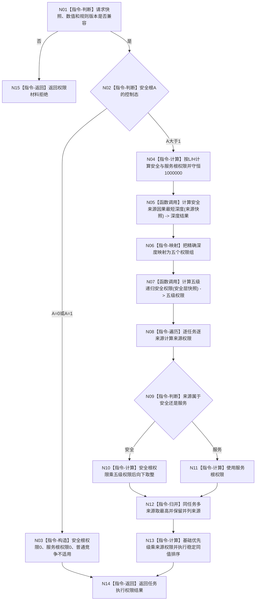

# BIZ-L2-003-03 计算任务执行权限目标函数流程图 v0.1

更新时间：2026-08-03

## 依据

```text
6150、6170
父函数：BIZ-L1-003 自我治理服务::执行一轮自我治理
```

## 身份与边界

正式目标函数设计图。根函数只形成可重建权限投影，不写安全值、服务值、需求、任务或方法事实。

## 函数合同

```text
根函数：计算任务执行权限
归属模块 / 文件 / 层级：任务执行权限 / 海中鱼巣/领域/服务.任务执行权限.ixx / L2
现有或待新增：待新增；当前代码中目标完整签名零命中，底层相邻能力仍待核
完整签名：任务执行权限结果 任务执行权限服务::计算任务执行权限(const 任务执行权限请求& 请求) const
参数：
  请求：const 任务执行权限请求&，只读借用，调用期间有效；必须含自我、安全根、L/H、需求任务来源、因果图/场景/规则版本和基础优先级
返回结果：
  任务执行权限结果；包含控制态、根权限、逐来源权限、任务有效优先级、并列来源和排序证据，或材料缺口、无安全深度和内部错误
被调函数流程图：下一层待按因果最短深度、五级递归门控和稳定排序分别展开
```

## 流程图



## 节点合同

| 节点 | 类型 | 参数 / 输入绑定 | 结果 / 输出绑定 | 事实读写 | 后继条件 | 验证 |
| --- | --- | --- | --- | --- | --- | --- |
| N04 | 指令-计算 | A、L、H | 两类根权限 | 无 | 和为1000000 | 阈值边界 |
| N05 | 函数调用 | 需求目标、因果快照 | 精确I64深度 | 只读 | 可无深度 | 环和多路径 |
| N07 | 函数调用 | 五组安全值与阈值 | 五级权限 | 只读 | 守恒 | 100%到1% |
| N08-N12 | 指令-遍历/归并 | 任务来源 | 最高来源权限 | 无 | 不求和 | 安全兼服务去重 |
| N13 | 指令-计算 | 基础优先级和来源权限 | 排序值与证据 | 无 | checked wide成功 | 稳定同值比较 |

## 关键边界

- 五级只提供任务权限精度，精确因果深度不截断。
- 权限为0不删除需求、任务、方法或事实，也不阻止观察和事件登记。
- 权限是值式投影；只有实际派发消费的快照可冻结为历史证据。
