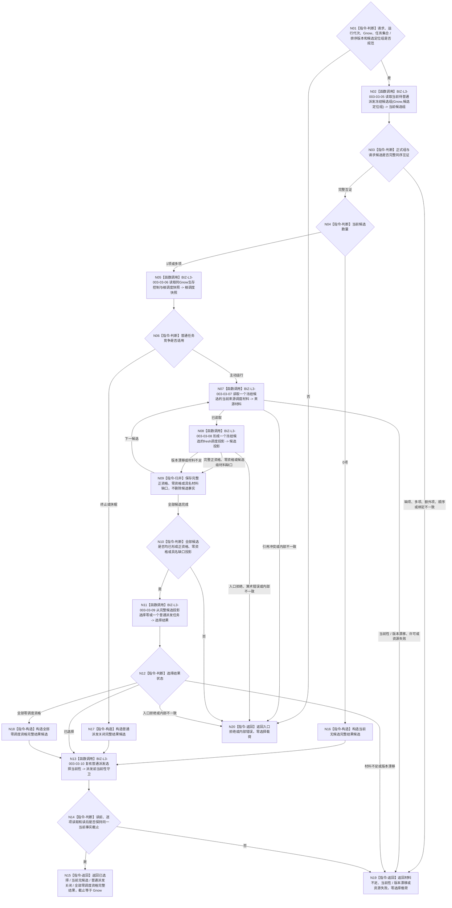

# BIZ-L2-003-03 选择一个冻结后当前可普通派发任务目标函数流程图 v0.2

更新时间：2026-08-27

## 依据

```text
3200、5090、5200、5230、6150、6170、8100、8200
父线程函数：BIZ-L1-T03 v0.5 任务管理线程::运行结果上行循环
前置：候选任务已经完成当前任务轮次的筹办、路径选择、实例形成和执行冻结
后继：只有本图返回已选择，才允许 BIZ-L2-004-04 冻结并派发所选任务的执行工作包
```

## 身份与边界

正式粗层目标函数图。本函数只在执行冻结完成后、真实派发前，对 task owner 当前全部待普通派发冻结任务形成同一 `Gnow` 的 fresh 调度投影并选择 0..1 项。它不参与需求选择、任务承接、筹办、路径选择、实例形成或执行冻结，也不发布安全值、服务值、任务状态、授权或硬否决事实。

旧 v0.1 在 T02 每批治理中处理调用方传入的“全局候选任务组”，混入冻结前来源、旧任务集合和不具名服务 / 安全分类，已经退出。候选完整性必须由任务管理当前槽与 task owner 正式读回共同证明；列表成员、队列到达顺序、缓存、日志或调用方任意子集不得冒充当前候选全集。

## 函数合同

```text
根函数：任务普通派发选择组合器::选择一个冻结后当前可普通派发任务
归属模块 / 文件 / 层级：任务普通派发选择 / 海中鱼巣/领域/内部治理/服务.任务普通派发选择.ixx / BIZ-L2
现有或待新增：待新增；HEAD 只有字段不闭合且固定返回材料缺口的旧治理骨架，没有本目标组合器
完整签名：任务普通派发选择结果 任务普通派发选择组合器::选择一个冻结后当前可普通派发任务(const 任务普通派发选择请求& 请求) const noexcept
参数：
  请求：只读借用；绑定运行代次、非零 Gnow、任务集合版本、排序规则版本，以及任务管理当前全部待普通派发候选定位组
  每个候选定位：必须显式绑定任务、任务轮次、筹办轮次、执行轮次、执行冻结、实例方法、当前路径、执行绑定冻结材料和正式共同作用场景读取键
返回结果：
  任务普通派发选择结果；状态为已选择、当前无候选、普通派发关闭、全部零调度资格、材料不足、当前性漂移、版本漂移、入口拒绝、资源失败或内部错误
  已选择时恰含一个所选候选、完整生存控制态、安全 / 服务根调度配额、逐 T→D 来源投影、并列最高来源、基础 / 有效优先级、稳定排序证据和正式读回截止 Gnow
  当前无候选、普通派发关闭和全部零调度资格是完整读取结果，选择载荷为空、正式读回截止等于 Gnow；其它非成功选择载荷为空、截止为 0
被调函数流程图：BIZ-L3-003-03-05—10 v0.1；旧 BIZ-L3-003-03-01—04 继续保持历史冻结，不作为当前直接子图
```

## 流程图



## 节点合同

| 节点 | 类型 | 输入绑定 | 输出绑定 | 事实读写 | 后继条件 | 验证 |
| --- | --- | --- | --- | --- | --- | --- |
| N02—N04 | L3-05 / 判断 | 请求候选定位组、任务集合版本、Gnow | task owner 当前完整待派发冻结组 | 只读任务、三轮次、冻结、实例和当前阶段 | 0/N 均可完整读取；请求不得裁剪全集 | 空组、漏项、额外项、重复、混版本 |
| N05/N06 | L3-06 / 判断 | 同 Gnow 的 A/L/H定义和规则版本 | 生存控制态与两类根调度配额 | 只读正式安全 / 服务事实 | A=0/1 零普通派发；A>1 才继续 | 0/1/L/H 边界、根配额守恒 |
| N07—N09 | L3-07/08 / 归并 | 单候选完整冻结、当前 T→D、逐来源需求、共同作用场景和版本 | 逐来源及任务调度投影 | 只读需求、任务、方法、因果、安全和服务 owner | 多来源取最高且保留并列，不求和 | 列表成员不补入、场景不从 self 位置或对象名推导 |
| N10—N12 | L3-09 / 判断 | 全部候选投影 | 0..1 所选候选和完整排序证据 | 无写入 | 零资格不删除任务；材料缺口不伪装零资格 | 多任务、并列、组5完整比较链 |
| N13/N14 | L3-10 / 判断 | 读前 Gnow 与全部来源版本 | 派发前当前性守卫 | 只读 | 任一变化整份选择失效 | 读前 / 读后漂移、候选加入或退出 |

## 关键边界

- 本函数选择的是“本次可普通派发的执行冻结”，不是需求、任务、方法或现实动作的业务授权。
- 任务基础优先级和调度倍率只决定尚未派发工作的执行机会顺序；不能决定需求满足、结果归属、自我后继或绕过执行前 fresh 复核。
- 当前 `T→D` 只取该候选执行冻结本轮实际消费的正式关系。列表项其它成员、历史来源、旧投影和线程缓存都不能补造来源。
- 共同作用场景是目标 / 方法 / 当前路径 / 执行冻结共同绑定的上下文；直接作用主体和间接结果主体是该场景中的存在。不得用 self 当前位置、公共祖先、首动作或对象名称反推场景。
- 本次已选择后，BIZ-L2-004-04 仍须按同一候选和投影形成不可变执行工作包；工作线程动作开始前还必须 fresh 复核当前冻结、调度资格、自我现实执行授权、技术许可和安全硬否决。
- 本 v0.2 已由 BIZ-L3-003-03-05—10 完成当前L3函数分解；task owner候选全集DATA入口、调度来源选择和各正式读取叶仍待下一层逐项冻结，不宣称L4 ABI、代码、构建或生产调度闭环已经完成。

## v0.2 校正记录

- 从 T02 每批全局权限计算移到 T03 的执行冻结后、真实派发前。
- 根目标从“计算一组权限材料”改为“对 task owner 当前完整冻结候选组 fresh 计算并选择 0..1 项”。
- 删除需求选择、任务承接、筹办和执行冻结前置语义；零调度资格只排除本次普通派发。
- 旧四个 L3 叶继续历史冻结；新建05—10承载完整候选读回、根调度、逐来源读取、单候选投影、确定性0..1选择和读后守卫，未改名复活旧身份。
