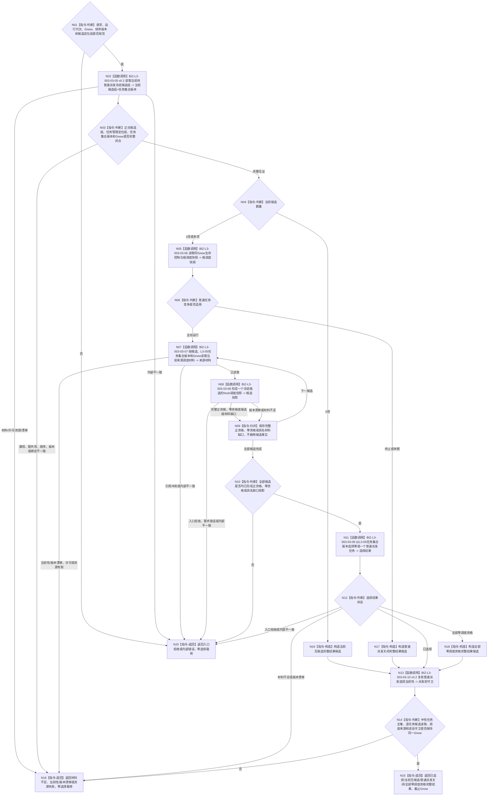

# BIZ-L2-003-03 选择一个冻结后当前可普通派发任务目标函数流程图 v0.3

更新时间：2026-08-27

## 依据

```text
0050、3200、5090、5200、5230、6150、6170、8100、8200
父线程函数：BIZ-L1-T03 v0.5 任务管理线程::运行结果上行循环
前置：任务管理已经接管当前阶段定位；候选权威仍须由本图同Gnow正式重读
后继：只有本图返回已选择，才允许BIZ-L2-004-04冻结并派发所选执行工作包
```

## 身份与边界

正式粗层目标函数替代图。本函数只在执行冻结完成后、真实派发前，读取 task owner 中性的当前任务全集，在 BIZ 层逐任务读取 ARCH-L2 当前阶段、正式选择 / 冻结 / 实例和排队事实，形成同一 `Gnow` 的完整待普通派发候选组；随后读取生存控制与安全 / 服务调度材料、形成 fresh 投影并选择 0..1 项。

v0.2 仍让调用方首次提供任务集合版本，并把“按阶段完整读取候选”错误归给 task owner。v0.3 改为由 L3-05 v0.2 的中性任务全集读取正式产生任务集合版本，再由后继调度请求逐字段复用；DATA-L2 不判断任务阶段，任务管理定位组只作接管完整性互证。

本函数不参与需求选择、任务承接、筹办、路径选择、实例形成或执行冻结，也不发布安全值、服务值、任务状态、授权、硬否决或排队事实。列表成员、队列到达顺序、缓存、日志、调用方子集和旧任务治理状态不得冒充候选权威。

## 函数合同

```text
根函数：任务普通派发选择组合器::选择一个冻结后当前可普通派发任务
归属模块 / 文件 / 目标分解深度：任务普通派发选择 / 海中鱼巣/领域/内部治理/服务.任务普通派发选择.ixx / BIZ-L2
现有或待新增：待新增；HEAD只有字段不闭合且固定返回材料缺口的旧治理骨架
完整签名：任务普通派发选择结果 任务普通派发选择组合器::选择一个冻结后当前可普通派发任务(const 任务普通派发选择请求& 请求) const noexcept
参数：
  请求：只读借用；绑定运行代次、非零Gnow、排序规则版本，以及任务管理当前全部待普通派发候选定位组；不接收调用方声明的任务集合版本
  每个候选定位：显式绑定任务、任务轮次、筹办轮次、执行轮次、执行冻结、实例方法、当前路径和执行绑定冻结材料；共同作用场景必须由后继按正式路径/冻结读回，定位不得补造
返回结果：
  状态为已选择、当前无候选、普通派发关闭、全部零调度资格、材料不足、当前性漂移、版本漂移、入口拒绝、资源失败或内部错误
  已选择时恰含一个所选候选、L3-05正式任务集合版本、完整生存控制态、安全/服务根调度配额、逐T→D来源投影、并列最高来源、基础/有效优先级、稳定排序证据和截止Gnow
  当前无候选、普通派发关闭和全部零调度资格是完整读取结果，选择载荷为空、正式读回截止等于Gnow；其它非成功选择载荷为空、截止0
被调函数流程图：BIZ-L3-003-03-05 v0.2、06—09 v0.1、10 v0.2；旧BIZ-L3-003-03-01—04及05/10 v0.1保持历史冻结
```

## 流程图



## 节点合同

| 节点 | 类型 | 输入绑定 | 输出绑定 | 事实读写 | 后继条件 | 验证 |
| --- | --- | --- | --- | --- | --- | --- |
| N02—N04 | L3-05 v0.2 / 判断 | 请求定位组、Gnow | 中性任务全集经BIZ筛选的0..N候选与正式任务集合版本 | 只读任务、存在、状态、选择、冻结和排队事实 | DATA不判断阶段；合法0项必须有完整覆盖 | 空组、漏项、额外项、重复、阶段变化、已有在途 |
| N05/N06 | L3-06 / 判断 | 同Gnow的A/L/H定义和规则版本 | 生存控制态与两类根调度配额 | 只读正式安全/服务事实 | A=0/1零普通派发；A>1继续 | 0/1/L/H边界、根配额守恒 |
| N07—N09 | L3-07/08 / 归并 | 单候选冻结、当前T→D、共同作用场景、L3-05集合版本和各来源版本 | 逐来源及任务调度投影 | 只读需求、任务、方法、因果、安全和服务owner | 多来源取最高且保留并列，不求和 | 列表成员不补入、场景不反推、集合版本原样复用 |
| N10—N12 | L3-09 / 判断 | 全部候选投影与L3-05集合版本 | 0..1所选候选和排序证据 | 无写入 | 零资格不删除任务；缺口不伪装零 | 多任务、并列、组5完整比较链 |
| N13/N14 | L3-10 v0.2 / 判断 | 原候选/定位/集合版本、Gnow及全部来源版本 | 派发前当前性守卫 | 只读 | 任一变化整份选择失效 | 任务加入/退出、阶段变化、换冻结、已排队、来源漂移 |

## 关键边界

- 任务集合版本只由中性完整任务全集读取产生，后继调度请求原样消费；调用方不得自报、由候选数量计算或从安全结果反推。
- DATA-L2不得判断任务是否待普通派发；当前阶段和排队资格必须经BIZ层读取ARCH-L2状态及正式排队事实裁决。
- 本函数选择的是本次普通派发机会，不是需求、任务、方法或现实动作授权。
- 当前`T→D`只取执行冻结本轮实际消费的正式关系；列表其它成员、历史来源、旧投影和线程缓存不得补造。
- 共同作用场景来自目标/方法/路径/冻结正式绑定；不得用self位置、公共祖先、首动作或对象名称反推。
- 已选择后BIZ-L2-004-04仍须形成不可变工作包；动作开始前还须fresh复核冻结、调度资格、自我授权、技术许可和安全硬否决。
- L4-05-01的具名DATA缺口未闭合前不得施工本链，也不得以task owner内部容器扫描取得假PASS。

## v0.3 校正记录

- 任务集合版本从调用方输入移到中性当前任务全集正式读回结果。
- DATA-L2退出按业务阶段筛选；L3-05在BIZ层逐任务读取阶段、冻结和排队事实。
- L3-10改为整体重放L3-05 v0.2，候选阶段变化和已排队均纳入派发前失效矩阵。
