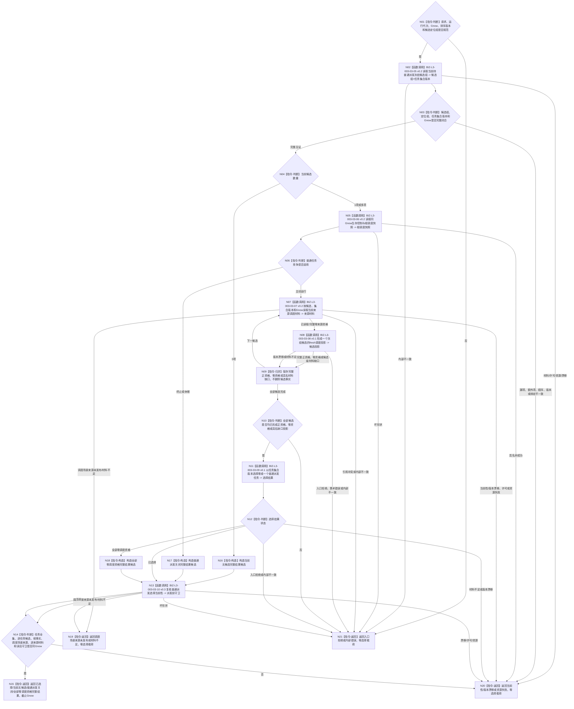

# BIZ-L2-003-03 选择一个冻结后当前可普通派发任务目标函数流程图 v0.4

更新时间：2026-08-27

## 依据

```text
0050、3200、5090、5200、5230、6150、6170、8100、8200
父线程函数：BIZ-L1-T03 v0.5 任务管理线程::运行结果上行循环
前置：任务管理已经接管当前阶段定位；候选权威仍须由本图同Gnow正式重读
后继：只有本图返回已选择，才允许BIZ-L2-004-04冻结并派发所选执行工作包
```

## 身份与边界

正式粗层目标函数替代图。本函数只在执行冻结完成后、真实派发前，读取 task owner 中性的当前任务全集，在BIZ层逐任务读取ARCH-L2当前阶段、正式选择/冻结/实例和排队事实，形成同一 `Gnow` 的完整候选；随后经正式生存安全根读回形成根调度快照，并逐候选读取当前 `T→D`、目标、基础优先级、安全和服务材料，形成fresh投影并选择0..1项。

v0.4继续保留v0.3中性任务全集与任务集合版本修正，并进一步闭合：L3-06只复用现有生存安全根读取叶；L3-07复用现有冻结/T→D/目标/服务合同读取，新增基础优先级DATA叶和安全来源调度叶。安全调度适用场景只能来自任务路径/冻结链显式生产且可同Gnow读回的任务级统一上下文场景；当前producer尚未发布，受影响安全来源读取必须结构化停在具名DRIFT。

本函数不参与需求选择、任务承接、筹办、路径选择、实例形成或执行冻结，也不发布安全值、服务值、任务状态、授权、硬否决或排队事实。列表成员、队列到达顺序、缓存、日志、动作目标、自我位置、调用方子集和旧任务治理状态不得冒充正式输入。

## 函数合同

```text
根函数：任务普通派发选择组合器::选择一个冻结后当前可普通派发任务
归属模块 / 文件 / 目标分解深度：任务普通派发选择 / 海中鱼巣/领域/内部治理/服务.任务普通派发选择.ixx / BIZ-L2
现有或待新增：待新增；HEAD只有字段不闭合且固定返回材料缺口的旧治理骨架
完整签名：任务普通派发选择结果 任务普通派发选择组合器::选择一个冻结后当前可普通派发任务(const 任务普通派发选择请求& 请求) const noexcept
参数：
  请求：只读借用；绑定运行代次、非零Gnow、排序规则版本和任务管理当前全部候选定位组；不接收调用方声明的任务集合版本、A/L/H、基础优先级或裸安全调度场景
  每个候选定位：绑定任务、任务轮次、筹办轮次、执行轮次、执行冻结、实例方法、当前路径和执行绑定冻结材料；定位只作任务管理接管见证，不产生候选资格或调度输入
返回结果：
  状态为已选择、当前无候选、普通派发关闭、全部零调度资格、调度场景来源未发布、材料不足、当前性漂移、版本漂移、入口拒绝、资源失败或内部错误
  已选择时恰含一个所选候选、L3-05任务集合版本、完整生存控制态、根调度配额、逐T→D来源投影、正式安全调度场景来源见证、并列最高来源、基础/有效优先级、稳定排序证据和截止Gnow
  当前无候选、普通派发关闭和全部零调度资格是完整读取结果，选择载荷为空、截止等于Gnow；调度场景来源未发布及其它非成功选择载荷为空、截止0
被调函数流程图：BIZ-L3-003-03-05 v0.2、06/07 v0.2、08/09 v0.1、10 v0.3；旧BIZ-L3-003-03-01—04、05/10 v0.1、06/07 v0.1与10 v0.2保持历史冻结
```

## 流程图



## 节点合同

| 节点 | 类型 | 输入绑定 | 输出绑定 | 事实读写 | 后继条件 | 验证 |
| --- | --- | --- | --- | --- | --- | --- |
| N02—N04 | L3-05 v0.2 / 判断 | 定位组、Gnow | 中性任务全集经BIZ筛选的0..N候选与任务集合版本 | 只读任务、存在、状态、冻结和排队事实 | DATA不判断阶段；合法0项有完整覆盖 | 空组、漏、多、重、阶段变化、已有在途 |
| N05/N06 | L3-06 v0.2 / 判断 | 自我、安全根、Gnow、范围和规则版本 | 正式A/L/H、控制态与两类根配额 | 只读生存安全根事实 | A=0/1关闭普通派发；A>1继续 | 0/1/L/H、版本回显、根配额守恒 |
| N07—N09 | L3-07 v0.2 / L3-08 / 归并 | 单候选、当前T→D/目标/B、正式调度场景、安全/服务版本 | 逐来源及任务调度投影 | 只读任务、需求、因果、安全和服务owner | 多来源取最高且保留并列，不求和 | 列表不补入、场景不反推、集合版本原样复用 |
| N10—N12 | L3-09 v0.1 / 判断 | 全部候选投影与任务集合版本 | 0..1所选候选和排序证据 | 无写入 | 零资格不删除任务；缺口不伪装零 | 多任务、并列、组5完整比较链 |
| N13/N14 | L3-10 v0.3 / 判断 | 原候选/定位/根快照/场景来源/全部版本 | 派发前当前性守卫 | 只读 | 任一变化整份选择失效 | 加入/退出、阶段、冻结、排队、B、场景和来源漂移 |

## 关键边界

- 任务集合版本只由中性完整任务全集读取产生；调用方不得自报、由数量计算或从安全结果反推。
- 生存控制和根配额唯一来自正式安全根读回；任务、线程和调度器不得声明或缓存覆盖。
- 当前 `T→D` 只取执行冻结本轮实际消费的正式关系；列表其它成员、历史来源和旧投影不得补造。
- 安全调度适用场景是统一执行上下文场景；它可以包含自我、控制设施和受影响存在，但不能由self位置、动作直接目标、观察范围、首动作或公共祖先反推。
- 当前正式调度场景producer和任务基础优先级DATA读取ABI未闭合前，本链不得施工，也不得以旧权限请求、动作场景或内部容器取得假PASS。
- 已选择后BIZ-L2-004-04仍须形成不可变工作包；动作开始前还须fresh复核冻结、调度资格、自我授权、技术许可和安全硬否决。

## v0.4 校正记录

- L3-06 v0.2固定复用现有生存安全根读取叶并在函数内计算6170根配额。
- L3-07 v0.2复用当前冻结、T→D、来源目标和服务合同读取，新增基础优先级DATA叶与安全来源调度叶。
- 删除共同作用场景推导；改为只消费任务级安全调度适用场景正式读回，producer未发布时结构化失败。
- L3-10 v0.3同时守卫根快照、B、调度场景来源和逐来源版本。
